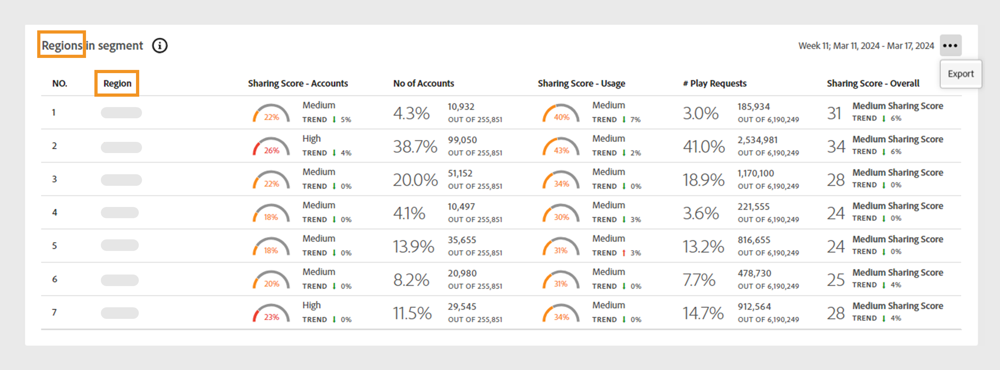

# Datenbedienfelder im Dashboard {#data-panels}

Nachdem Sie ein Segment und ein Zeitintervall ausgewählt haben, zeigt das Dashboard verschiedene Datenbedienfelder, Tabellen und Diagramme an, die eine allgemeine Ansicht der Teilungsaktivität innerhalb des ausgewählten Segments widerspiegeln.

In der folgenden Tabelle sind die Verfügbarkeit und Unterschiede zwischen den Datenfeldern in den verschiedenen [Versionen](/help/accountiq/versions-aiq.md) von Account IQ aufgeführt:

| Datenfelder | D2C-Dienste | TVE-Programmierer | TVE MVPDs |
|---|---|---|---|
| [Durchschnittliche Teilungsbewertung, aggregiert für das aktuelle Segment](#aggregated-sharing) | Verfügbar und konsistent | Verfügbar und konsistent | Verfügbar und konsistent |
| [Videokategorien im Segment](#video-categories-segment) | Verfügbar mit leichten Varianten | Verfügbar mit leichten Varianten | Verfügbar mit leichten Varianten |
| [Teilungsergebnis nach Kanälen und MVPDs](#sharin-score-by-channels-and-mvpds) | Nicht verfügbar | Verfügbar | Nicht verfügbar |
| [Freigabewahrscheinlichkeit von Konten](#accounts-sharing-probability) | Verfügbar und konsistent | Verfügbar und konsistent | Verfügbar und konsistent |
| [Anzahl der Konten und Verwendung nach Freigabe der Wahrscheinlichkeitsstufe](#number-of-accounts-usage-sharing-probability) | Verfügbar und konsistent | Verfügbar und konsistent | Verfügbar und konsistent |

## Durchschnittliche Teilungsbewertung, aggregiert für das aktuelle Segment {#aggregated-sharing}

Das Bedienfeld für die durchschnittliche Teilungsbewertung bietet eine erstrangige Übersicht, die die Menge und die Auswirkungen der Freigabe in Bezug auf Konten und Streaming-Volumen zusammenfasst.

Die Metriken helfen Ihnen dabei, die Größenordnung (von niedrig, mittel, hoch bis anormal) der Weitergabe von Anmeldedaten durch Ihre Abonnenten zu verstehen, gemessen in Bezug auf Konten und Verbrauch.

*Bedienfeld &quot;Durchschnittliche Teilungsbewertung&quot;für das aktuelle Segment aggregiert*

>[!NOTE]
>
> Der blaue Indikator in der für das aktuelle Segment aggregierten **durchschnittlichen Teilungsbewertung** dient unterschiedlichen Zwecken für D2C-Dienste im Vergleich zu TV Anywhere. Bei D2C-Diensten stellt er den **durchschnittlichen Dienstindex** dar, wie in der vorherigen Abbildung gezeigt. Wenn Sie sich als Programmierer oder MVPD anmelden, ändert sich diese Bezeichnung in **Branchendurchschnittsindex**.

Die folgenden Metriken sind Komponenten des Bereichs &quot;Durchschnittliche Teilungsbewertung&quot;.

### Freigabestufe {#sharing-level}

Der Freigabebereich zeigt den Prozentsatz aller gemeinsam genutzten Abonnentenkonten innerhalb des definierten Segments während des ausgewählten Zeitintervalls an.

Der Prozentsatz wird anhand des Durchschnitts der Teilungswahrscheinlichkeit berechnet, die für jedes Konto im Segment berechnet wird. Diese Berechnung umfasst Konten, die im ausgewählten Zeitintervall mindestens einmal gestreamt haben.

Der Trend -Indikator zeigt die prozentuale Änderung des Werts der Metrik im Vergleich zum vorherigen Zeitintervall an.

{width="350" align="left"}

*Freigabestufe*

### Nutzung durch freigegebene Konten {#usage-from-shared-accounts}

Die Messung gibt den Prozentsatz der Nutzung durch die gemeinsam genutzten Konten unter allen Abonnentenkonten für das definierte Segment und den definierten Zeitraum an. Diese Bereiche mit den Namen &quot;Niedrig&quot;, &quot;Medium&quot;, &quot;Hoch&quot;und &quot;Abnormal&quot;basieren auf Branchendurchschnitten.

Der Trend -Indikator, der einen Anstieg oder Rückgang der Nutzung durch freigegebene Konten im Vergleich zum vorherigen Zeitintervall darstellt.

{width="350" align="left"}

*Nutzung durch freigegebene Konten*

### Gesamte Teilungsbewertung {#overall-sharing-score}

Das Gesamt-Sharing-Ergebnis ist eine Kombination aus Sharing-Werten, einschließlich &quot;Sharing-Level&quot;und &quot;Nutzung von freigegebenen Konten&quot;.

Es bietet einen Wert, der die Gesamtauswirkungen der Freigabe widerspiegelt. Ihr Zweck ähnelt dem eines Kreditwerts, bei dem die Teilungsebene mit einer einzelnen Zahl zusammengefasst wird. In diesem Fall weist ein höherer Wert jedoch auf eine höhere Freigabestufe hin.

{width="350" align="left"}

*Gesamte Teilungsbewertung*

## Videokategorien im Segment {#video-categories-segment}

Sie können die Spaltenüberschriften auswählen, um die Daten in allen Versionen von Account IQ zu sortieren.

++ + D2C-Dienste: Regionen im Segment

Wenn Sie sich als D2C-Dienst anmelden, bietet die Tabelle **Regionen in Segment** eine vergleichende Ansicht der verschiedenen aggregierten Sharing-Bewertungen für die [Videokategorien](/help/accountiq/product-concepts.md#video-category-def) im aktuellen Segment.

*Teilen der Punktzahl nach Regionen im Segment*

>[!NOTE]
>
> Die im vorherigen Bild angezeigten [Videokategorien](product-concepts.md#video-category-def), z. B. **Regionen** im Segment, sind nur ein Beispiel. Wenn Sie sich bei Account IQ anmelden, wird in diesem Bedienfeld die spezifische Videokategorie Ihres Unternehmens angezeigt.

Wählen Sie **Exportieren** aus, um die Daten in eine CSV-Datei herunterzuladen. Erfahren Sie [, wie Sie Datenbereichsberichte exportieren](/help/accountiq/export-reports.md).

+++

+++ Programmierer: MVPDs im Segment

Wenn Sie sich als Programmierer anmelden, bietet die Tabelle **MVPDs in Segment** eine vergleichende Ansicht der verschiedenen aggregierten Freigabewerte für die MVPDs im aktuellen Segment.

Wählen Sie **Exportieren** aus, um die Daten in eine CSV-Datei herunterzuladen. Erfahren Sie [, wie Sie Datenbereichsberichte exportieren](/help/accountiq/export-reports.md).

+++

+++MVPDs: Programmierer im Segment

Wenn Sie sich als MVPD anmelden, bietet die Tabelle **Programmierer in Segment** eine vergleichende Ansicht der verschiedenen aggregierten Sharing-Bewertungen für die Programmierer im aktuellen Segment.

Wählen Sie die Spaltenüberschriften aus, um die Daten zu sortieren.

*Teilungsbewertung durch Programmierer in Segment*

Wählen Sie **Exportieren** aus, um die Daten in eine CSV-Datei herunterzuladen. Erfahren Sie [, wie Sie Datenbereichsberichte exportieren](/help/accountiq/export-reports.md).

+++

## Teilungsbewertung nach Kanälen und MVPDs  {#sharin-score-by-channels-and-mvpds}

Wenn Sie sich als Programmierer anmelden, bietet diese Tabelle einen vergleichenden Überblick über die Freigabe von Bewertungen der ausgewählten Kanäle für die MVPDs im aktuellen Segment.

Wählen Sie die Spaltenüberschriften aus, um die Daten zu sortieren.

*Teilen von Bewertungen nach Kanälen und MVPDs*

## Wahrscheinlichkeit der Kontofreigabe {#accounts-sharing-probability}

Dieses Diagramm teilt in Bereiche mit Wahrscheinlichkeitsquintilien auf, die von sehr niedrig (0-20%) bis sehr hoch (80-100%) reichen. Erfahren Sie mehr über die Bereiche der [Wahrscheinlichkeit der Kontofreigabe](#accounts-sharing-probability).

>[!NOTE]
>
>Das Balkendiagramm verwendet eine logarithmische Skala.

*Anzahl und Prozentsatz der Abonnentenkonten in verschiedenen Wahrscheinlichkeitsbereichen für die Freigabe*

## Anzahl der Konten und Nutzung nach Freigabe der Wahrscheinlichkeitsstufe {#number-of-accounts-usage-sharing-probability}

Dieses Bedienfeld bietet eine tabellarische Ansicht von Konten, die in Bereiche mit Wahrscheinlichkeitsquintilien für gemeinsame Nutzung unterteilt sind, die von sehr niedrig (0-20 %) bis sehr hoch (80-100 %) reichen, wobei die zugehörige Nutzung jedes Quintils aus freigegebenen Konten erfolgt. Erfahren Sie mehr über die Bereiche der [Wahrscheinlichkeit der Kontofreigabe](#accounts-sharing-probability).

*Anzahl der Konten, Trends und Verwendungen, die in verschiedene Wahrscheinlichkeitsbereiche fallen*

Wählen Sie **Exportieren** aus, um die Daten in eine CSV-Datei herunterzuladen. Erfahren Sie [, wie Sie Datenbereichsberichte exportieren](/help/accountiq/export-reports.md).
