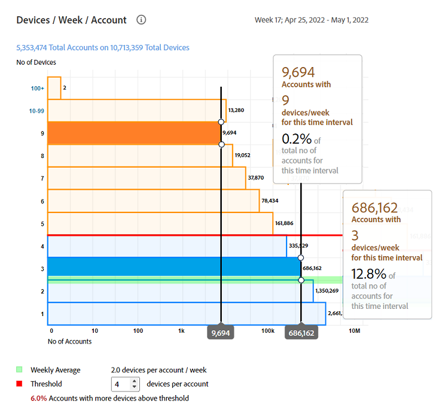

# [!UICONTROL General usage] Berichte {#general-usage-reports}

[!UICONTROL Account IQ] Berichte sind grundlegende Analysetools, mit denen Sie Ihre Daten im Drilldown-Verfahren untersuchen und isolieren können [Kohorten](/help/accountiq/product-concepts.md#segmet-def), identifizieren Sie Anomalien und erstellen Sie ein Verständnis Ihrer Kontomerkmale.

[!UICONTROL General usage] Die Seite &quot;Berichte&quot;bietet Tools zum Erstellen von Untergruppenmetriken basierend auf der Anzahl der verwendeten Kontogeräte, erkannten IPs und den jeweiligen Postleitzahlen.

Die Berichte basieren alle auf dem aktuellen Segment, das aus dem [Segmente und Zeitintervall](/help/accountiq/segments-timeinterval.md) Bedienfeld. Sie können Ihre Auswahl anpassen und weiter einschränken, indem Sie in der Variablen [Momentaufnahme Übersicht - Konten über Schwellenwerten](#snapshot-overview) Bedienfeld.

## Abspielanfragen und eindeutige Abonnenten {#playreq-uniquesubs}

Die Liniendiagramme hier geben Ihnen einen Überblick über die Änderungen im Zeitverlauf von Werten, wie z. B. Abspielanforderungen und Unique Subscribers in einem ausgewählten Zeitintervall für das definierte Segment.

+++ D2C-Dienste: Play Requests/Unique Subscribers

*Abspielanforderungen/Unique Subscribers für D2C-Dienste*

+++

+++ Programmierer: Play Requests/Unique Subscribers

*Abspielen von Anforderungen/Unique Subscribers für Programmierer*

+++

+++MVPDs: Unique Subscribers

*Eindeutige Abonnenten für MVPDs*

+++

 

Die X-Achse stellt die Zeit basierend auf dem aktuellen Intervall dar und die Y-Achse stellt grundlegende Metriken zur Abonnentenaktivität während dieses Zeitraums dar. Mithilfe der Liniendiagramme können Sie die Aktivitäten der Abonnenten im aktuellen Segment visualisieren und vergleichen. Abhängig von der Version von Konto IQ umfassen die Metriken:

* **AuthN OK**: Anzahl erfolgreicher Authentifizierungen. Mehr dazu [AuthN OK](/help/accountiq/product-concepts.md#authn-ok-def).

* **AuthZ OK**: Anzahl erfolgreicher Berechtigungen. Mehr dazu [AuthZ OK](/help/accountiq/product-concepts.md#authz-ok-def).

* **Abspielanforderungen**: Anzahl der Wiedergabeanforderungen. Mehr dazu [Abspielanforderungen](/help/accountiq/product-concepts.md#play-requests-def).

* **Unique Subscribers**: Anzahl erfolgreicher Unique Abonnenten. Mehr dazu [Unique Subscribers](/help/accountiq/product-concepts.md#unique-subscriber-def).

>[!NOTE]
>
>Die Verfügbarkeit von Metriken hängt von der Version von Konto IQ ab.

## Momentaufnahmen-Übersichtskonten oberhalb der Schwellenwerte {#snapshot-overview}

Passen Sie Ihre Analyse und Berichte mithilfe dieses zusätzlichen Filters an, um verschiedene Verwendungsschwellen festzulegen. Nachdem Sie ein Segment ausgewählt haben, können Sie auch die folgenden Filter verwenden, um das Verhalten der Abonnenten weiter zu analysieren:

* Schwellenwert für Anzahl Geräte

* IP-Schwellenwert

* Schwelle für Postleitzahlen

Wenn Sie Schwellenwerte in [Konten Segmentbasiert auf ausgewählten Schwellenwerten](#account-segments-basedon-segments) -Bedienfeld anzeigen, sehen Sie den Effekt in:

* [Geräte pro Woche (oder Monat) pro Konto](#devices-week-account)

* [Standorte pro Woche (oder Monat) pro Konto](#locations-week-account)

* [IPs pro Woche (oder Monat) und Konto](#ip-week-account)

* [Historische Ansicht des Kontosegments](#account-segment-historical-view)

>[!NOTE]
>
>Jeder Schwellenwert ist auf den Standardwert 4 gesetzt. Auf der Seite &quot;Allgemeine Nutzung&quot;werden also Analysen für Abonnenten angezeigt, die mehr als vier Geräte verwenden und Inhalte von mehr als vier verschiedenen IP-Adressen verbrauchen. *und* mehr als vier verschiedene Postleitzahlen.

### Konten segmentbasiert auf ausgewählten Schwellenwerten {#account-segments-basedon-segments}

Die **Konten Segmentbasiert auf ausgewählten Schwellenwerten** bietet Optionen zum Festlegen von Schwellenwerten (zwischen 1 und 10) für die Anzahl der Geräte, die Anzahl der IPs und die Anzahl der Postleitzahlen.

Das Diagramm zeigt Ihnen Folgendes:

* Absolute Anzahl der Abonnentenkonten.

* Prozentualer Anteil der gesamten Abonnentenkonten im Segment, die die Anzahl der Geräte verwenden, von der Anzahl der IPs an in der Anzahl der Postleitzahlen angegebenen Anzahl an Postleitzahlen.

## Geräte pro Woche (oder Monat) pro Konto {#devices-week-account}

Dieses Balkendiagramm bietet Einblicke in das Nutzungsverhalten, was die Nutzung der Geräte durch die Abonnenten für den Zugriff auf Inhalte betrifft.

Die X-Achse zeigt die Anzahl der Konten und die Anzahl der Geräte auf der y-Achse an. Basierend auf dem Schwellenwert, den Sie für die Anzahl der Geräte pro Konto festgelegt haben, wird die absolute Anzahl der Abonnentenkonten angezeigt, die Inhalte von einer bestimmten Anzahl von Geräten in einer Woche verbrauchen.

Wenn Sie den Mauszeiger über eine Leiste bewegen (spezifisch für die Anzahl der Geräte), wird eine Beschriftung angezeigt, die Informationen über die Anzahl der Abonnentenkonten (und den Prozentsatz der Gesamtzahl der Abonnentenkonten im Segment) enthält, die Inhalte von Streaming-Kanälen mit diesen vielen Geräten in einer Woche nutzen.

Das Diagramm markiert auch Folgendes:

* Eine rote Linie, die den festgelegten Schwellenwert markiert.

* Eine grüne Linie, die die durchschnittliche Anzahl verschiedener Geräte angibt, die von einem Abonnentenkonto pro Woche (oder Monat) verwendet werden.

Der Donut bietet eine alternative Ansicht der Geräte, die von Konten im aktuellen Segment über dem festgelegten Schwellenwert verwendet werden.

## Standorte pro Woche (oder Monat) pro Konto {#locations-week-account}

Ähnlich der Metrik für [Geräte pro Woche (oder Monat) pro Konto](#devices-week-account)können Sie mit der Metrik Standorte pro Woche (oder Monat) pro Konto die Nutzung des Abonnentenkontos von verschiedenen Standorten aus analysieren. Die X-Achse zeigt die Anzahl der Konten und die Anzahl der Standorte auf der y-Achse an.

Nachdem Sie den Schwellenwert für die Anzahl der Standorte festgelegt haben, können Sie das Diagramm verwenden, um Folgendes zu identifizieren:

* Anzahl (und Prozentsatz) der Abonnenten, die Inhalte von (einer bestimmten) x Anzahl von Orten in einer Woche nutzen.

* Prozentsatz der Gesamtanzahl der Abonnentenkonten, die Inhalte von mehr Standorten als dem Schwellenwert anzeigen.

* Vergleichen Sie den wöchentlichen Durchschnitt (Anzahl verschiedener Orte für ein Konto) mit dem Schwellenwert.

## IPs pro Woche (oder Monat) pro Konto {#ip-week-account}

Ähnlich der Metrik für **Anzahl der Standorte pro Woche und Konto**, die **Anzahl der IPs pro Woche und Konto** -Metrik können Sie die Änderungsmenge an der Streaming-Quelle für das aktuelle Segment auswerten.

Die X-Achse zeigt die Anzahl der Konten und die Anzahl der IPs auf der y-Achse an.

Nachdem Sie ein Segment definiert und den Schwellenwert für die Anzahl der IPs festgelegt haben, können Sie mit dem Diagramm Folgendes identifizieren:

* Anzahl (und Prozentsatz) der Abonnenten, die Inhalte von einer bestimmten Anzahl von IP-Adressen in einer Woche nutzen.

* Prozentsatz der Gesamtanzahl der Abonnentenkonten, die Inhalte von mehr IP-Adressen als dem Schwellenwert anzeigen.

* Vergleichen Sie den wöchentlichen Durchschnitt (Anzahl verschiedener IPs für ein Konto) mit dem Schwellenwert.

## Ansicht &quot;Segment - Historie&quot;der Konten {#account-segment-historical-view}

Mit dem Balkendiagramm für die Historische Ansicht können Sie die Nutzungsmetriken über verschiedene Zeitintervalle hinweg vergleichen. Außerdem werden die verschiedenen Nutzungsmetriken, wie z. B. [Geräte pro Woche (oder Monat) pro Konto](#devices-week-account), [Standorte pro Woche (oder Monat) pro Konto](#locations-week-account), und [IPs pro Woche (oder Monat) und Konto](#ip-week-account).

* Die X-Achse zeichnet das Zeitintervall auf und zeigt die Anzahl der Teilnehmerkonten, Geräte, Standorte und IPs auf der y-Achse an.

* Die orangefarbenen Balken kennzeichnen Segmente in verschiedenen Zeitintervallen.

* Das Liniendiagramm zeichnet die Änderungen in [Geräte pro Woche (oder Monat) pro Konto](#devices-week-account), [Standorte pro Woche (oder Monat) pro Konto](#locations-week-account), und [IPs pro Woche (oder Monat) und Konto](#ip-week-account) Werte über das Zeitintervall basierend auf dem Schwellenwert hinweg.

* Die blauen Balken bezeichnen die Gesamtanzahl der aktiven Abonnenten in der Branche in einem Zeitintervall.

* Sie können spezifische Legenden auswählen und sie helfen Ihnen, das Diagramm zu skalieren.

