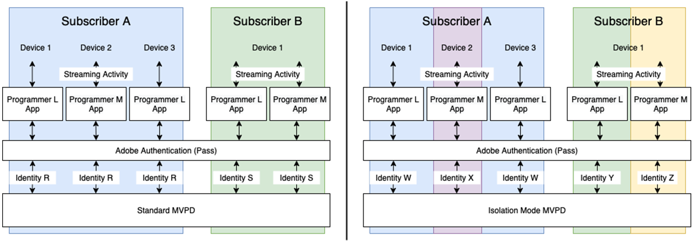

# Isolationsmodus-MVPDs für TV-Programmierer überall {#isolation-mode-tve}

>[!IMPORTANT]
>
> Die Beschränkung des Isolationsmodus-MVPDs gilt nur für TV-Programmierer überall.

Im Isolationsmodus identifizieren MVPDs (z. B. Xfinity) Abonnenten über Geräte hinweg auf der Grundlage ihrer Interaktionen mit bestimmten Programmierern. Im Standardmodus identifizieren MVPDs Abonnenten konsistent geräteübergreifend, unabhängig von den beteiligten Programmierern.

Im Folgenden finden Sie ein Beispiel:

*Isolationsmodus-MVPDs identifizieren vier verschiedene Abonnenten anstelle von zwei*

* Wenn ein Abonnent B eines Isolationsmodus-MVPD (z. B. Xfinity) auf den Inhalt zugreift, der von zwei verschiedenen Programmierern mit demselben Gerät bereitgestellt wird, ordnet der MVPD den beiden unterschiedlichen Zugriffsversuchen unterschiedliche Kennungen zu. Es scheint, dass zwei verschiedene Abonnenten auf den Inhalt für die Programmierer zugreifen (L und M in der Abbildung).

* Wenn Abonnent B bei Standard-MVPDs auf Inhalte zugreift, die von zwei verschiedenen Programmierern bereitgestellt werden, verknüpft der MVPD eine einzige Zugriffskennung für beide Zugriffsversuche.

* MVPDs (z. B. Xfinity) im Isolationsmodus identifizieren einen Abonnenten nicht konsistent, selbst wenn der Abonnent dasselbe Gerät über verschiedene Programmierer hinweg verwendet.

Um Datenverzerrungen zu verhindern, die durch die Zählung eines einzelnen Abonnenten als mehrere Abonnenten aufgrund des Zugriffs auf verschiedene Programmierer verursacht werden, beschränkt der Isolationsmodus die gemeldete Aktivität eines Programmierers auf nur seine Anwendungen.

Beispielsweise kann Programmierer L Daten nur basierend auf der Aktivität von Identitäten W und Y anzeigen, wobei Identitäten X und Z im vorherigen Bild ignoriert werden.

>[!IMPORTANT]
>
> Der Nachteil ist, dass Programmierer L aufgrund von Aktivitäten mit anderen Programmierern als L keine Informationen über Abonnenten A und B weitergeben kann.

Im Isolationsmodus werden die Bewertungen und zugehörigen Metriken für die Freigabe ausschließlich aus der Aktivität von Geräten berechnet, die aus den Anwendungen des ausgewählten Programmierers und Kanals gestreamt werden. Die Freigabewerte und -wahrscheinlichkeiten werden anhand der Stream-Starts auf den aktuell ausgewählten Kanälen berechnet.

Das System arbeitet automatisch im Isolationsmodus, wenn das ausgewählte Segment einen Isolationsmodus-MVPD enthält, der einzelne Abonnenten beim Streaming von verschiedenen Programmierern als mehrere Abonnenten identifiziert. Alle Diagramme für diese Segmente spiegeln die Ergebnisse dieses geänderten Verhaltens wider.

>[!IMPORTANT]
>
> Das Verhalten im Isolationsmodus ist mit dem Standardmodus inkompatibel, der Isolationsmodus MVPD kann nicht mit anderen MVPDs gemischt werden und umgekehrt.

Um ein Segment zu erstellen, das im Isolationsmodus analysiert wird, ziehen Sie den Isolationsmodus-MVPD, z. B. **Xfinity**, in den Abschnitt &quot;MVPDs&quot;der Segmentdefinition.

>[!NOTE]
>
> Da Isolationsmodus-MVPDs nicht mit anderen MVPDs gemischt werden können, lässt der MVPD-Abschnitt der Segmentdefinition nicht zu, dass ein anderer MVPD dorthin gezogen wird.

*Xfinity-Auswahl im Isolationsmodus*

>[!IMPORTANT]
>
> Die Kontofreigabe ist relevanter, wenn sie für das Streaming über alle Programme des Programmierers hinweg gemessen wird. Rechnen Sie im Isolationsmodus mit niedrigeren **Sharing Scores** und einigen Varianten der Metriken.

*Teilen von Wahrscheinlichkeitsmessern im Isolationsmodus*

Die obigen Kennzahlen zeigen, dass nur 9 % aller Konten geteilt werden und von diesen nur 11 % des Inhalts verbraucht werden. Aufgrund der natürlich niedrigeren Werte sollten die Ergebnisse im Isolationsmodus anders interpretiert werden als die Ergebnisse im Standardmodus.
