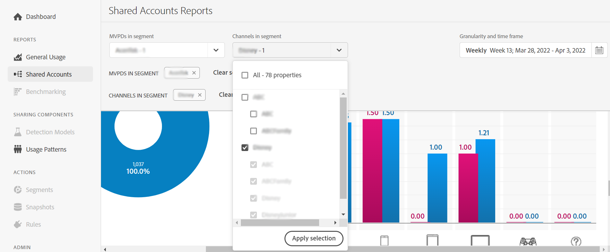

# Anzeigen von Berichten zur Kontofreigabe für einen bestimmten Programmierer {#report-sp-programmers}

So zeigen Sie Berichte in Konto IQ an, sobald Sie sich erfolgreich als MVPD bei der Anwendung angemeldet haben:

1. Wählen Sie den spezifischen Programmierer aus, während Sie Ihr Abonnentensegment für die Analyse und Anzeige von Berichten mithilfe der Schritte unter [So definieren Sie ein Segment](/help/accountiq/howto-select-segment-timeframe.md).

   

1. Wählen Sie im linken Navigationsbereich eine gewünschte Berichtseite aus:

* [Allgemeine Nutzung](/help/accountiq/general-usage-reports.md)

  
* [Freigegebene Konten](/help/accountiq/shared-acc-reports.md)

  
* [Nutzungsmuster](/help/accountiq/usage-patterns.md)

  

* [Dashboard](/help/accountiq/dashboard.md) (Dashboard gibt einen Überblick über die ausgewählten Diagramme aus verschiedenen Seiten in Berichten).

  

Jede dieser Seiten spiegelt die Aktivität des ausgewählten Segments wider.
