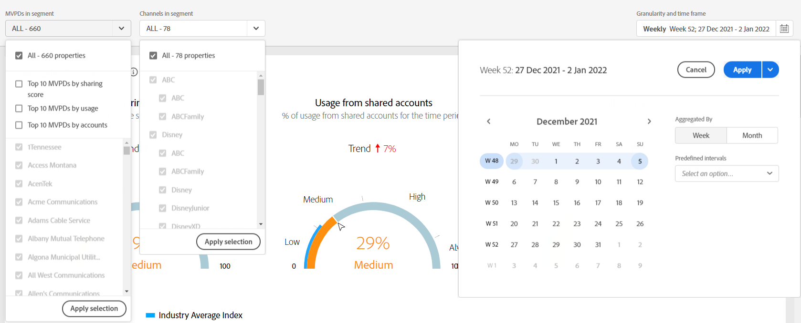

# Abonnierte Segmente und Zeitraum {#cohorts-segments}

Wenn Sie sich bei Konto IQ anmelden, befindet sich oben ein Bedienfeld, in dem Sie den Abonnenten definieren können [Segment](/help/accountiq/product-concepts.md#segment-segmet-def) , um Ihre Ergebnisse für die Anzeige von Berichten nach dem Verhalten und den Mustern der Abonnentenfreigabe zu filtern.

<!---->

+++Bedienfeld für Segmentauswahl für Programmierer

<!---->

Die folgenden Dropdown-Optionen werden zum Definieren von Segmenten verwendet:

**[!UICONTROL MVPDs in segment]**

Die **[!UICONTROL MVPDs in segment]** -Auswahl können Sie die [MVPDs](/help/accountiq/product-concepts.md#mvpd-def) (Einzelanwender oder Gruppe), für deren Abonnent Sie die Berichte zur Kontofreigabe anzeigen möchten.

In diesem Selektor können Sie neben der Auswahl der einzelnen MVPDs auch die folgenden Gruppen auswählen:

* [Top-10-MVPDs nach Freigabe der Punktzahl](/help/accountiq/product-concepts.md#top-mvpds-def)

* [Die 10 MVPDs nach Verwendung](/help/accountiq/product-concepts.md#top-mvpds-def)

* [Die 10 MVPDs nach Konten](/help/accountiq/product-concepts.md#top-mvpds-def)

* [Isolationsmodus](/help/accountiq/isolation-mode.md)

**[!UICONTROL Channels in segment]**

Wenn Sie als Programmierer-Benutzer angemeldet sind, können Sie Ihre Kanäle auswählen, um die Analyse der Kontofreigabe anzuzeigen. Verwenden Sie die **[!UICONTROL Channels in segment]** Dropdown-Option zur Auswahl einzelner oder mehrerer Kanäle in Ihrer Organisation.

+++

+++Auswahlfeld für Segmente für MVPDs

Die folgenden Dropdown-Optionen werden zum Definieren von Segmenten verwendet:

**[!UICONTROL Channels in segment]**

Die **[!UICONTROL Channels in segment]** Mit dem -Selektor können Sie Ihren Filter weiter einschränken, um Kanäle auszuwählen, die den ausgewählten MVPDs entsprechen.

* [Top 10-Programmierer nach der Freigabe von Bewertungen](/help/accountiq/product-concepts.md#top-mvpds-def)

* [Die 10 beliebtesten Programmierer nach Verwendung](/help/accountiq/product-concepts.md#top-mvpds-def)

* [Die 10 beliebtesten Programmierer nach Konten](/help/accountiq/product-concepts.md#top-mvpds-def)

**MVPD(s) im Segment**

Wenn Sie als MVPD-Benutzer angemeldet sind, wird Ihr Name im Feld für **[!UICONTROL MVPDs in segment]**.

+++

<!--For example, you can define your segment as the "subscribers of the MVPD A that watched the channels X, Y, and Z".-->

## [!UICONTROL Granularity and time frame] {#granularity-timeframe}

Die **[!UICONTROL Granularity and time frame]** Mit dem -Selektor können Sie Datum und Dauer sowie die Zeitspanne angeben, für die Sie das Teilungsverhalten des Abonnenten anzeigen möchten.

![[!UICONTROL Granularity and timeframe]](assets/granularity-timeframe-weekwise.png)

Mit diesen Steuerelementen können Sie also Ihre Problemanweisung als &quot;Abonnenten des MVPD A, der die Kanäle X, Y und Z im Mai angesehen hat&quot; definieren.

