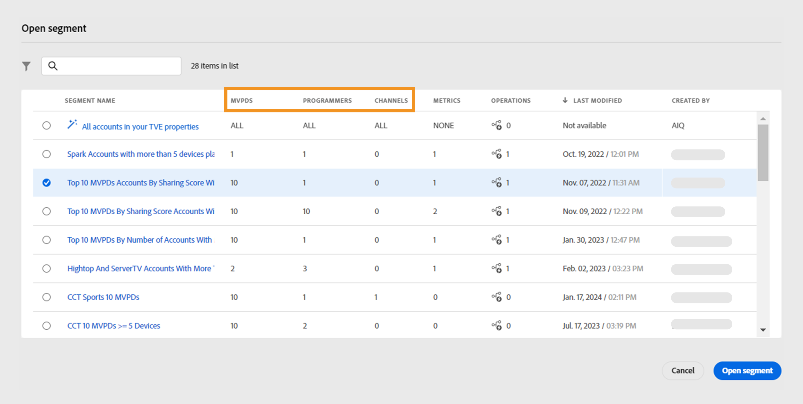
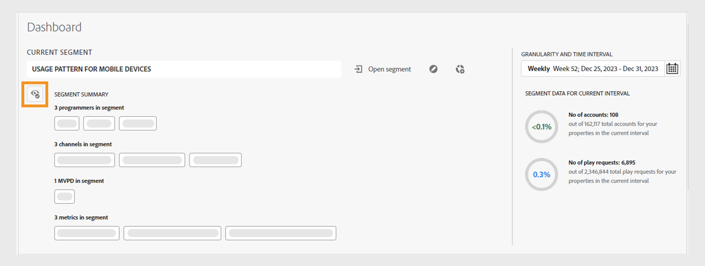

# Segmente und Zeitintervall {#segment-timeinterval}

Wenn Sie sich bei Account IQ anmelden, können Sie im Bedienfeld „Segment“ und „Zeitintervall“ über dem Dashboard den Abonnenten ([) ](product-concepts.md#segmet-def). Dieses Bedienfeld hilft beim Filtern von Ergebnissen und beim Anzeigen von Berichten über das Verhalten und die Muster bei der Freigabe von Abonnenten. Ein Segment mit **Namen „ALLE KONTEN IN IHREN**&quot; ist derzeit standardmäßig ausgewählt, wo Sie die folgenden Optionen anzeigen können:

{align="left"}

*Bedienfeld „Segment“ und „Zeitintervall“ mit reduzierter Segmentzusammenfassung*

**A.** Aktuell ausgewählter Segmentname **B.** Segmentliste öffnen **C.** Segment bearbeiten **D.** Neues Segment erstellen **E.** Granularitäts- und Zeitintervallauswahl **F.** Symbol zum Erweitern der Segmentzusammenfassung **G.** Zusammengefasste Segmentzusammenfassung **H.** Anzahl der Konten im Segment für das ausgewählte Intervall

>[!NOTE]
>
> Die reduzierte Segmentzusammenfassung zeigt die [Videokategorien](product-concepts.md#video-category-def) an, die in der Account IQ-Version „TV Everywhere“ verwendet werden. Wenn Sie als D2C-Service angemeldet sind, zeigen diese Kennzeichnungen die spezifischen Videokategorien Ihres Unternehmens an.

Weitere Informationen zum [Erstellen](work-with-segments.md#create-new-segment) und [Verwalten von Segmenten](work-with-segments.md#manage-segment) finden Sie auf der Registerkarte **Segmente** im linken Bereich.

## Segmentauswahl {#segment-selection}

Gehen Sie wie folgt vor, um ein bestimmtes Segment auszuwählen:

1. Navigieren Sie zur Option **[!UICONTROL Open segment]** im Bedienfeld Segment und Zeitintervall .
1. Wählen Sie **Segmentname** aus, für den Sie die Berichte zur Kontofreigabe anzeigen möchten.

   {align="left"}

   *Segmentnamen auswählen*

   >[!NOTE]
   >
   > Die im vorherigen Bild angezeigten Videokategorien wie **MVPDs**, **Programmierer** und **Kanäle** stellen die Bezeichnungen dar, die in der Account IQ-Version von TV Everywhere verwendet werden. Wenn Sie als D2C-Service angemeldet sind, zeigen diese Kennzeichnungen die spezifischen Videokategorien Ihres Unternehmens an.

1. Wählen Sie **[!UICONTROL Open segment]** aus.

## Granularität und Zeitintervallauswahl {#granularity-timeinterval}

Mit **Selektor „Granularität und**&quot; können Sie die Daten und die Dauer angeben, die auf wöchentlicher/monatlicher Basis aggregiert werden, um das Verhalten bei der Freigabe durch Abonnenten zu beobachten. Die Standardauswahl ist die aktuelle Woche.

{align="left"}

*Dialogfeld „Granularität und Zeitintervall“*

**A.** Granularität- und Zeitintervallauswahl **B.** Pfeil nach rechts, um zum nächsten Monat/zur nächsten Woche zu wechseln **C.** Option, um die Granularität nach Woche/Monat auszuwählen **D.** Aktuell ausgewähltes Zeitintervall **E.** Pfeil nach links, um zum vorherigen Monat/zur letzten Woche zu wechseln

Sie können die Dauer in den folgenden Schritten ändern:

1. Wählen Sie in der Datumsauswahl die **[!UICONTROL Granularity and Time Interval]** aus.

1. Wählen Sie entweder **[!UICONTROL Week]** oder **[!UICONTROL Month]** aus **[!UICONTROL Aggregate By]** Option aus, um die Granularität für Ihre Auswertung festzulegen.

1. Nachdem Sie die Granularität ausgewählt haben, können Sie mit den Vorwärts- oder Rückwärtspfeilen durch den Zeitbereich navigieren.

1. Einen bestimmten Zeitraum für die Auswertung auswählen.

1. Wählen Sie **[!UICONTROL Apply]** aus, um sicherzustellen, dass Ihre Auswahl wirksam wird.

Auf diese Weise können Sie Ihre Problembeschreibung als „Abonnenten von MVPD A, die die Kanäle X, Y und Z in der ausgewählten Dezemberwoche angesehen haben“ definieren.

## Segmentzusammenfassung {#segment-summary}

Die Segmentzusammenfassung ist für D2C-Services und TV Everywhere ähnlich. Die Videokategorien unterscheiden sich für jede Version von Account IQ.

Auswählen  Symbol zum Anzeigen der detaillierten Segmentzusammenfassung. Es enthält auch Informationen über die Anzahl der Teilnehmerkonten und deren Wiedergabeanforderungen innerhalb des gewählten Zeitraums.

+++ D2C-Dienste

{align="left"}

*Segmentzusammenfassung für D2C-Services*

>[!NOTE]
>
>Die [Videokategorien](product-concepts.md#video-category-def) im vorherigen Bild angezeigt, wie **Region** und **Inhaltstypen** im Segment sind nur Beispiele. Wenn Sie sich bei Account IQ anmelden, zeigen diese Kennzeichnungen die spezifischen Videokategorien Ihres Unternehmens an.

Die **Segmentzusammenfassung** umfasst die folgenden Bedingungen, die ein Segment definieren:

**[Regionen und Inhaltstypen](product-concepts.md#video-category-def) im Segment** beziehen sich auf die Metadatenbeschriftungen, die mit den Videostreams verknüpft sind, die von freigegebenen Konten angesehen werden und in Kontofreigabeberichten dargestellt werden.

**[Metriken](product-concepts.md#metric) im Segment** beziehen sich auf Attribute oder Kriterien, die Abonnenten erfüllt haben müssen, damit sie in Berichten zur Kontofreigabe identifiziert werden können.

+++

+++ TV Everywhere

{align="left"}

*Segmentzusammenfassung für Programmierer/MVPDs*

Die **Segmentzusammenfassung** umfasst die folgenden Bedingungen, die ein Segment definieren:

**[Programmierer](product-concepts.md#programmer-def) im Segment** beziehen sich auf Inhaltsanbieter, deren Video-Streams von freigegebenen Konten angesehen wurden, die in Berichten zur Kontofreigabe dargestellt werden.

**[Kanäle](product-concepts.md#channel-def) im Segment** beziehen sich auf Kanäle, deren Video-Streams von freigegebenen Konten angesehen wurden, die in Berichten zur Kontofreigabe dargestellt werden.

**[MVPDs](product-concepts.md#mvpd-def) im Segment** beziehen sich auf Distributoren für mehrere Videoprogrammierung, denen die Abonnenten zugeordnet sind, um in Berichten zur Kontofreigabe identifiziert zu werden.

**[Metriken](product-concepts.md#metric) im Segment** beziehen sich auf Attribute oder Kriterien, die Abonnenten erfüllt haben müssen, damit sie in Berichten zur Kontofreigabe identifiziert werden können.

+++
