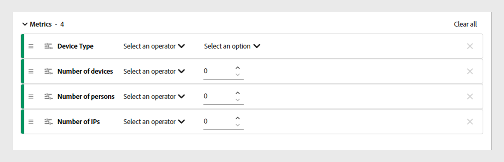

# Arbeiten mit Segmenten {#work-with-segments}

[Segmente](product-concepts.md#segmet-def) sind eine Sammlung von Abonnentenkonten, mit denen Sie die Freigabe von Anmeldedaten unter benutzerdefinierten Bedingungen analysieren können. Sie können Segmente verwenden, um verschiedene Sätze von Abonnentenkonten zu untersuchen und entsprechende Datenberichte in Tabellen und Grafiken zu generieren. Es gibt zwei Arten von Segmenten in Konto IQ:

1. **Standardsegment**: **Alle Konten in Ihren Eigenschaften** ist ein vordefiniertes Segment im System, das alle aktiven Abonnentenkonten ohne spezifische Bedingungen umfasst.

   >[!NOTE]
   >
   >Die Verwendung des Standardsegments kann die Anzeige bestimmter Tabellen wie [Videokategorien im Segment](data-panels.md#video-categories-segment), [Teilungsbewertung nach Kanälen und MVPDs](data-panels.md#sharin-score-by-channels-and-mvpds), und [Verteilung der Nutzungsmuster für Videokategorien](usage-patterns.md#usage-pattern-dis-video-categories). Diese Tabellen können nur Daten für bis zu 20 Zeilen gleichzeitig aufnehmen und anzeigen. Die übrigen Tabellen, Diagramme und Berichte sind für standardmäßige und benutzerdefinierte Segmente identisch.

1. **Benutzerspezifische Segmente**: Hierbei handelt es sich um maßgeschneiderte Segmente, mit denen Sie Abonnentenkonten aus bestimmten Kategorien wie D2C-Inhaltstypen, Programmierern, Kanälen und MVPDs gruppieren können, um die Freigabe von Anmeldedaten unter benutzerdefinierten Bedingungen zu analysieren. Erfahren Sie mehr über das [benutzerdefiniertes Segment erstellen](#create-new-segment).

   >[!IMPORTANT]
   >
   >Alle in diesem Handbuch beschriebenen Verfahren basieren auf benutzerdefinierten Segmenten. Die Konzepte für standardmäßige und benutzerdefinierte Segmente bleiben jedoch gleich.

Wenn Sie zur **Aktionen** und wählen Sie die **[!UICONTROL Segments]** im linken Bereich eine Liste der im System verfügbaren Segmente angezeigt. Auf der Segmentseite können Sie wichtige Details zu jedem Segment schnell in einem tabellarischen Format bewerten. Zu den Details gehören der Segmentname und die Anzahl der [Videokategorien](product-concepts.md#video-category-def), Metriken, [Vorgänge](product-concepts.md#operation-def) unter Verwendung des aktuellen Segments, des Datums und der Uhrzeit der letzten Änderung sowie des Namens des Erstellers des Segments.

Sie können die folgenden Funktionen mit Segmenten ausführen:

* [Neues Segment erstellen](#create-new-segment)
* [Segmente verwalten](#manage-segments)

## Neues Segment erstellen {#create-new-segment}

Der Prozess der Erstellung eines neuen Segments ähnelt dem von D2C-Diensten und TV Anywhere. Die Videokategorien unterscheiden sich für die jeweilige Version von Konto-IQ.

++ + D2C-Dienste

Um ein Segment zu erstellen und das Freigabeverhalten des Abonnenten zu analysieren, wählen Sie **[!UICONTROL Create new segment]** oben rechts.

*Neues Segment erstellen*

>[!NOTE]
>
>Die im vorherigen Bild angezeigten Videokategorien, z. B. **Regionen** und **Content-Typen** sind nur Beispiele. Wenn Sie sich bei Konto IQ anmelden, zeigen diese Beschriftungen die spezifischen Videokategorien Ihres Unternehmens an.

Dadurch wird ein **Neues Segment** -Seite, die die folgenden Elemente enthält:

*Neue Segmentseite*

**A.** Segmentkomponenten **B.** Segmentdefinition **C.** Segmentzusammenfassung

* **Segmentkomponenten**: Ein Inventar von [Videokategorien](product-concepts.md##video-category-def) und berechnete Metriken, die zur Definition eines Segments verwendet werden.

  >[!NOTE]
  >
  >Verwendung **[!UICONTROL Show all]** , um die Liste der Segmentkomponenten zu erweitern. Um eine Komponente schnell zu finden, suchen Sie ihren Namen in **Segmentkomponenten suchen** anstatt durch die gesamte Liste zu scrollen.

* **Segmentdefinition**: Eine Arbeitsfläche, auf der Sie verschiedene Segmentkomponenten per Drag &amp; Drop verschieben können, um ein Segment zu erstellen.

* **Segmentzusammenfassung**: Eine Zusammenfassung, die die qualifizierten Konten auf Grundlage der Komponenten in der Segmentdefinition schätzt und eine kurze Übersicht über das Segment während des Bewertungszeitraums bietet.

Führen Sie die folgenden Schritte aus, um ein Segment zu erstellen:

1. Geben Sie den Namen Ihres Segments in **Segmentname** wird in der Segmentliste und während der Segmentauswahl angezeigt.
1. Geben Sie eine detaillierte Beschreibung Ihres Segments in **Segmentbeschreibung**.
1. Ziehen Sie beispielsweise **Regionen und Inhaltstypen** aus den Segmentkomponenten im linken Bereich und legen Sie sie im **Regionen/Content-Typen** innerhalb des **Segmentdefinition**.

   >[!NOTE]
   >
   >Sie können ein Segment basierend auf Regionen oder Inhaltstypen erstellen. Zeigen Sie die zugehörigen Inhaltstypen einer Region über ein Dropdown-Menü an.

   Wenn Sie mit dem Hinzufügen einer **Content-Typ** im **Regionen/Content-Typen** -Abschnitt können Sie nur Inhaltstypen als nachfolgende Komponenten hinzufügen.

   Wenn Sie mit dem Hinzufügen einer **Region** im **Regionen/Content-Typen** -Abschnitt, wird ein Entscheidungsdialogfeld angezeigt.

   {width="550" align="left"}

   *Segmentkomponente als Region oder das Dialogfeld &quot;Inhaltstypen&quot;hinzufügen*

   Entscheiden Sie, ob Sie bestimmte Regionen oder ein Segment anhand der mit einer Region verknüpften Inhaltstypen vergleichen möchten.

   Auswählen **[!UICONTROL As a region]** , um Regionen zur **Regionen/Content-Typen** Abschnitt.

   Auswählen **[!UICONTROL As its content types]** , um Inhaltstypen einer Region hinzuzufügen.

1. Ziehen **Metriken** aus den Segmentkomponenten im linken Bereich und legen Sie sie im **Metriken** innerhalb des **Segmentdefinition**.

   

   *Wählen Sie einen Operator aus und weisen Sie ihm einen Wert für die hinzugefügte Metrik zu*

   Wählen Sie nach dem Hinzufügen von Metriken in der Segmentdefinition einen Operator aus **[!UICONTROL Select an operator]** Dropdown-Menü ein und weisen Sie einen Wert mithilfe von **[!UICONTROL Select an option]**.

   Passen Sie die Werte für bestimmte Metriken an, indem Sie die Erhöhung mit dem Pfeil nach oben und die Verringerung mit dem Pfeil nach unten durchführen.

1. Ziehen **Berechnete Metriken** aus den Segmentkomponenten im linken Bereich und legen Sie sie im **Berechnete Metriken** innerhalb des **Segmentdefinition**.

   

   *Wählen Sie einen Operator aus und weisen Sie ihm einen Wert für die hinzugefügte berechnete Metrik zu*

   Nach dem Hinzufügen berechneter Metriken zur Segmentdefinition, **[!UICONTROL Select an operator]** aus dem Dropdown-Menü aus und weisen Sie einen Wert zu mithilfe von **[!UICONTROL Select an option]**.

   >[!NOTE]
   >
   >Alle Metriken und berechneten Metriken, die Sie unter der Segmentdefinition ablegen, werden von entsprechenden Operatoren begleitet, um den jeweiligen Metriken und berechneten Metriken Werte zuzuweisen.

1. Überprüfen Sie die Segmentdetails im Abschnitt **Segmentzusammenfassung** um die Änderungen zu bestimmen, die Sie im gesamten Segment implementieren möchten.
1. Auswählen **[!UICONTROL Last week]** oder **[!UICONTROL Last month]** aus dem **Bewertungszeitraum** Dropdown-Menü, um die Zusammenfassungswerte für die letzte Woche oder den letzten Monat zu schätzen.
1. Auswählen **[!UICONTROL Update estimation]** um die Anzahl der geschätzten qualifizierten Konten im aktuellen Segment basierend auf dem ausgewählten Bewertungszeitraum zu berechnen.
1. Auswählen **[!UICONTROL Save segment]**.

Das von Ihnen erstellte Segment ist jetzt in der Segmentliste verfügbar.

+++

+++TV Überall

Um ein Segment zu erstellen und das Freigabeverhalten des Abonnenten zu analysieren, wählen Sie **[!UICONTROL Create new segment]** oben rechts.

*Neues Segment erstellen*

Dadurch wird ein **Neues Segment** -Seite, die die folgenden Elemente enthält:

*Neue Segmentseite*

**A.** Segmentkomponenten **B.** Segmentdefinition **C.** Segmentzusammenfassung

* **Segmentkomponenten**: Eine Bestandsaufnahme der Programmierer und Kanäle, MVPDs, Metriken und berechneten Metriken, die zur Definition eines Segments verwendet werden.

  >[!NOTE]
  >
  >Verwendung **[!UICONTROL Show all]** , um die Liste der Segmentkomponenten zu erweitern. Um eine Komponente schnell zu finden, suchen Sie ihren Namen in **Segmentkomponenten suchen** anstatt durch die gesamte Liste zu scrollen.

* **Segmentdefinition**: Eine Arbeitsfläche, auf der Sie verschiedene Segmentkomponenten per Drag &amp; Drop verschieben können, um ein Segment zu erstellen.

* **Segmentzusammenfassung**: Eine Zusammenfassung, die die qualifizierten Konten auf Grundlage der Komponenten in der Segmentdefinition schätzt und eine kurze Übersicht über das Segment während des Bewertungszeitraums bietet.

Führen Sie die folgenden Schritte aus, um ein Segment zu erstellen:

1. Geben Sie den Namen Ihres Segments in **Segmentname** wird in der Segmentliste und während der Segmentauswahl angezeigt.
1. Geben Sie eine detaillierte Beschreibung Ihres Segments in **Segmentbeschreibung**.
1. Ziehen **Programmierer und Kanäle** aus den Segmentkomponenten im linken Bereich und legen Sie sie im **Programmierer/Kanäle** innerhalb des **Segmentdefinition**.

   >[!NOTE]
   >
   >Sie können ein Segment entweder auf der Basis von Programmierern oder Kanälen erstellen. Zeigen Sie die zugehörigen Kanäle mit einem Programmierer über ein Dropdown-Menü an.

   Wenn Sie mit dem Hinzufügen einer **Kanal** im **Programmierer/Kanäle** -Abschnitt können Sie Kanäle nur als nachfolgende Komponenten hinzufügen.

   Wenn Sie mit dem Hinzufügen einer **Programmierer** im **Programmierer/Kanäle** -Abschnitt, wird ein Entscheidungsdialogfeld angezeigt.

   {width="550" align="left"}

   *Segmentkomponente als Programmierer oder Dialogfeld &quot;Kanäle&quot;hinzufügen*

   Entscheiden Sie, ob Sie bestimmte Programmierer oder ein Segment anhand der mit einem Programmierer verknüpften Kanäle vergleichen möchten.

   Auswählen **[!UICONTROL As a programmer]** , um Programmierer zum **Programmierer/Kanäle** Abschnitt.

   Auswählen **[!UICONTROL As its channels]** , um alle Kanäle eines Programmierers hinzuzufügen.

1. Ziehen **MVPDs** aus den Segmentkomponenten im linken Bereich und legen Sie sie im **MVPDs** innerhalb des **Segmentdefinition**.

   >[!NOTE]
   >
   >Wenn Sie sich als Programmierer anmelden, wird ein MVPD mit dem Namen **xfinity** wird als eigenständige Option im **MVPDs** Abschnitt. Sie können es nicht mit einem anderen MVPD kombinieren.

1. Ziehen **Metriken** aus den Segmentkomponenten im linken Bereich und legen Sie sie im **Metriken** innerhalb des **Segmentdefinition**.

   

   *Wählen Sie einen Operator aus und weisen Sie ihm einen Wert für die hinzugefügte Metrik zu*

   Wählen Sie nach dem Hinzufügen von Metriken in der Segmentdefinition einen Operator aus **[!UICONTROL Select an operator]** Dropdown-Menü ein und weisen Sie einen Wert mithilfe von **[!UICONTROL Select an option]**.

   Passen Sie die Werte für bestimmte Metriken an, indem Sie die Erhöhung mit dem Pfeil nach oben und die Verringerung mit dem Pfeil nach unten durchführen.

1. Ziehen **Berechnete Metriken** aus den Segmentkomponenten im linken Bereich und legen Sie sie im **Berechnete Metriken** innerhalb des **Segmentdefinition**.

   

   *Wählen Sie einen Operator aus und weisen Sie ihm einen Wert für die hinzugefügte berechnete Metrik zu*

   Nach dem Hinzufügen berechneter Metriken zur Segmentdefinition, **[!UICONTROL Select an operator]** aus dem Dropdown-Menü aus und weisen Sie einen Wert zu mithilfe von **[!UICONTROL Select an option]**.

   >[!NOTE]
   >
   >Alle Metriken und berechneten Metriken, die Sie unter der Segmentdefinition ablegen, werden von entsprechenden Operatoren begleitet, um den jeweiligen Metriken und berechneten Metriken Werte zuzuweisen.

1. Überprüfen Sie die Segmentdetails im Abschnitt **Segmentzusammenfassung** um die Änderungen zu bestimmen, die Sie im gesamten Segment implementieren möchten.
1. Auswählen **[!UICONTROL Last week]** oder **[!UICONTROL Last month]** aus dem **Bewertungszeitraum** Dropdown-Menü, um die Zusammenfassungswerte für die letzte Woche oder den letzten Monat zu schätzen.
1. Auswählen **[!UICONTROL Update estimation]** um die Anzahl der geschätzten qualifizierten Konten im aktuellen Segment basierend auf dem ausgewählten Bewertungszeitraum zu berechnen.
1. Auswählen **[!UICONTROL Save segment]**.

Das von Ihnen erstellte Segment ist jetzt in der Segmentliste verfügbar.
+++

## Segmente verwalten {#manage-segments}

Sie können ein Segment aus der Segmentliste auswählen und dann die folgenden Aktionen ausführen:

* [Segment bearbeiten](#edit-segment)
* [Segment duplizieren](#duplicate-segment)
* [Segment löschen](#delete-segment)

*Auswählen eines Segments zum Bearbeiten, Duplizieren oder Löschen*

**A.** [Standardsegment](#work-with-segments) **B.** [Videokategorien](product-concepts.md#video-category-def)

>[!NOTE]
>
>Die in diesem Abschnitt angezeigten Videokategorien, z. B. **MVPDs**, **Programmierer**, und **Kanäle** stellen die Beschriftungen dar, die in der TV Anywhere-Version von Account IQ verwendet werden. Wenn Sie als D2C-Dienst angemeldet sind, zeigen diese Beschriftungen die spezifischen Videokategorien Ihres Unternehmens an.

Sie können das Standardsegment mit dem Namen **Alle Konten in Ihren Eigenschaften**.

### Segment bearbeiten {#edit-segment}

1. Navigieren Sie zum **[!UICONTROL Segments]** Registerkarte unter **Aktionen** im linken Bereich, um eine Liste von Segmenten anzuzeigen.
1. Wählen Sie ein Segment aus, das Sie bearbeiten möchten.
1. Auswählen **[!UICONTROL Edit]**.
1. Ändern Sie die Segmentdetails wie den Segmentnamen, die Beschreibung oder die Komponenten im **Segmentdefinition**.

   >[!TIP]
   >
   >Verwendung **[!UICONTROL Clear all]** , um alle Segmentkomponenten in jedem Abschnitt unter der Segmentdefinition gleichzeitig zu entfernen. Wählen Sie alternativ die Schaltfläche &quot;Kreuz&quot;aus, um einzelne Elemente zu entfernen.

   

   *Wählen Sie Alle löschen aus, um alle Segmentkomponenten gleichzeitig zu entfernen.*

1. Wählen Sie entweder **[!UICONTROL Update segment]** , um das vorhandene Segment zu aktualisieren, oder **[!UICONTROL Save as new segment]** , um ein neues Segment mit den Änderungen zu erstellen.

   >[!NOTE]
   >
   >Das Aktualisieren von Segmenten, die derzeit in Betrieb sind, ist nicht zulässig. Das Speichern von Änderungen als neues Segment ist die einzige Option für Segmente mit laufenden Vorgängen.

### Segment duplizieren {#duplicate-segment}

1. Navigieren Sie zum **[!UICONTROL Segments]** Registerkarte unter **Aktionen** im linken Bereich, um eine Liste von Segmenten anzuzeigen.
1. Wählen Sie ein Segment aus, das Sie duplizieren möchten.
1. Auswählen **[!UICONTROL Duplicate]**.

Eine Kopie des ausgewählten Segments wird generiert und am Ende der Segmentliste platziert. Sie können die erforderlichen Details im duplizierten Segment bearbeiten und dann entweder das doppelte Segment aktualisieren oder es als neues Segment speichern.

### Segment löschen {#delete-segment}

1. Navigieren Sie zum **[!UICONTROL Segments]** Registerkarte unter **Aktionen** im linken Bereich, um eine Liste von Segmenten anzuzeigen.
1. Wählen Sie ein Segment aus, das Sie entfernen möchten.

   Wählen Sie mehrere Segmente aus, um sie in einem einzigen Vorgang zu löschen. Sie können auch ein Kontrollkästchen links neben dem **Segmentname** , um alle Segmente gleichzeitig zu löschen.

   >[!NOTE]
   >
   > Sie können nur mehr als ein Segment oder alle Segmente löschen, wenn keines der Segmente von Vorgängen verwendet wird. Darüber hinaus wird das Standardsegment mit dem Namen **Alle Konten in Ihren Eigenschaften** ist nicht zulässig. Die Auswahl bleibt aufgehoben, wenn Sie versuchen, alle Segmente gleichzeitig zu löschen.

   

   *Mehrere Segmente auswählen, um mehr als ein Segment zu löschen*

1. Auswählen **[!UICONTROL Delete]**.
1. Bestätigen Sie **[!UICONTROL Delete]** im Dialogfeld, um das Segment dauerhaft zu entfernen.

   >[!NOTE]
   >
   >Das Segment wird dauerhaft aus dem System gelöscht und Sie können diese Aktion nicht rückgängig machen.
