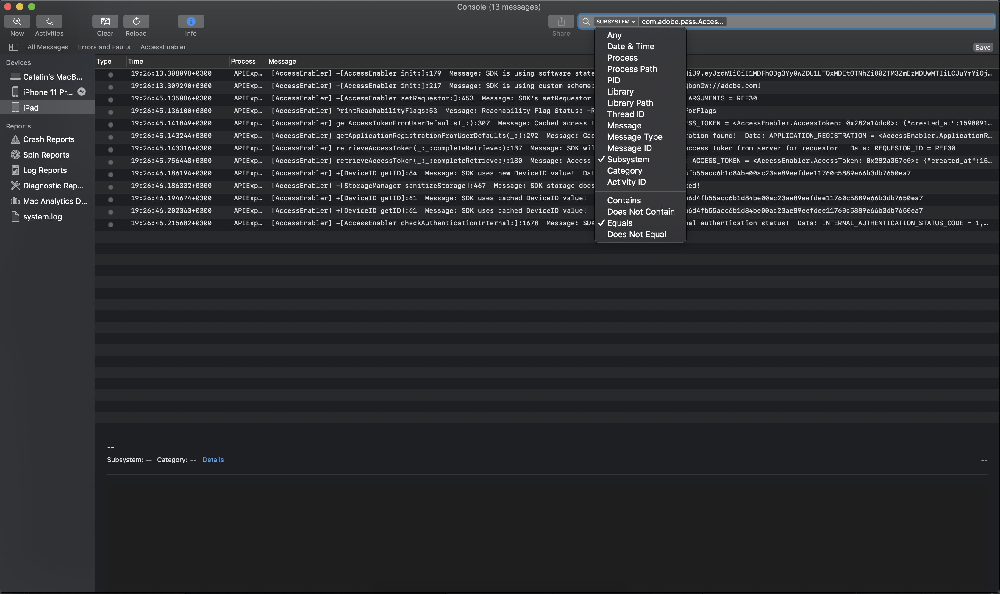

# (Legacy) Debugging des AccessEnabler iOS/tvOS SDK mithilfe der Protokolle der Konsolenanwendung {#debugging-the-accessenabler-iostvos-sdk-using-console-app-logs}

>[!NOTE]
>
>Der Inhalt dieser Seite dient nur zu Informationszwecken. Die Verwendung dieser API erfordert eine aktuelle Lizenz von Adobe. Eine unbefugte Nutzung ist nicht zulässig.

>[!IMPORTANT]
>
> Achten Sie darauf, über die neuesten Ankündigungen zu Produkten der Adobe Pass-Authentifizierung und Stilllegungszeitpläne auf der Seite [Produktankündigungen](/help/authentication/product-announcements.md) auf dem Laufenden zu bleiben.

## Überblick

In diesem Dokument sollen die Entwicklungen des iOS/tvOS SDK-Protokollierungsmechanismus von AccessEnabler erfasst und präsentiert sowie einige nützliche Details zum Debugging des AccessEnabler-Frameworks mithilfe der Protokolle der Konsolenanwendung erläutert werden.

## Status des Protokollierungsmechanismus

Der AccessEnabler iOS/tvOS-Protokollierungsmechanismus dient zum Ausgeben nützlicher Nachrichten für die Fehlerbehebung möglicher Probleme, auf die eine Anwendung, die das AccessEnabler-Framework verwendet, aufgrund dieses Problems stoßen könnte.

### AccessEnabler iOS/tvOS 3.5.0 und höher

Ab AccessEnabler iOS/tvOS 3.5.0 führt der Protokollierungsmechanismus bei Änderungen die folgenden Verbesserungen ein:

* Das AccessEnabler-Framework nutzt die von Apple empfohlene [OSLog](https://developer.apple.com/documentation/os/oslog)-Implementierung.

* Das AccessEnabler-Framework bietet die Möglichkeit, Protokolle von Konsolen-Apps basierend auf dem Subsystem zu filtern: **com.adobe.pass.AccessEnabler**. Alle von SDK ausgegebenen Nachrichten sind Teil von com.adobe.pass.AccessEnabler.

* Das AccessEnabler-Framework bietet die Möglichkeit, Protokolle von Konsolen-Apps basierend auf „Beliebig“ (Präfix) zu filtern: **[AccessEnabler]**. Allen von SDK ausgegebenen Nachrichten wird [AccessEnabler] vorangestellt.

* Das AccessEnabler-Framework bietet die Möglichkeit, die Protokolle von Konsolen-Apps nach Kategorie: **debug**, **error** in Verbindung mit einem der beiden oben genannten Kriterien zu filtern: Subsystem oder Beliebig (Präfix).

## Debugging mithilfe der Protokolle der Konsolenanwendung

Je nach den untersuchten Problemen möchten Sie möglicherweise die vom AccessEnabler-Framework ausgehenden Protokollmeldungen ein- oder ausschließen. Daher finden Sie unten einige nützliche Details, die Ihnen bei Untersuchungen und bei der Verwendung von Konsolen-App-Protokollen helfen können.

### AccessEnabler iOS/tvOS 3.5.0 und höher

#### Einschließlich {#including}

Um eine der Protokollmeldungen des AccessEnabler-Frameworks einsehen zu können, **müssen** Sie zunächst die Optionen „Include Info Messages“ und „Include Debug Messages“ im Aktionsabschnitt der Konsolenanwendung auswählen, wie in der Abbildung unten dargestellt.

Um die Funktionalität der AccessEnabler iOS/tvOS SDK zu debuggen und die AccessEnabler **Framework** Protokolle zu lesen, können Sie:

* Suchen Sie in der Konsolen-App mit **Subsystem**-Option, die dem Wert von com.adobe.pass.AccessEnabler entspricht, wie in der Abbildung unten dargestellt.

* Suchen Sie in der Konsolen-App mit **Beliebig**-Option, die Folgendes enthält
  [AccessEnabler]-Wert wie in der Abbildung unten dargestellt.

Neben den beiden oben genannten Kriterien können Sie auch die Option **Kategorie** in Verbindung mit **Subsystem** oder **Beliebig (Präfix)** verwenden, um explizit nach **debug**- oder **error**-Meldungen zu suchen, die von AccessEnabler iOS/tvOS SDK ausgegeben werden.

#### Ausschließen

Um die Funktionalität anderer Komponenten besser debuggen und die AccessEnabler **Framework-Protokolle** können Sie:

* Suchen Sie in der Konsolen-App mit **Subsystem**-Option, die nicht dem com.adobe.pass.AccessEnabler-Wert entspricht.
* Suchen Sie in der Konsolen-App mit **Beliebig**-Option, die nicht den [AccessEnabler]-Wert enthält.

## Melden eines Problems

Beachten Sie beim Melden eines Problems an die Adobe Pass-Authentifizierung die folgenden Vorschläge:

* Versuchen Sie, die Reproduktionsschritte anzugeben.
* Bitte versuchen, die Betriebssystemversionen und Gerätemodelle anzugeben, bei denen das Problem auftritt.
* Bitte geben Sie die Version des AccessEnabler iOS/tvOS SDK an, bei der das Problem auftritt.
* Versuchen Sie, alle AccessEnabler iOS/tvOS SDK-Protokollmeldungen mithilfe einer der beiden Optionen im Abschnitt [Einschließlich“ ](#including) erfassen und anzuhängen.
