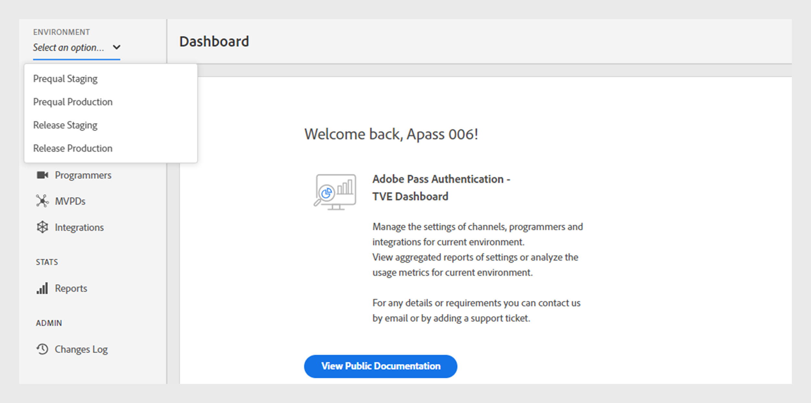

# Benutzerhandbuch für das (veraltete) Primetime TVE Dashboard {#tve-db-user-guide}

>[!NOTE]
>
>Der Inhalt dieser Seite dient nur zu Informationszwecken. Die Verwendung dieser API erfordert eine aktuelle Lizenz von Adobe. Eine unbefugte Nutzung ist nicht zulässig.

>[!IMPORTANT]
>
> Achten Sie darauf, über die neuesten Ankündigungen zu Produkten der Adobe Pass-Authentifizierung und Stilllegungszeitpläne auf der Seite [Produktankündigungen](/help/authentication/product-announcements.md) auf dem Laufenden zu bleiben.

## Einführung {#tve-db-intro}

[[!DNL Adobe] TVE Dashboard (TVE Dashboard)](https://console.auth.adobe.com/) ist ein Self-Service-Dashboard, das sich an Benutzende richtet, die für Medienunternehmen (Programmierer) arbeiten, die eine Geschäftsbeziehung mit dem Adobe Pass Authentication-Produktteam haben.

Wenden Sie sich an Ihren Technical Account Manager (TAM), um Zugriff zu erhalten. Um Zugriff zu erhalten, müssen in Ihrer Adobe Marketing Cloud-Organisation zwei neue Benutzergruppen konfiguriert werden:

* TVE Dashboard - Lesen und Schreiben - Die Mitglieder dieser Gruppe haben volle Rechte für alle bearbeitbaren Abschnitte des Dashboards
* TVE Dashboard Read-Only : Die Mitglieder dieser Gruppe haben nur Anzeigerechte für das gesamte Dashboard

Bevor Sie sich mit diesem Benutzerhandbuch vertraut machen, empfehlen wir Ihnen, die folgenden Ressourcen durchzugehen, um sich mit den vom Adobe Pass-Authentifizierungs-Produktteam bereitgestellten Abläufen und Funktionen vertraut zu machen und sich mit den in diesem Dokument verwendeten Begriffen vertraut zu machen:

* [Technisches Papier zu TVE](/help/authentication/kickstart/technical-paper.md)
* [Anleitung für Programmierer](/help/authentication/kickstart/programmer-kickstart-guide.md)
* [Berechtigungsfluss](/help/authentication/integration-guide-programmers/entitlement-flow.md)

Wenn Sie mit den nächsten Abschnitten dieses Benutzerhandbuchs fortfahren, erfahren Sie, wie Sie verschiedene Einstellungen für die Kanäle, Programmierer oder die Integrationen zwischen Kanälen und MVPDs (Multichannel Video Program Distributors) Ihres Unternehmens verwalten können.

>[!IMPORTANT]
>Das TVE Dashboard bietet die Möglichkeit, zwischen einem einfachen und einem erweiterten Workspace zu wechseln. Sie können dies tun, indem Sie das Symbol in der oberen rechten Ecke umschalten. Die Advanced Workspace richtet sich an Benutzende mit umfangreichen technischen Kenntnissen sowie fortgeschrittenen Kenntnissen der Funktionen, die das Produktteam für die Adobe Pass-Authentifizierung bietet.

*Abbildung 1: Die Dropdown-Liste „Basic / Advanced Workspace&quot; im Adobe Primetime TVE-Dashboard*

## Umgebungen {#authn-environments}

Je nach den Aufgaben, die eine Benutzerin bzw. ein Benutzer erfüllen muss, muss sie bzw. er möglicherweise zwischen Adobe Pass-Authentifizierungsumgebungen wechseln. Ausführliche Informationen zu den Adobe Pass-Authentifizierungsumgebungen finden Sie im folgenden Dokument: [Grundlagen zu den Adobe Pass-Authentifizierungsumgebungen](/help/authentication/notes-technical/environments/understanding-the-adobe-environments.md).

Das TVE-Dashboard bietet zwei Umgebungen mit den Namen Prequal (Präqualifikation) und Release, von denen jede zwei Profile mit den Namen Staging und Produktion aufweist, wie unten dargestellt:

* [Prequal-Staging](https://console-prequal.auth-staging.adobe.com/)
* [Prequal-Produktion](https://console-prequal.auth.adobe.com/)
* [Release-Staging](https://console.auth-staging.adobe.com/)
* [Release-Produktion](https://console.auth.adobe.com/)

Um zwischen Umgebungen zu wechseln, kann der Benutzer über das unten abgebildete Dropdown-Element auf die gewünschte Umgebung klicken, die durch den Eintrag repräsentiert wird:

*Abbildung 2: Dropdown-Liste &quot;Adobe Pass TVE Dashboard Environments“*

>[!IMPORTANT]
>
>Es ist sehr wichtig zu beachten, dass wir Ihnen bei administrativen Änderungen an Ihrer Adobe Pass-Authentifizierungskonfiguration über das TVE-Dashboard dringend empfehlen, die folgende Reihenfolge zu befolgen, um eine ordnungsgemäße Funktionalität sicherzustellen.

So nehmen Sie über das TVE-Dashboard administrative Änderungen an Ihrer Adobe Pass-Authentifizierungskonfiguration vor:

* Nehmen Sie die Änderungen in [Release-Staging und validieren Sie sie](http://sp.auth-staging.adobe.com/apitest/api.html) vor.
* Nehmen Sie die Änderungen in [Prequal-Produktion vor und validieren Sie sie](http://sp.auth-staging.adobe.com/apitest/api.html).
* Nehmen Sie die Änderungen in [Produktion freigeben und validieren Sie sie](http://sp.auth-staging.adobe.com/apitest/api.html) vor.

>[!IMPORTANT]
>
>Damit die administrativen Änderungen aktiviert werden können, müssen Benutzer zum Abschnitt „Änderungen überprüfen und Push-Benachrichtigungen“ navigieren, indem sie auf die Schaltfläche klicken, die unten links in der Seitenleiste angezeigt wird. So können Sie Änderungen überprüfen, eine Beschreibung für die neu erstellten Änderungen hinzufügen und die Konfigurationsaktualisierung durch Auswahl von „Push-Konfiguration“ bestätigen.

*Abbildung 3: Benachrichtigung zur Überprüfung und Push-Änderung des Adobe Primetime TVE-Dashboards*

## Abschnitte {#sections}

Benutzer, die für Medienunternehmen (Programmierer) arbeiten, können über die Seitenleiste auf die folgenden Abschnitte des TVE-Dashboards zugreifen:

* **Kanäle** - Enthält Einstellungen zu Inhaltsanbietern
* **Programmierer** - Enthält Einstellungen in Bezug auf die übergeordnete Organisation, die einen oder mehrere **aggregiert (Kanäle**
* **Integrationen** - Enthält Einstellungen zur Integration zwischen **Channels** und **MVPDs**
* **MVPDs** - Enthält Einstellungen zu den verfügbaren **MVPDs**
* **Berichte** - Enthält aggregierte Daten für drei Berichtstypen: AuthN TTL, AuthZ TTL, SSO
* **Änderungsprotokoll** - Enthält die neuesten Änderungen, die an der TVE Dashboard-Konfiguration vorgenommen wurden

*Abbildung 4: Die Abschnitte im Adobe Primetime TVE-Dashboard*

### Kanäle {#tve-db-channels-section}

Dieser Abschnitt ermöglicht die Anzeige und Bearbeitung von Einstellungen für verfügbare Kanäle oder die Erstellung eines neuen Kanals. Wenn Sie auf einen der verfügbaren Kanäle klicken, wird ein Bildschirm mit den folgenden Registerkarten angezeigt:

* **Kanaldaten**
   * **Kanal-ID** - Die eindeutige ID des Kanals, die in unserem System verwendet wird und auch als „Anforderer-ID“ bezeichnet wird.
   * **Anzeigename** - Der kommerzielle Name des Kanals.
* **Allgemeine Einstellungen**
   * **Analytics-Konfiguration** - Konfigurieren von Adobe Pass-Authentifizierungsereignissen, die an Adobe Analytics weitergeleitet werden sollen. Wenden Sie sich an Adobe, um weitere Informationen dazu zu erhalten, wie die Report Suite-ID (RSID) konfiguriert werden muss, bevor Sie diese Funktion aktivieren.
* **Zertifikate**

  Enthält die Liste der Zertifikate, die im Authentifizierungsfluss zusammen mit ihrer ausstellenden Organisation, dem Ausstellungsdatum und dem Ablaufdatum verwendet werden. Diese Zertifikate dienen als private/öffentliche Schlüssel und werden zu Validierungszwecken verwendet.
* **Domains**

  Enthält die Liste der Domains, von denen der entsprechende Kanal mit der Adobe Pass-Authentifizierung kommuniziert.
* **Integrationen**

  Enthält die Liste der Integrationen mit verfügbaren MVPDs sowie den Status der einzelnen Integrationen, die aktiviert werden können oder nicht. Die Navigation zur Seite Integration ist durch Klicken auf einen bestimmten Eintrag verfügbar.
* **Registrierte Anwendungen**

  Enthält die Liste der Anwendungsregistrierungen. Weitere Informationen finden Sie im Dokument [Verwaltung der dynamischen Client-Registrierung](/help/authentication/integration-guide-programmers/rest-apis/rest-api-dcr/dynamic-client-registration-overview.md#dynamic-client-registration-management).

* **Benutzerdefinierte Schemata**

  Enthält die Liste der benutzerdefinierten Schemata. Weitere Informationen finden Sie unter [Registrierung von iOS-/tvOS-](/help/authentication/integration-guide-programmers/legacy/sdks/ios-tvos-sdk/iostvos-application-registration.md) und [Verwaltung der dynamischen Client-Registrierung](/help/authentication/integration-guide-programmers/rest-apis/rest-api-dcr/dynamic-client-registration-overview.md#dynamic-client-registration-management)

#### Hinzufügen/Löschen von Domains {#add-delete-domains}

Um das Hinzufügen einer neuen Domain für den ausgewählten Kanal zu starten, klicken Sie auf die Schaltfläche „Neue Domain hinzufügen“ unter der Liste „Domains“. Dadurch wird ein neuer Domain-Eintrag erstellt, in dem Sie den Domain-Namen angeben können. Wenn in der Liste der Domains bereits eine allgemeinere Domain vorhanden ist, sollte keine neue Subdomain hinzugefügt werden.

*Abbildung: Registerkarte „Domains“ in Kanälen*

#### Erstellen einer registrierten Anwendung auf Kanalebene {#create-registered-application-channel-level}

Um eine registrierte Anwendung auf Kanalebene zu erstellen, navigieren Sie zum Menü „Kanäle“ und wählen Sie die Anwendung aus, für die Sie eine Anwendung erstellen möchten. Klicken Sie dann nach der Navigation zur Registerkarte „Registrierte Anwendungen“ auf die Schaltfläche „Neue Anwendung hinzufügen“.

Wie in der Abbildung unten dargestellt, sollten Sie die folgenden Felder ausfüllen:

* **Anwendungsname** - der Name der Anwendung

* **Dem Kanal zugewiesen** - Wie unten gezeigt, unterscheidet sich hier etwas von der Aktion, die auf Programmiererebene ausgeführt wird, durch das Dropdown-Menü „Zugewiesene Kanäle“, das nicht aktiviert ist. Daher gibt es keine Option, die registrierte Anwendung an einen anderen als den aktuellen Kanal zu binden.

* **Anwendungsversion** - Standardmäßig ist dies „1.0.0“, aber wir empfehlen Ihnen dringend, es mit Ihrer eigenen Anwendungsversion zu ändern. Wenn Sie sich entscheiden, die Version Ihres Programms zu ändern, empfiehlt es sich, diese zu übernehmen, indem Sie ein neues registriertes Programm dafür erstellen.

* **Anwendungsplattformen** - die Plattformen für die Anwendung, mit denen verknüpft werden soll. Sie haben die Möglichkeit, alle oder mehrere Werte auszuwählen.

* **Domain-Namen** - die Domains für das Programm, mit denen verknüpft werden soll. Die Domains in der Dropdown-Liste sind eine einheitliche Auswahl aller Domains aus allen Kanälen. Sie haben die Möglichkeit, mehrere Domains aus der Liste auszuwählen. Die Bedeutung der Domains ist Umleitungs-URLs [RFC6749](https://tools.ietf.org/html/rfc6749). Im Rahmen des Client-Registrierungsprozesses kann die Client-Anwendung beantragen, dass ihr die Verwendung einer Umleitungs-URL für die Fertigstellung des Authentifizierungsflusses erlaubt wird. Wenn eine Client-Anwendung eine bestimmte Umleitungs-URL anfordert, wird sie anhand der Domains validiert, die in dieser registrierten Anwendung aufgelistet sind, die mit der Software-Anweisung verknüpft ist.

Nachdem Sie die Felder mit den entsprechenden Werten ausgefüllt haben, müssen Sie auf „Fertig“ klicken, damit die Anwendung in der Konfiguration gespeichert wird.

Beachten Sie, dass es **keine Option zum Ändern einer bereits erstellten Anwendung** gibt. Falls festgestellt wird, dass ein erstelltes Programm die Anforderungen nicht mehr erfüllt, muss ein neues registriertes Programm erstellt und mit dem Client-Programm verwendet werden, dessen Anforderungen es erfüllt.

##### Software-Erklärung herunterladen {#download-software-statement-channel-level}

Durch Anklicken des Buttons „Download“ in dem Listeneintrag, für den ein Software-Statement benötigt wird, wird eine Textdatei erzeugt. Diese Datei enthält etwas Ähnliches wie die folgende Beispielausgabe.

Der Name der Datei wird eindeutig identifiziert, indem er mit dem Präfix „software_statement“ versehen und den aktuellen Zeitstempel hinzugefügt wird.

Bitte beachten Sie, dass für dieselbe registrierte Anwendung bei jedem Klick auf den Download-Button unterschiedliche Software-Anweisungen eingehen, die zuvor für diese Anwendung erhaltenen Software-Anweisungen jedoch nicht ungültig machen. Dies geschieht, weil sie pro Aktionsanfrage vor Ort generiert werden.

Es gibt eine **Einschränkung** bezüglich der Download-Aktion. Wenn Sie nach einem Software-Statement fragen, indem Sie kurz nach der Erstellung der registrierten Anwendung auf die Schaltfläche „Download“ klicken, und diese noch nicht gespeichert wurde und die Konfigurations-JSON nicht synchronisiert wurde, erscheint unten auf der Seite die folgende Fehlermeldung.

Dies umschließt einen HTTP-Fehler-Code 404 Nicht gefunden , der von Core empfangen wurde, da die ID der registrierten Anwendung noch nicht weitergegeben wurde und der Core davon keine Kenntnis hat.

Die Lösung besteht darin, nach dem Erstellen der registrierten Anwendung maximal 2 Minuten zu warten, bis die Konfiguration synchronisiert wird. Danach wird die Fehlermeldung nicht mehr empfangen und die Textdatei mit der Software-Anweisung steht zum Download bereit.

### Programmierer {#tve-db-programmers-section}

In diesem Abschnitt können Sie die Einstellungen für verfügbare Programmierer anzeigen und bearbeiten oder einen neuen erstellen. Durch Klicken auf einen der verfügbaren Programmierer wird ein Bildschirm mit den folgenden Registerkarten angezeigt:

* **Programmiererdaten**
   * **Programmierer-**: Die eindeutige ID des Programmierers, die in unserem System verwendet wird.
   * **Anzeigename** - Der kommerzielle Name des Programmierers.
   * **Logo URL** - Die URL (Uniform Resource Locator) für das kommerzielle Logo des Programmierers.
   * **Logo-Vorschau** - Die Vorschau des kommerziellen Logos des Programmierers durch Herunterladen vom obigen URL (Uniform Resource Locator).

* **Zertifikate**

  Enthält die Liste der Zertifikate, die im Authentifizierungsfluss zusammen mit ihrer ausstellenden Organisation, dem Ausstellungsdatum und dem Ablaufdatum verwendet werden. Diese Zertifikate dienen als private/öffentliche Schlüssel und werden zu Validierungszwecken verwendet.

* **Kanäle**

  Enthält die Liste der Kanäle, die zu diesem spezifischen Programmierer gehören. Die Navigation zum Abschnitt Kanäle ist durch Klicken auf einen bestimmten Eintrag verfügbar.

* **Registrierte Anwendungen**

  Enthält die Liste der Anwendungsregistrierungen. Weitere Informationen finden Sie unter [Verwaltung der dynamischen Client-Registrierung](/help/authentication/integration-guide-programmers/rest-apis/rest-api-dcr/dynamic-client-registration-overview.md#dynamic-client-registration-management).

* **Benutzerdefinierte Schemata**

  Enthält die Liste der benutzerdefinierten Schemata. Weitere Informationen finden Sie unter [Registrierung von iOS-/tvOS-Anwendungen](/help/authentication/integration-guide-programmers/legacy/sdks/ios-tvos-sdk/iostvos-application-registration.md).

#### Erstellen einer registrierten Anwendung auf Programmiererebene {#create-registered-application-programmer-level}

Wechseln Sie **Registerkarte** Programmierer **> Registrierte Anwendungen** .

Klicken Sie auf der Registerkarte Registrierte Anwendungen auf **Neue Anwendung hinzufügen**. Füllen Sie im neuen Fenster die erforderlichen Felder aus.

Wie in der Abbildung unten dargestellt, sollten Sie die folgenden Felder ausfüllen:

* **Anwendungsname** - der Name der Anwendung

* **Dem Kanal zugewiesen** - Der Name Ihres Kanals, mit  diese Anwendung verknüpft ist. Die Standardeinstellung in der Dropdown-Maske ist &quot;**Kanäle“.** In der Benutzeroberfläche können Sie entweder einen Kanal oder alle Kanäle auswählen.

* **Anwendungsversion** - Standardmäßig ist dies „1.0.0“, aber wir empfehlen Ihnen dringend, es mit Ihrer eigenen Anwendungsversion zu ändern. Wenn Sie sich entscheiden, die Version Ihres Programms zu ändern, empfiehlt es sich, diese zu übernehmen, indem Sie ein neues registriertes Programm dafür erstellen.

* **Anwendungsplattformen** - die Plattformen für die Anwendung, mit denen verknüpft werden soll. Sie haben die Möglichkeit, alle oder mehrere Werte auszuwählen.

* **Domain-Namen** - die Domains für das Programm, mit denen verknüpft werden soll. Die Domains in der Dropdown-Liste sind eine einheitliche Auswahl aller Domains aus allen Kanälen. Sie haben die Möglichkeit, mehrere Domains aus der Liste auszuwählen. Die Bedeutung der Domains ist Umleitungs-URLs [RFC6749](https://tools.ietf.org/html/rfc6749). Im Rahmen des Client-Registrierungsprozesses kann die Client-Anwendung beantragen, dass ihr die Verwendung einer Umleitungs-URL für die Fertigstellung des Authentifizierungsflusses erlaubt wird. Wenn eine Client-Anwendung eine bestimmte Umleitungs-URL anfordert, wird sie anhand der Domains validiert, die in dieser registrierten Anwendung aufgelistet sind, die mit der Software-Anweisung verknüpft ist.

Nachdem Sie die Felder mit den entsprechenden Werten ausgefüllt haben, müssen Sie auf „Fertig“ klicken, damit die Anwendung in der Konfiguration gespeichert wird.

Beachten Sie, dass es **keine Option zum Ändern einer bereits erstellten Anwendung** gibt. Falls festgestellt wird, dass ein erstelltes Programm die Anforderungen nicht mehr erfüllt, muss ein neues registriertes Programm erstellt und mit dem Client-Programm verwendet werden, dessen Anforderungen es erfüllt.

##### Software-Erklärung herunterladen {#download-software-statement-programmer-level}

Durch Anklicken des Buttons „Download“ in dem Listeneintrag, für den ein Software-Statement benötigt wird, wird eine Textdatei erzeugt. Diese Datei enthält etwas Ähnliches wie die folgende Beispielausgabe.

Der Name der Datei wird eindeutig identifiziert, indem er mit dem Präfix „software_statement“ versehen und den aktuellen Zeitstempel hinzugefügt wird.

Bitte beachten Sie, dass für dieselbe registrierte Anwendung bei jedem Klick auf den Download-Button unterschiedliche Software-Anweisungen eingehen, die zuvor für diese Anwendung erhaltenen Software-Anweisungen jedoch nicht ungültig machen. Dies geschieht, weil sie pro Aktionsanfrage vor Ort generiert werden.

Es gibt eine **Einschränkung** bezüglich der Download-Aktion. Wenn Sie nach einem Software-Statement gefragt werden, indem Sie kurz nach der Erstellung der registrierten Anwendung auf die Schaltfläche „Download“ klicken und diese noch nicht gespeichert wurde und die Konfigurations-JSON nicht synchronisiert wurde, wird die folgende Fehlermeldung am unteren Rand der Seite angezeigt.

Dies umschließt einen HTTP-Fehler-Code 404 Nicht gefunden , der von Core empfangen wurde, da die ID der registrierten Anwendung noch nicht weitergegeben wurde und der Core davon keine Kenntnis hat.

Die Lösung besteht darin, nach dem Erstellen der registrierten Anwendung maximal 2 Minuten zu warten, bis die Konfiguration synchronisiert wird. Danach wird die Fehlermeldung nicht mehr empfangen und die Textdatei mit der Software-Anweisung steht zum Download bereit.

### Integrationen {#tve-db-integrations-sec}

Dieser Abschnitt ermöglicht die Anzeige und Bearbeitung von Einstellungen für Integrationen zwischen Kanälen und verfügbaren MVPDs oder die Erstellung eines neuen. Wenn Sie auf eine der verfügbaren Integrationen klicken, wird bei Verwendung der einfachen Workspace eine einzelne Seite oder bei Verwendung der erweiterten Workspace ein Bildschirm mit den folgenden Registerkarten angezeigt:

* **Integrationsdaten**
   * **Integrations-ID** - Das Ergebnis des Anhängen der eindeutigen MVPDs-ID an die eindeutige ID des Kanals, getrennt durch das Zeichen „_“.
   * **Kanalanzeigename** - Der kommerzielle Name des Kanals.
   * **Kanal-ID** - Die eindeutige ID des Kanals, die in unserem System verwendet wird und auch als „Anforderer-ID“ bezeichnet wird.
   * **MVPD-Anzeigename** - Der kommerzielle Name von MVPD.
   * **MVPD ID** - Die eindeutige ID von MVPD, die in unserem System verwendet wird.
* **Allgemeine Einstellungen**
   * **Benutzermetadatenschlüssel** - Konfigurieren der Metadatenschlüssel, die für die spezifische Integration verfügbar sind.
   * **Plattformspezifische Einstellungen** - Konfigurieren verschiedener Einstellungen für eine bestimmte Plattform (z. B. TTLs, SSO und IFrames).

* **Authentifizierungseinstellungen**
   * Enthält Einstellungen im Zusammenhang mit der Adobe Pass-Authentifizierungsfunktion.
* **Autorisierungseinstellungen**
   * Enthält Einstellungen im Zusammenhang mit der Adobe Pass-Authentifizierungsautorisierungsfunktion.
* **Abmeldeeinstellungen**
   * Enthält Einstellungen für die Abmeldefunktion der Adobe Pass-Authentifizierung.

#### Integration erstellen {#create-integration}

Gehen Sie wie folgt vor, um eine neue Integration zu erstellen:

* Klicken Sie auf die Schaltfläche „Neue Integration hinzufügen“
* Suchen und Auswählen eines Kanals
* MVPD suchen und auswählen
* Warten Sie, bis das TVE-Dashboard die „Integrations-ID“ berechnet und die verfügbaren MVPD-Endpunkte angezeigt hat
* Authentifizierungs-, Autorisierungs- und Abmeldeendpunkte auswählen oder die Standardwerte verwenden
* Klicken Sie auf die Schaltfläche „Integration erstellen“
* Abhängig von den MVPD-Einstellungen kann ein Popup angezeigt werden, in dem Sie nach zusätzlichen Eigenschaften gefragt werden. Diese sollten zuvor von der MVPD bereitgestellt worden sein. Andernfalls erfolgt eine Umleitung zur neu erstellten Integrationsseite

*Abbildung 5. Fenster „Neue Integration“ im Adobe Primetime TVE-Dashboard*

#### Integration aktualisieren {#update-integration}

Um eine vorhandene Integration zu aktualisieren, klicken Sie im Abschnitt Integrationen oder im Abschnitt Kanäle , der die Registerkarte Integrationen enthält, auf den Tabelleneintrag für diese bestimmte Integration.

Wenn Sie den Workspace-Standardmodus verwenden, können Sie in diesem Abschnitt die am häufigsten aktualisierten Einstellungen wie Authentifizierungs- und Autorisierungs-Token-TTLs (Time-to-Live) sowie iFrame-Einstellungen anzeigen und bearbeiten. Bitte beachten Sie, dass bei Integrationen mit MVPDs, die dynamisch definierte Token-Persistenz-TTL unterstützen, möglicherweise TTL-Einstellungen fehlen (siehe Eintrag 1.19 unter [MVPD-Integrationsanforderungen](/help/authentication/integration-guide-mvpds/mvpd-integr-features.md)).

Wenn Sie den erweiterten Workspace-Modus verwenden, können Sie in diesem Abschnitt weniger gängige Einstellungen anzeigen und bearbeiten.

Im Falle des Workspace-Modus „Einfach“ und „Erweitert“ können diese Einstellungen auf Plattformebene geändert werden (z. B. kann ein benutzerdefinierter Wert für das Autorisierungs-TTL-Token auf Android ausgewählt werden, der auf jeder anderen Plattform standardmäßig eingestellt ist).

>[!IMPORTANT]
>Es ist wichtig, die Einstellungen zur Vererbungskette zu verstehen: MVPD -> MVPD-Endpunkt -> Integration -> Platform , wobei Platform den spezifischsten Wert und MVPD den generischsten Standardwert hat.

*Abbildung 6. Die Adobe Primetime TVE Dashboard Property Inheritance Chain-Komponente*

#### Plattformspezifische Einstellungen {#platform-sp-settings}

Dieser Unterabschnitt kann verwendet werden, um die Einstellungen für bestimmte Plattformen zu überschreiben. Die verfügbaren Plattformen sind:

* **Alle Plattformen** - Legen Sie Werte fest, die unabhängig von den Programmierimplementierungen auf alle Plattformen angewendet werden, falls keine anderen Werte für eine bestimmte Plattform festgelegt sind.
* **Android** - Legen Sie Werte fest, die über Adobe Pass Authentication Android SDK auf die Programmiererimplementierungen angewendet werden.
* **Clientless REST API** - Legen Sie Werte fest, die über die Adobe Pass-Authentifizierungs-REST-API auf die Programmier-Implementierungen angewendet werden.
* **Fire TV** - Legen Sie Werte fest, die über die Adobe Pass-Authentifizierung FireTV SDK auf die Programmiererimplementierungen angewendet werden.
* **Flash SDK** - Diese Plattform ist veraltet. **veraltet**
* **JavaScript SDK** - Legen Sie Werte fest, die über Adobe Pass Authentication JavaScript SDK auf die Programmiererimplementierungen angewendet werden.
* **Roku** - Legen Sie Werte fest, die über die Adobe Pass-Authentifizierungs-REST-API auf die Programmiererimplementierungen angewendet werden und „Roku“ als Gerätetyp senden. Dies hat im Fall von Roku-Geräten Vorrang vor den Werten, die für die Client-lose REST-API-Plattform festgelegt wurden.
* **Xbox native SDK** - Diese Plattform ist veraltet. **veraltet**
* **Xbox 360 REST API** - Legen Sie Werte fest, die über die Adobe Pass Authentication REST API auf die Programmierimplementierungen angewendet werden und die „xbox“ als Gerätetyp senden. Dies hat im Falle von Xbox 360-Geräten Vorrang vor den Werten, die für die Client-lose REST-API-Plattform festgelegt wurden.
* **Xbox One REST API** - Legen Sie Werte fest, die über die Adobe Pass-Authentifizierungs-REST-API auf die Programmiererimplementierungen angewendet werden und „xboxOne“ als Gerätetyp senden. Dies hat im Falle von XboxOne-Geräten Vorrang vor den Werten, die für die Client-lose REST-API-Plattform festgelegt wurden.
* **iOS** - Legen Sie Werte fest, die über Adobe Pass Authentication iOS SDK auf die Programmiererimplementierungen angewendet werden.
* **tvOS** - Legen Sie Werte fest, die über Adobe Pass Authentication tvOS SDK auf die Programmiererimplementierungen angewendet werden.

*Abbildung 7. Plattformspezifische Einstellungen für das Adobe Primetime TVE-Dashboard*

#### Platform Single Sign-On aktivieren {#enable-platform-sso}

Gehen Sie wie folgt vor, um Single Sign-On für eine bestimmte Integration und Plattform zu aktivieren/deaktivieren:

* Stellen Sie sicher, dass Sie den erweiterten Workspace-Modus verwenden
* Zur gewünschten Integration navigieren
* Navigieren Sie zur Registerkarte **Allgemeine Einstellungen** .
* Wählen Sie die gewünschte Plattform aus, auf der Sie Single Sign-On aktivieren oder deaktivieren möchten
* Markieren Sie **Enable Single Sign On** auf den gewünschten Wert (Yes/No)

  >[!IMPORTANT]
  >Beachten Sie, dass das Flag **Single Sign-On aktivieren** nur für iOS-, tvOS-, Roku- und FireTV-Plattformen verfügbar ist und nur für Integrationen mit MVPDs, die Single Sign-On für diese Plattformen unterstützen.

* Schalten Sie die **Platform-Berechtigung erzwingen** auf den gewünschten Wert (Ja/Nein)

  >[!IMPORTANT]
  >Beachten Sie, dass das Flag **Platform-Berechtigung erzwingen** steuert, ob die Entscheidung des Benutzers, Plattformzugriff auf sein TV-Provider-Abonnement zu erlauben oder zu verweigern, erzwungen wird oder nicht. In Anbetracht des Szenarios, in dem das Flag **Single Sign On aktivieren** auf „Ja“ gesetzt ist, das Flag **Plattformberechtigung erzwingen** ebenfalls auf „Ja“ gesetzt ist und der Benutzer den Plattformzugriff auf sein TV-Provider-Abonnement verweigern möchte, kann die entsprechende Anwendung (der Kanal) das von einer anderen Anwendung (dem Kanal) erhaltene Adobe Pass-Authentifizierungstoken nicht verwenden.

#### Aktivieren der Home-Based-Authentifizierung {#enable-hba}

Führen Sie zum Aktivieren/Deaktivieren der Home-Base-Authentifizierung für **OAuth2**-basierte MVPDs die folgenden Schritte aus:

* Stellen Sie sicher, dass Sie den erweiterten Workspace-Modus verwenden
* Zur gewünschten Integration navigieren
* Navigieren Sie zur **Authentifizierungseinstellungen** .
* Navigieren Sie zur Unterregisterkarte **Dynamische Regeln** AuthN) .
* Markierung **HBA versuchen** auf den gewünschten Wert (Ja/Nein) umschalten

>[!IMPORTANT]
>Bitte beachten Sie, dass der Wert „HBA AuthN TTL“ niemals überschrieben werden sollte, da sonst der Autorisierungsfluss unerwartet fehlschlagen könnte.

Wenden Sie sich an **tve-support@adobe.com**, um Informationen zur Aktivierung der Home-Base-Authentifizierung für SAML-basierte MVPDs zu erhalten.

### MVPD {#tve-db-mvpds-sec}

Dieser Abschnitt ermöglicht die Anzeige von Einstellungen für verfügbare MVPDs. Wenn Sie auf eines der verfügbaren MVPDs klicken, wird ein Bildschirm mit den folgenden Registerkarten angezeigt:

* **MVPD-Daten**
   * **MVPD ID** - Die eindeutige ID von MVPD, die in unserem System verwendet wird.
   * **Anzeigename** - Der kommerzielle Name der MVPD, der bei der Benutzerauswahl verwendet werden kann.
   * **Logo URL** - Die URL (Uniform Resource Locator) für kommerzielle Logos von MVPD.
   * **Logo-Vorschau** - Die Vorschau des kommerziellen Logos von MVPD durch Herunterladen vom obigen URL (Uniform Resource Locator).
* **Allgemeine Einstellungen**
   * **Benutzer-Metadatenschlüssel**
      * Für die jeweilige MVPD verfügbare Metadatenschlüssel.
   * **Client-Dateneigenschaften**
      * **Auth/Aggregator** - Ist hierfür „Ja“ festgelegt, wird für jeden neuen Kanal, auf den der Benutzer zugreifen möchte, ein neues Authentifizierungs-Token benötigt.
      * **Passive AuthN aktiviert** - Wenn das Auth-/Aggregator-Flag auf „Ja“ gesetzt ist und „Passive AuthN aktiviert“ auf „Ja“ gesetzt ist, erfolgt der Authentifizierungsprozess mit einem anderen Kanal im Hintergrund, ohne dass eine vollständige Browser-Umleitung erforderlich ist und die Auswahl angezeigt wird.
      * **Auth/Browser-Sitzung** - Wenn auf „Ja“ gesetzt, wird der Benutzer abgemeldet, nachdem der Browser geschlossen wurde. Wenn dies auf „Nein“ festgelegt ist, kann der Benutzer den Browser neu starten und angemeldet bleiben.
      * **IFrame Erforderlich** - Wenn Sie dies auf „Ja“ setzen, bedeutet dies, dass das MVPD-Anmeldefenster einen iFrame erfordert. Die Felder „iFrame-Breite“ und „iFrame-Höhe“ stellen die Größe dar, die für das Laden des iFrames auf der MVPD-Anmeldeseite erforderlich ist.
* **Authentifizierungseinstellungen**
   * **Endpunkt auswählen**
      * Dieses Feld gibt den/die Authentifizierungsendpunkt(e) an, der/die von der MVPD bereitgestellt wird/werden. Der Endpunkt kann je nach verwendetem Authentifizierungsprotokoll unterschiedlich sein.
   * **AuthN - Allgemeine Einstellungen**
      * Diese Unterregisterkarte zeigt das von MVPD verwendete Authentifizierungsprotokoll und protokollbezogene Informationen an.
   * **AuthN-Zertifikate**
      * Auf dieser Unterregisterkarte werden die Zertifikate angezeigt, die MVPD im Authentifizierungsfluss verwendet, zusammen mit der Organisation des Zertifikatausstellers, dem Ausstellungsdatum und dem Ablaufdatum. Diese Zertifikate dienen als private/öffentliche Schlüssel und werden zu Validierungszwecken verwendet.
   * **Dynamische AuthN-Regeln**
      * Diese Unterregisterkarte zeigt die Regeln an, die für den Authentifizierungsprozess gelten. Wenn Sie auf Anfrage/Antwort/Token des Diagramms klicken, werden die Parameter angezeigt, die auf diesen Teil des Authentifizierungsflusses angewendet wurden.
* **Autorisierungseinstellungen**
   * **Endpunkt auswählen**
      * Dieses Feld gibt den Autorisierungsendpunkt an, der von der MVPD bereitgestellt wird. Der Endpunkt kann je nach verwendetem Autorisierungsprotokoll unterschiedlich sein. Die verfügbaren Autorisierungsprotokolle sind SOAP, REST (für Client-lose Geräte), SAML, XACML und OAUTH.
   * **AuthZ - Allgemeine Einstellungen**
      * Auf dieser Unterregisterkarte werden das von MVPD verwendete Autorisierungsprotokoll und protokollbezogene Informationen angezeigt.
      * **Preflight-Konfiguration**
         * Sie beschreibt die Anzahl der Ressourcen, die von einem MVPD in einem einzigen Aufruf vorab autorisiert werden können, das verwendete PreFlight-Modell sowie den Timeout-Schwellenwert. Gelegentlich kann die Anzahl der Ressourcen für eine bestimmte Integration unterschiedlich sein. Dies kann durch Bearbeiten der Eigenschaft &quot;**Max. Anzahl von Preflight-Ressourcen**&quot; auf der Registerkarte „Allgemeine Einstellungen“ verwaltet werden. Diese Eigenschaft ist nur für eine bestimmte Integration verfügbar und wird, wenn sie festgelegt ist, anstelle des in Autorisierungseinstellungen -> PreFlight-Konfiguration -> PreFlight Max-Ressourcen definierten Werts verwendet.
      * **DOS-**
         * Es beschreibt den Denial-of-Service-Schutz auf dem MVPD-Autorisierungsendpunkt. Eine genaue Beschreibung der einzelnen Felder finden Sie in den QuickInfos, indem Sie den Mauszeiger über die DOS-Schutzfelder bewegen.
      * Wenn es sich bei der MVPD um **TempPass** handelt, enthält **AuthZ Allgemeine Einstellungen** auch Informationen zur TempPass-Dauer.
      * Wenn es sich bei der MVPD um **FlexibleTempPass** handelt, enthält **AuthZ Allgemeine Einstellungen** auch Informationen zur TempPass-Dauer, zur maximalen Anzahl von Ressourcen und zum Identifizierungsfeld (siehe Abbildung unten).
   * **AuthZ-Zertifikate**
      * Auf dieser Unterregisterkarte werden die Zertifikate angezeigt, die MVPD im Autorisierungsfluss verwendet, zusammen mit der Organisation des Zertifikatausstellers, dem Ausstellungsdatum und dem Ablaufdatum. Diese Zertifikate dienen als private/öffentliche Schlüssel und werden zu Validierungszwecken verwendet.
   * **Dynamische AuthZ-Regeln**
      * Auf dieser Unterregisterkarte werden die Regeln angezeigt, die für den Autorisierungsprozess gelten. Wenn Sie auf die Schaltfläche **Anfrage/Antwort/Token** des Diagramms klicken, werden die Parameter angezeigt, die auf diesen Teil des Autorisierungsflusses angewendet wurden.
* **Abmeldeeinstellungen**
   * **Endpunkt auswählen**
      * Dieses Feld gibt den Abmeldeendpunkt an, der von der MVPD bereitgestellt wird. Die bereitgestellten Protokolle können entweder SAML oder OAuth2 sein.
      * **Allgemeine Abmeldeeinstellungen**
         * Auf dieser Unterregisterkarte werden das von MVPD verwendete Abmeldeprotokoll und protokollbezogene Informationen angezeigt.
         * **Abmeldeantwort signiert verlangen** - Wenn auf „Ja“ gesetzt, muss die Antwort von einem vertrauenswürdigen Zertifikat signiert werden.
      * **Abmeldezertifikate**
         * Auf dieser Unterregisterkarte werden die Zertifikate angezeigt, die MVPD im Abmeldefluss verwendet, zusammen mit der Organisation des Zertifikatausstellers, dem Ausstellungsdatum und dem Ablaufdatum. Diese Zertifikate dienen als private/öffentliche Schlüssel und werden zu Validierungszwecken verwendet.
      * **Dynamische Regeln für das Abmelden**
         * Auf dieser Unterregisterkarte werden die Regeln angezeigt, die für den Abmeldevorgang gelten. Wenn Sie auf die Schaltfläche **Anfrage/Antwort/Token** des Diagramms klicken, werden die Parameter angezeigt, die auf diesen Teil des Abmeldevorgangs angewendet wurden.

### Berichte {#tve-db-reports-sec}

Um zu diesem Abschnitt zu navigieren, klicken Sie im Menü „Dashboard-[&quot; auf &quot;](#sections)&quot;. Dadurch wird zu einem Bildschirm mit drei Registerkarten navigiert, die in den folgenden Unterabschnitten detailliert dargestellt werden: [AuthN TTL-Berichte](#authn-ttl-reports), [AuthZ TTL-Berichte](#authz-ttl-reports), [SSO-Berichte](#sso-reports).

Dieser Abschnitt ermöglicht das Anzeigen und Exportieren aggregierter Daten für verschiedene Berichtstypen für Ihre Kanal-/Kanalintegration/-integrationen mit verschiedenen MVPDs über alle Plattformen hinweg.

#### Plattformen {#report-platforms}

Alle Berichte aggregieren Werte über die folgenden Plattformen:

**BROWSER**
Zeigt Werte an, die über die Adobe Pass-Authentifizierung von JavaScript SDK auf die Programmiererimplementierungen angewendet werden.

**MOBIL: IOS**
Zeigt Werte an, die über die Adobe Pass-Authentifizierung von iOS SDK auf die Programmiererimplementierungen angewendet werden.

**MOBIL: ANDROID**
Zeigt Werte an, die über die Adobe Pass-Authentifizierung von Android SDK auf die Programmiererimplementierungen angewendet werden.

**MOBILE: SONSTIGE**
Zeigt Werte an, die über die für Mobilgeräte entwickelte Adobe Pass-Authentifizierungs-REST-API auf die Programmiererimplementierungen angewendet werden.

**TVCD: ROKU**
Zeigt Werte an, die über die Adobe Pass-Authentifizierungs-REST-API auf die Programmier-Implementierungen angewendet werden und die „Roku“ als Gerätetyp senden.

**TVCD: FIRETV**
Zeigt Werte an, die über Adobe Pass Authentication FireTV SDK auf die Programmiererimplementierungen angewendet werden.

**TVCD: APPLETV**
Zeigt Werte an, die über Adobe Pass Authentication tvOS SDK auf die Programmiererimplementierungen angewendet werden.

**TVCD: SONSTIGE**
Zeigt Werte an, die über die für TV-verbundene Geräte entwickelte Adobe Pass Authentication REST-API auf die Programmier-Implementierungen angewendet werden.

**PLATTFORM: UNBEKANNT**
Zeigt Werte an, die auf die Programmierimplementierungen angewendet werden, für die Adobe Pass-Authentifizierungsdienste einen unbekannten Gerätetyp erkennen.

Lesen Sie den Mechanismus der [Übergabe von Client](/help/authentication/integration-guide-programmers/legacy/client-information/passing-client-information-device-connection-and-application.md)Informationen an REST-APIs oder SDKs für die Adobe Pass-Authentifizierung, um weitere Informationen zum Senden des gewünschten Gerätetyps (z. B. „Roku„) zu erhalten.

Alle Berichte aggregieren Werte, die auf der Grundlage der für jede Adobe Pass-Authentifizierungsumgebung spezifischen Konfiguration berechnet werden. Daher können beim Wechsel zwischen verschiedenen TVE-Dashboard-Umgebungen unterschiedliche Berichtsdaten erwartet werden.

Lesen Sie den Abschnitt [Umgebungen](#authn-environments) für weitere Details zu den für die Adobe Pass-Authentifizierung verfügbaren Umgebungen.

##### Auswählen bestimmter Kanäle/MVPDs {#selecting-specific-channels-mvpds}

Alle Berichte ermöglichen die Verwendung von Filtern durch Auswahl bestimmter Kanäle oder bestimmter MVPDs, die in die resultierenden Berichte aufgenommen werden sollen.

Um einen oder mehrere Kanäle auszuwählen, verwenden Sie die **Dropdown-Liste** die hinter der Beschriftung „Kanäle für Bericht ausgewählt“ steht. Siehe Abbildung 8./9./10. Bilder von unten.

Um ein oder mehrere MVPD(s) auszuwählen, verwenden Sie die **Dropdown-Liste** die hinter der Beschriftung „Für Bericht ausgewählte MVPDs“ steht. Siehe Abbildung 8./9./10. Bilder von unten.

Standardmäßig werden die Daten über alle Kanäle Ihres Unternehmens („Alle Kanäle„) und die MVPDs, mit denen sie integriert sind („Alle MVPDs„), aggregiert.

Falls Sie die Auswahl von „Alle Kanäle“ oder „Alle MVPDs“ aufheben möchten, ohne bestimmte Optionen auszuwählen, zeigt die Benutzeroberfläche den Platzhalter „Keine Daten verfügbar“ an.

##### Bericht exportieren {#export-report}

Alle Berichte ermöglichen den Export von Daten in einer CSV-Datei (kommagetrennte Werte).

Um Daten zu exportieren, verwenden Sie bitte die Schaltfläche „Bericht exportieren“ in der rechten oberen Ecke des Fensters. Siehe Abbildung 8./9./10. Bilder von unten.

Eine Datei mit dem Namen **Report.csv** wird automatisch auf Ihren Computer heruntergeladen. Stellen Sie daher sicher, dass die Einstellungen Ihres Browsers das Herunterladen von Dateien erlauben.

Das Ladesymbol „Daten exportieren“ wird auf dem Bildschirm angezeigt, während die Datei Report.csv berechnet wird, was je nach der Größe der zu exportierenden Daten **bis zu ein paar** dauern kann.

#### AuthN-TTL-Berichte (#authn-ttl-reports)

Dieser Bericht zeigt die Time-to-Live (TTL) des Authentifizierungstokens an, das für Ihre Kanal-/Kanalintegration(en) mit verschiedenen MVPDs auf allen Plattformen konfiguriert ist.

Das Authentifizierungstoken Time-to-Live, das auch als **AuthN TTL** bezeichnet wird, wird in für Menschen lesbaren Werten angezeigt, wie **Tage, Stunden, Minuten, Sekunden**.

Im Hinblick auf das Benutzererlebnis können Sie mit den AuthN-TTL-Berichten die Zeit visuell überprüfen, die eine Benutzerin oder ein Benutzer unter Berücksichtigung einer bestimmten MVPD und einer bestimmten Plattform authentifiziert wird.

Um zu diesem Berichtstyp zu navigieren, klicken Sie im Abschnitt „Berichte“ auf die Registerkarte „AuthNt TTL-Berichte“.

*Abbildung 8: Registerkarte „AuthN TTL-Bericht“ im Adobe Primetime TVE-Dashboard*

Die Tabelle AuthN TTL-Berichte enthält Seiten und kann je nach Bildschirmgröße horizontal und vertikal gescrollt werden.

Falls Sie eine Änderung an einem AuthN-TTL-Wert vornehmen möchten, lesen Sie bitte den Abschnitt [Integrationen](#tve-db-integrations-sec).

>[!IMPORTANT]
>Der Platzhalter &quot;**von MVPD festgelegt** wird in Fällen verwendet, in denen es sich bei der MVPD um diejenige handelt, die den AuthN-TTL-Wert erzwingt, und nicht um die Adobe Pass-Authentifizierungskonfiguration.

#### AuthZ-TTL-Berichte {#authz-ttl-reports}

Dieser Bericht zeigt die Time-to-Live (TTL) des Autorisierungstokens an, das für Ihre Kanal-/Kanalintegration(en) mit verschiedenen VPDs auf allen Plattformen konfiguriert ist.

Das Autorisierungs-Token Time-to-Live, das auch als **AuthZ TTL** bezeichnet wird, wird in für Menschen lesbaren Werten angezeigt, wie **Tage, Stunden, Minuten,**.

Im Hinblick auf das Benutzererlebnis können Sie mit den AuthZ-TTL-Berichten visuell überprüfen, wie lange ein Benutzer in Anbetracht einer bestimmten MVPD und einer bestimmten Plattform autorisiert sein wird.

Um zu diesem Berichtstyp zu navigieren, klicken Sie im Abschnitt „Berichte“ auf die Registerkarte „AuthZ TTL-Berichte“.

*Abbildung 9. Die Registerkarte AuthZ-TTL-Bericht im Adobe Primetime TVE-Dashboard*

Die Tabelle AuthZ TTL-Berichte enthält Seiten und kann je nach Bildschirmgröße horizontal und vertikal gescrollt werden.

Wenn Sie eine Änderung an einem AuthZ-TTL-Wert vornehmen möchten, lesen Sie den Abschnitt [Integrationen](#tve-db-integrations-sec).

>[!IMPORTANT]
>Der Platzhalter &quot;**von MVPD festgelegt** wird in Fällen verwendet, in denen es sich bei der MVPD um diejenige handelt, die den AuthZ-TTL-Wert erzwingt, und nicht um die Adobe Pass-Authentifizierungskonfiguration.

#### SSO-Berichte {#sso-reports}

Dieser Bericht zeigt den Single Sign-On (SSO)-Status an, der für Ihre Kanal-/Kanalintegration(en) mit verschiedenen MVPDs über alle Plattformen hinweg konfiguriert ist.

Der Single-Sign-On-Status, der auch als **SSO-Status** bezeichnet wird, wird als Tri-State mit den folgenden möglichen Werten angezeigt: **SSO deaktiviert, SSO aktiviert, SSO unsicher**.

In Bezug auf das Benutzererlebnis können Sie mit den SSO-Berichten das erwartete Benutzerauthentifizierungs-SSO-Erlebnis unter Berücksichtigung einer bestimmten MVPD und einer bestimmten Plattform visuell überprüfen.

Um zu diesem Berichtstyp zu navigieren, klicken Sie im Abschnitt „Berichte **auf** Registerkarte &quot;**SSO-Berichte**&quot;.

*Abbildung 10: Die Registerkarte Adobe Primetime TVE Dashboard SSO-Berichte*

Die Tabelle SSO-Berichte enthält Seiten und lässt sich je nach Bildschirmgröße horizontal und vertikal scrollen.

Falls Sie eine Änderung an einem SSO-Status erwägen, lesen Sie bitte den Abschnitt [Integrationen](#tve-db-integrations-sec).

>[!IMPORTANT]
>Der Platzhalter &quot;**SSO Uncertain**&quot; wird in Fällen verwendet, in denen SSO aktiviert und möglich ist, aber Benutzerplattformeinstellungen/Benutzerentscheidungen (z. B. Benutzerbrowseroption zum Blockieren von Drittanbieter-Cookies, Benutzerentscheidung, den Plattformzugriff auf das TV-Anbieterabonnement zu verweigern) oder MVPD-Einstellungen (z. B. MVPD, das die Authentifizierung für jeden Kanal anfordert) das SSO möglicherweise verhindern.

### Änderungsprotokoll {#tve-db-changelog-sec}

In diesem Abschnitt wird eine Liste aller Änderungen angezeigt, die über das TVE-Dashboard an die Adobe Pass-Authentifizierungsumgebung und -konfiguration gepusht wurden.

Es gibt Spalten, die das Push-Datum, den Benutzer, der die Änderung durchgeführt hat, und den Status der Push-Benachrichtigung angeben.

Dieser Abschnitt ermöglicht auch den Vergleich von zwei Tabelleneinträgen, um die spezifischen Änderungen, die Sie überprüfen möchten, einzugrenzen und sogar den Vergleich als E-Mail-Element freizugeben.

### Feedback {#tve-db-feedback-sec}

In diesem Abschnitt können Benutzer Feedback senden. Führen Sie die Schritte aus, um dem Adobe Pass-Authentifizierungs-Produkt-Team Feedback zu geben:

* Klicken Sie auf die Schaltfläche „Feedback“ auf der rechten Bildschirmseite
* Betreff eingeben
* Nachricht eingeben
* Laden Sie bei Bedarf einen Screenshot in die Nachricht hoch, indem Sie auf die Schaltfläche „Screenshot hochladen“ klicken
* Klicken Sie auf „Senden“

*Abbildung 11: Abschnitt „Feedback zum Adobe Primetime TVE-Dashboard“*

Anweisungen zum Erfassen von Screenshots finden Sie unter den folgenden Links:

* [So zeichnen Sie Screenshots unter Windows auf](https://support.microsoft.com/en-us/windows/use-snipping-tool-to-capture-screenshots-00246869-1843-655f-f220-97299b865f6b#1TC=windows-7)

* [So zeichnen Sie Screenshots auf Mac auf](https://support.apple.com/en-us/HT201361)

## Fehlerbehebung {#tve-db-troubleshoot}

### Wartungsmodus {#maintenance-mode}

*Abbildung: TVE-App im Wartungsmodus*

Wenn sich das TVE-Dashboard im „Wartungsmodus“ befindet, können Benutzende keine Änderungen anzeigen oder vornehmen.

In diesem Fall müssen Sie warten, bis das technische Adobe Pass-Authentifizierungsteam die Wartungsarbeiten am TVE-Dashboard abgeschlossen hat.

### Heruntergestufter Zustand {#degraded-state}

*Abbildung: TVE-App im heruntergestuften Zustand*

Wenn sich das TVE-Dashboard im „heruntergestuften Zustand“ befindet, verfügen die Benutzer nicht über Such- und Sortierfunktionen, sie können jedoch Änderungen anzeigen oder vornehmen.

In diesem Fall müssen Sie warten, bis das technische Adobe Pass-Authentifizierungsteam die Wartungsarbeiten am TVE-Dashboard abgeschlossen hat.
