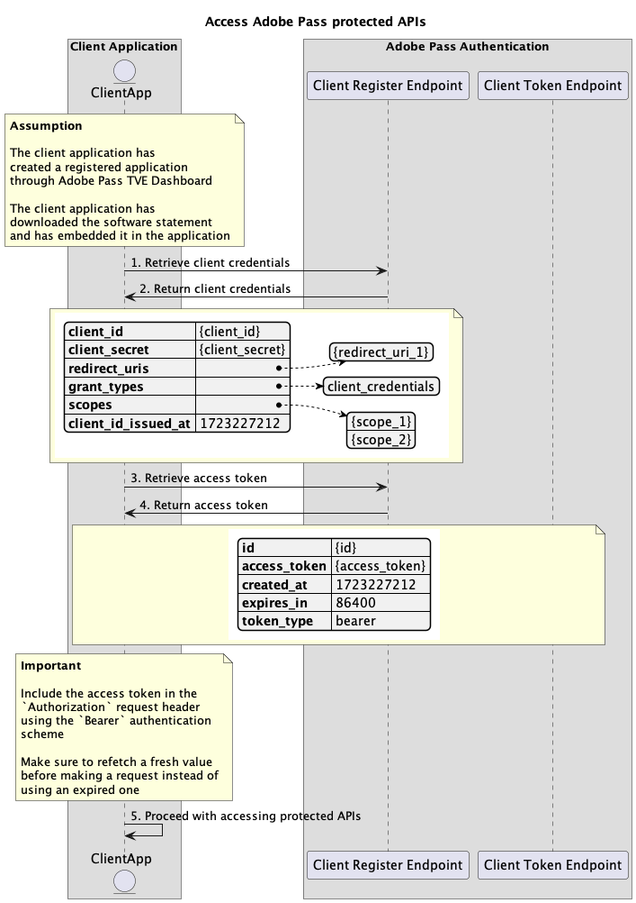

# Dynamischer Client-Registrierungsfluss {#dynamic-client-registration-flow}

>[!IMPORTANT]
>
> Der Inhalt dieser Seite dient nur zu Informationszwecken. Die Verwendung dieser API erfordert eine aktuelle Lizenz von Adobe. Eine unbefugte Nutzung ist nicht zulässig.

>[!IMPORTANT]
>
> Die Implementierung der dynamischen Client-Registrierungs-API ist an die Dokumentation [Drosselungsmechanismus](/help/authentication/integration-guide-programmers/throttling-mechanism.md) gebunden.

## Zugriff auf Adobe Pass-geschützte APIs {#access-adobe-pass-protected-apis}

### Voraussetzungen {#prerequisites-access-adobe-pass-protected-apis}

Stellen Sie vor dem Zugriff auf Adobe Pass Protected APIs sicher, dass die folgenden Voraussetzungen erfüllt sind:

* Ein Kundenbetreuer muss eine registrierte Anwendung erstellen, wie im Abschnitt [Verwalten registrierter Anwendungen](../dynamic-client-registration-overview.md#manage-registered-applications) beschrieben.
* Ein Kundenbetreuer muss eine Software-Anweisung herunterladen und einbetten, wie im Abschnitt [Software-Anweisungen verwalten](../dynamic-client-registration-overview.md#manage-software-statements) beschrieben.

>[!IMPORTANT]
>
> Adobe Pass-Authentifizierungs-SDKs sind für das Abrufen und Aktualisieren der Client-Anmeldeinformationen und des Zugriffstokens im Namen der Client-Anwendung verantwortlich.
> 
> Für alle anderen von Adobe Pass geschützten APIs muss die Client-Anwendung dem folgenden Workflow folgen.

### Workflow {#workflow-access-adobe-pass-protected-apis}

Führen Sie die angegebenen Schritte aus, um auf Adobe Pass Protected APIs zuzugreifen, wie im folgenden Diagramm dargestellt.

*Zugriff auf Adobe Pass-geschützte APIs*

1. **Client-Anmeldeinformationen abrufen:** Die Client-Anwendung sammelt alle erforderlichen Daten, um die Client-Anmeldeinformationen abzurufen, indem sie den Endpunkt „Client Register“ aufruft.

   >[!IMPORTANT]
   >
   > Weitere Informationen zu folgenden Themen finden [ in der API](../apis/dynamic-client-registration-apis-retrieve-client-credentials.md#request)Dokumentation zum Abrufen von Client-Anmeldeinformationen:
   >
   > * Alle _erforderlichen_ Parameter wie `software_statement`
   > * Alle _erforderlichen_ Kopfzeilen wie `Content-Type`, `X-Device-Info`
   > * Alle _optionalen_ Parameter und Kopfzeilen

1. **Client-Anmeldeinformationen zurückgeben:** Die Antwort des Client Register-Endpunkts enthält Informationen zu den Client-Anmeldeinformationen, die mit den empfangenen Parametern und Headern verknüpft sind.

   >[!IMPORTANT]
   >
   > Weitere Informationen zu den [ in einer Antwort zum Abrufen von Client](../apis/dynamic-client-registration-apis-retrieve-client-credentials.md#success)Anmeldeinformationen finden Sie in der API-Dokumentation.
   >
   >  
   >
   > Das Client-Register validiert die Anfragedaten, um sicherzustellen, dass die grundlegenden Bedingungen erfüllt sind:
   >
   > * Die _erforderlichen_ Parameter und Kopfzeilen müssen gültig sein.
   >
   >  
   >
   > Wenn die Validierung fehlschlägt, wird eine Fehlerantwort generiert, die zusätzliche Informationen entsprechend der API-Dokumentation [Client-Anmeldeinformationen abrufen](../apis/dynamic-client-registration-apis-retrieve-client-credentials.md#error) bereitstellt.

   >[!TIP]
   >
   > Die Client-Anmeldeinformationen müssen zwischengespeichert und unbegrenzt verwendet werden.

1. **Zugriffs-Token abrufen:** Die Client-Anwendung erfasst alle erforderlichen Daten zum Abrufen des Zugriffs-Tokens durch Aufruf des Client-Token-Endpunkts.

   >[!IMPORTANT]
   >
   > Weitere Informationen zu folgenden Themen finden [ in der API](../apis/dynamic-client-registration-apis-retrieve-access-token.md#request)Dokumentation zum Abrufen von Zugriffstoken:
   >
   > * Alle _erforderlichen_ Parameter wie `client_id`, `client_secret` und `grant_type`
   > * Alle _erforderlichen_ Kopfzeilen wie `Content-Type`, `X-Device-Info`
   > * Alle _optionalen_ Parameter und Kopfzeilen

1. **Zugriffs-Token zurückgeben:** Die Antwort des Client-Token-Endpunkts enthält Informationen zum Zugriffs-Token, das mit den empfangenen Parametern und Kopfzeilen verknüpft ist.

   >[!IMPORTANT]
   >
   > Weitere Informationen zu den [ in einer Zugriffstoken-Antwort bereitgestellten Informationen finden ](../apis/dynamic-client-registration-apis-retrieve-access-token.md#success) in der API-Dokumentation zum Abrufen von Zugriffstoken .
   >
   >  
   >
   > Das Client-Token validiert die Anfragedaten, um sicherzustellen, dass die grundlegenden Bedingungen erfüllt sind:
   >
   > * Die _erforderlichen_ Parameter und Kopfzeilen müssen gültig sein.
   >
   >  
   >
   > Wenn die Validierung fehlschlägt, wird eine Fehlerantwort generiert, die zusätzliche Informationen entsprechend der API-Dokumentation [Zugriffstoken abrufen](../apis/dynamic-client-registration-apis-retrieve-access-token.md#error) bereitstellt.

   >[!TIP]
   >
   > Das Zugriffstoken muss im Cache gespeichert und nur innerhalb der angegebenen Dauer verwendet werden (z. B. 24-Stunden-Time-to-Live). Nach Ablauf muss die Client-Anwendung ein neues Zugriffstoken anfordern.

1. **Zugriff auf geschützte APIs:** Die Client-Anwendung verwendet das Zugriffstoken, um auf andere durch Adobe Pass geschützte APIs zuzugreifen. Die Client-Anwendung muss das Zugriffstoken unter Verwendung des `Authorization` Authentifizierungsschemas (d. h. `Bearer`) in die `Authorization: Bearer <access_token>`-Anfragekopfzeile aufnehmen.

   >[!IMPORTANT]
   >
   > Die Adobe Pass-geschützten APIs überprüfen das Zugriffstoken, um sicherzustellen, dass die grundlegenden Bedingungen erfüllt sind:
   >
   > * Das _access__&quot; muss gültig sein.
   > * Das _access_token_ muss mit einer gültigen _client_id_ und _client_secret_ verknüpft sein.
   > * Das _access_token_ muss mit einer gültigen _software_statement_ verknüpft sein.
   >
   >  
   >
   > Wenn die Validierung fehlschlägt, wird eine Fehlerantwort generiert, die zusätzliche Informationen entsprechend der Dokumentation [Erweiterte Fehlercodes](../../../features-standard/error-reporting/enhanced-error-codes.md) bereitstellt.
