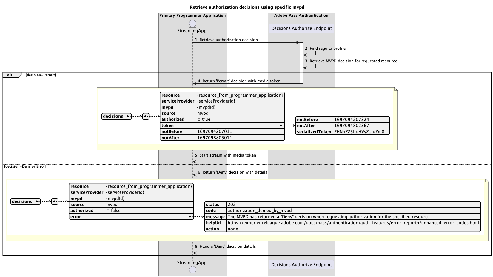

# Grundlegender Autorisierungsfluss innerhalb der primären Anwendung {#basic-authorization-flow-performed-within-primary-application}

>[!IMPORTANT]
>
> Der Inhalt dieser Seite dient nur zu Informationszwecken. Die Verwendung dieser API erfordert eine aktuelle Lizenz von Adobe. Eine unbefugte Nutzung ist nicht zulässig.

>[!IMPORTANT]
>
> Die REST-API-V2-Implementierung ist an die Dokumentation [Drosselungsmechanismus](/help/authentication/integration-guide-programmers/throttling-mechanism.md) gebunden.

Mit dem **Autorisierungsfluss** innerhalb der Berechtigung für die Adobe Pass-Authentifizierung kann die Streaming-Anwendung bestimmen, ob eine MVPD die Anforderung des Benutzers zum Streamen von Inhalten zulässt oder ablehnt. Wenn die Entscheidung `Permit` ist, enthält die Antwort ein Medien-Token. Der Adobe Pass-Server signiert das Medien-Token und ermöglicht es der Streaming-Anwendung, die Media Token Verifier-Bibliothek zu verwenden, um ihre Authentizität zu überprüfen, bevor der Stream veröffentlicht wird.

Die Überprüfung mit der Media Token Verifier-Bibliothek sollte auf dem Backend-Service der Streaming-Anwendung erfolgen, der in der Kette der Berechtigungen zum Freigeben eines Streams aus dem CDN verknüpft ist.

## Abrufen von Autorisierungsentscheidungen mithilfe bestimmter MVPD {#retrieve-authorization-decisions-using-specific-mvpd}

### Voraussetzungen {#prerequisites-retrieve-authorization-decisions-using-specific-mvpd}

Bevor Sie Autorisierungsentscheidungen mit einer bestimmten MVPD abrufen, stellen Sie sicher, dass die folgenden Voraussetzungen erfüllt sind:

* Die Streaming-Anwendung muss über ein gültiges reguläres Profil verfügen, das mithilfe eines der grundlegenden Authentifizierungsflüsse erfolgreich für die MVPD erstellt wurde:
   * [Authentifizierung innerhalb der primären Anwendung durchführen](rest-api-v2-basic-authentication-primary-application-flow.md)
   * [Authentifizierung innerhalb der sekundären Anwendung mit vorab ausgewähltem mvpd durchführen](rest-api-v2-basic-authentication-secondary-application-flow.md)
   * [Authentifizierung innerhalb der sekundären Anwendung ohne vorab ausgewählte mvpd durchführen](rest-api-v2-basic-authentication-secondary-application-flow.md)
* Die Streaming-Anwendung muss eine Autorisierungsentscheidung abrufen, bevor eine vom Benutzer ausgewählte Ressource wiedergegeben wird.

### Workflow {#workflow-retrieve-authorization-decisions-using-specific-mvpd}

Führen Sie die angegebenen Schritte aus, um den grundlegenden Autorisierungsfluss mit einem bestimmten MVPD zu implementieren, der in einer primären Anwendung ausgeführt wird, wie im folgenden Diagramm dargestellt.

*Abrufen von Autorisierungsentscheidungen mithilfe bestimmter MVPD*

1. **Autorisierungsentscheidung abrufen:** Die Streaming-Anwendung erfasst alle erforderlichen Daten, um eine Autorisierungsentscheidung für eine bestimmte Ressource zu erhalten, indem sie den Decisions Authorize-Endpunkt aufruft.

   >[!IMPORTANT]
   >
   > Weitere Informationen zu folgenden Themen finden [&#x200B; in der API](../../apis/decisions-apis/rest-api-v2-decisions-apis-retrieve-authorization-decisions-using-specific-mvpd.md)Dokumentation zum Abrufen von Autorisierungsentscheidungen mithilfe bestimmter MVPD:
   >
   > * Alle _erforderlichen_ Parameter wie `serviceProvider`, `mvpd` und `resources`
   > * Alle _erforderlichen_ Kopfzeilen wie `Authorization` und `AP-Device-Identifier`
   > * Alle _optionalen_ Parameter und Kopfzeilen

1. **Reguläres Profil suchen:** Der Adobe Pass-Server identifiziert ein gültiges Profil anhand der empfangenen Parameter und Kopfzeilen.

1. **MVPD-Entscheidung für angeforderte Ressource abrufen:** Der Adobe Pass-Server ruft den MVPD-Autorisierungsendpunkt auf, um eine `Permit`- oder `Deny`-Entscheidung für die bestimmte Ressource abzurufen, die von der Streaming-Anwendung empfangen wurde.

1. **Rückgabe `Permit` Entscheidung mit Medien-Token:** Die Endpunktantwort „Entscheidungen autorisieren“ enthält eine `Permit` Entscheidung und ein Medien-Token.

   >[!IMPORTANT]
   >
   > Weitere Informationen zu den [&#x200B; in einer Entscheidungsantwort bereitgestellten Informationen finden Sie in der API](../../apis/decisions-apis/rest-api-v2-decisions-apis-retrieve-authorization-decisions-using-specific-mvpd.md)Dokumentation zum Abrufen von Autorisierungsentscheidungen mithilfe einer bestimmten mvpd.
   > 
   >  
   > 
   > Der Decisions-Autorisierungs-Endpunkt validiert die Anfragedaten, um sicherzustellen, dass grundlegende Bedingungen erfüllt werden:
   >
   > * Die _erforderlichen_ Parameter und Kopfzeilen müssen gültig sein.
   > * Die Integration zwischen den bereitgestellten `serviceProvider` und `mvpd` muss aktiv sein.
   >
   >  
   > 
   > Wenn die Validierung fehlschlägt, wird eine Fehlerantwort generiert, die zusätzliche Informationen entsprechend der Dokumentation [Erweiterte Fehlercodes](../../../../features-standard/error-reporting/enhanced-error-codes.md) bereitstellt.

1. **Stream mit Medien-Token starten:** Die Streaming-Anwendung verwendet das Medien-Token, um den Inhalt wiederzugeben.

1. **Rückgabe `Deny` Entscheidung mit Details:** Die Endpunktantwort „Decisions Authorize“ enthält eine `Deny` Entscheidung und eine Fehler-Payload, die der Dokumentation zu [Enhanced Error Codes](../../../../features-standard/error-reporting/enhanced-error-codes.md) entsprechen.

   >[!IMPORTANT]
   >
   > Weitere Informationen zu den [&#x200B; in einer Entscheidungsantwort bereitgestellten Informationen finden Sie in der API](../../apis/decisions-apis/rest-api-v2-decisions-apis-retrieve-authorization-decisions-using-specific-mvpd.md)Dokumentation zum Abrufen von Autorisierungsentscheidungen mithilfe einer bestimmten mvpd.
   > 
   >  
   > 
   > Der Decisions-Autorisierungs-Endpunkt validiert die Anfragedaten, um sicherzustellen, dass grundlegende Bedingungen erfüllt werden:
   >
   > * Die _erforderlichen_ Parameter und Kopfzeilen müssen gültig sein.
   > * Die Integration zwischen den bereitgestellten `serviceProvider` und `mvpd` muss aktiv sein.
   >
   >  
   > 
   > Wenn die Validierung fehlschlägt, wird eine Fehlerantwort generiert, die zusätzliche Informationen entsprechend der Dokumentation [Erweiterte Fehlercodes](../../../../features-standard/error-reporting/enhanced-error-codes.md) bereitstellt.

1. **Handhabung `Deny` Entscheidungsdetails:** Die Streaming-Anwendung verarbeitet die Fehlerinformationen aus der Antwort und kann sie verwenden, um optional eine bestimmte Nachricht auf der Benutzeroberfläche anzuzeigen.
