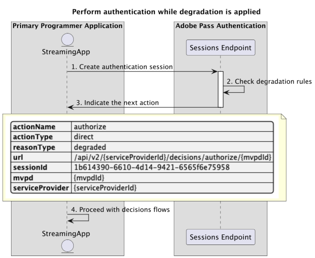

# Eingeschränkte Zugriffsflüsse {#degraded-access-flows}

>[!IMPORTANT]
>
> Der Inhalt dieser Seite dient nur zu Informationszwecken. Die Verwendung dieser API erfordert eine aktuelle Lizenz von Adobe. Eine unbefugte Nutzung ist nicht zulässig.

>[!IMPORTANT]
>
> Die REST-API-V2-Implementierung ist an die Dokumentation [Drosselungsmechanismus](/help/authentication/integration-guide-programmers/throttling-mechanism.md) gebunden.

Durch die Beeinträchtigung werden bestimmte Authentifizierungs- und Autorisierungsendpunkte von MVPD vorübergehend umgangen. Normalerweise initiiert der Programmierer diese Aktion, aber unabhängig davon, wer ein Degradation-Ereignis Trigger, hängt die Aktion von vorherigen Vereinbarungen mit den betroffenen MVPDs ab.

Weitere Informationen zur Degradation-Funktion finden Sie in der Dokumentation [Degradation](../../../../features-premium/degraded-access/degradation-api-overview.md).

Aufgrund des eingeschränkten Zugriffs können Sie Abfragen für die folgenden Szenarien durchführen:

* [Authentifizierung bei angewendeter Beeinträchtigung durchführen](#perform-authentication-while-degradation-is-applied)
* [Autorisierungsentscheidungen abrufen, während eine Beeinträchtigung angewendet wird](#retrieve-authorization-decisions-while-degradation-is-applied)
* [Abrufen von Entscheidungen vor der Autorisierung, während eine Degradierung angewendet wird](#retrieve-preauthorization-decisions-while-degradation-is-applied)
* [Profil abrufen, während die Beeinträchtigung angewendet wird](#retrieve-profile-while-degradation-is-applied)

## Authentifizierung bei angewendeter Beeinträchtigung durchführen {#perform-authentication-while-degradation-is-applied}

### Voraussetzungen {#prerequisites-perform-authentication-while-degradation-is-applied}

Bevor Sie den Authentifizierungsfluss durchführen, während die Beeinträchtigung angewendet wird, stellen Sie sicher, dass die folgenden Voraussetzungen erfüllt sind:

* Die Streaming-Anwendung muss eine Authentifizierungssitzung starten, wenn sie sich mit der MVPD anmelden muss.

>[!IMPORTANT]
> 
> Annahmen
> 
>  
> 
> * Die Streaming-Anwendung hat kein gültiges Profil für diese bestimmte MVPD, die im Adobe Pass-Backend gespeichert ist.
> * Es wird eine AuthNAll-Abbauregel auf die Integration zwischen dem bereitgestellten `serviceProvider` und `mvpd` angewendet.

### Workflow {#workflow-perform-authentication-while-degradation-is-applied}

Führen Sie die angegebenen Schritte aus, um den Authentifizierungsfluss zu implementieren, während die Beeinträchtigung angewendet wird, wie im folgenden Diagramm dargestellt.

*Authentifizierung durchführen, während die Beeinträchtigung angewendet wird*

1. **Authentifizierungssitzung erstellen:** Die Streaming-Anwendung erfasst alle erforderlichen Daten, um eine Authentifizierungssitzung zu initiieren, indem der Sessions-Endpunkt aufgerufen wird.

   >[!IMPORTANT]
   >
   > Weitere Informationen zu folgenden Themen finden [ in der API](../../apis/sessions-apis/rest-api-v2-sessions-apis-create-authentication-session.md)Dokumentation zu „Authentifizierungssitzung erstellen“:
   > 
   > * Alle _erforderlichen_ Parameter wie `serviceProvider`, `mvpd`, `domainName` und `redirectUrl`
   > * Alle _erforderlichen_ Kopfzeilen wie `Authorization` und `AP-Device-Identifier`
   > * Alle _optionalen_ Parameter und Kopfzeilen

1. **Abbauregeln überprüfen:** Der Adobe Pass-Server überprüft, ob eine AuthNAll-Abbauregel auf die Integration zwischen der bereitgestellten `serviceProvider` und `mvpd` angewendet wurde.

1. **Nächste Aktion angeben:** Die Antwort des Sitzungs-Endpunkts enthält die erforderlichen Daten, um die Streaming-Anwendung bezüglich der nächsten Aktion zu leiten:
   * Das `actionName`-Attribut ist auf „authorize“ festgelegt.
   * Das `actionType`-Attribut ist auf „direct“ festgelegt.

   >[!IMPORTANT]
   >
   > Weitere Informationen zu den [ in einer Sitzungsantwort bereitgestellten Informationen finden Sie in der API](../../apis/sessions-apis/rest-api-v2-sessions-apis-create-authentication-session.md)Dokumentation zu „Authentifizierungssitzung erstellen“.
   > 
   >  
   > 
   > Der Sessions-Endpunkt validiert die Anfragedaten, um sicherzustellen, dass die grundlegenden Bedingungen erfüllt sind:
   >
   > * Die _erforderlichen_ Parameter und Kopfzeilen müssen gültig sein.
   > * Die Integration zwischen den bereitgestellten `serviceProvider` und `mvpd` muss aktiv sein.
   >
   >  
   > 
   > Wenn die einfache Validierung fehlschlägt, wird eine Fehlerantwort generiert, die zusätzliche Informationen entsprechend der Dokumentation [Erweiterte Fehlercodes](../../../../features-standard/error-reporting/enhanced-error-codes.md) bereitstellt.
   >
   >  
   > 
   > Der Sitzungs-Endpunkt verwendet die Anfragedaten, um zu überprüfen, ob eingeschränkte Zugriffsbedingungen erfüllt sind:
   >
   > * Für die Integration zwischen dem bereitgestellten `serviceProvider` und `mvpd` muss eine AuthNAll-Abbauregel angewendet werden.
   >
   >  
   > 
   > Wenn die Überprüfung des eingeschränkten Zugriffs fehlschlägt, wird standardmäßig der einfache Authentifizierungsfluss zurückgegeben.

1. **Fahren Sie mit Entscheidungsflüssen fort:** Die Streaming-Anwendung kann mit nachfolgenden Entscheidungsflüssen fortfahren.

## Autorisierungsentscheidungen abrufen, während eine Beeinträchtigung angewendet wird {#retrieve-authorization-decisions-while-degradation-is-applied}

### Voraussetzungen {#prerequisites-retrieve-authorization-decisions-while-degradation-is-applied}

Bevor Sie Autorisierungsentscheidungen abrufen, während die Beeinträchtigung angewendet wird, stellen Sie sicher, dass die folgenden Voraussetzungen erfüllt sind:

* Die Streaming-Anwendung muss eine Autorisierungsentscheidung abrufen, bevor eine vom Benutzer ausgewählte Ressource wiedergegeben wird.

>[!IMPORTANT]
>
> Annahmen
> 
>  
> 
> * Die Streaming-Anwendung hat kein gültiges Profil für diese spezifische MVPD.
> * Es wird eine AuthZAll- oder AuthNAll-Abbauregel auf die Integration zwischen dem bereitgestellten `serviceProvider` und `mvpd` angewendet.

### Workflow {#workflow-retrieve-authorization-decisions-while-degradation-is-applied}

Führen Sie die angegebenen Schritte aus, um den Autorisierungsfluss zu implementieren, während die Degradation angewendet wird, wie in der folgenden Abbildung dargestellt.

*Abrufen von Autorisierungsentscheidungen, während eine Beeinträchtigung angewendet wird*

1. **Autorisierungsentscheidung abrufen:** Die Streaming-Anwendung erfasst alle erforderlichen Daten, um eine Autorisierungsentscheidung für eine bestimmte Ressource zu erhalten, indem sie den Decisions Authorize-Endpunkt aufruft.

   >[!IMPORTANT]
   > 
   > Weitere Informationen zu folgenden Themen finden [ in der API](../../apis/decisions-apis/rest-api-v2-decisions-apis-retrieve-authorization-decisions-using-specific-mvpd.md)Dokumentation zum Abrufen von Autorisierungsentscheidungen mithilfe bestimmter MVPD:
   >
   > * Alle _erforderlichen_ Parameter wie `serviceProvider`, `mvpd` und `resources`
   > * Alle _erforderlichen_ Kopfzeilen wie `Authorization` und `AP-Device-Identifier`
   > * Alle _optionalen_ Parameter und Kopfzeilen

1. **Abbauregeln überprüfen:** Der Adobe Pass-Server überprüft, ob eine AuthZAll- oder AuthNAll-Abbauregel auf die Integration zwischen den bereitgestellten `serviceProvider` und `mvpd` angewendet wurde.

1. **Rückgabe `Permit` Entscheidung mit Medien-Token:** Die Endpunktantwort „Entscheidungen autorisieren“ enthält eine `Permit` Entscheidung und ein Medien-Token.

   >[!IMPORTANT]
   >
   > Weitere Informationen zu den [ in einer Entscheidungsantwort bereitgestellten Informationen finden Sie in der API](../../apis/decisions-apis/rest-api-v2-decisions-apis-retrieve-authorization-decisions-using-specific-mvpd.md)Dokumentation zum Abrufen von Autorisierungsentscheidungen mithilfe einer bestimmten mvpd.
   >
   >  
   > 
   > Der Decisions-Autorisierungs-Endpunkt validiert die Anfragedaten, um sicherzustellen, dass grundlegende Bedingungen erfüllt werden:
   >
   > * Die _erforderlichen_ Parameter und Kopfzeilen müssen gültig sein.
   > * Die Integration zwischen den bereitgestellten `serviceProvider` und `mvpd` muss aktiv sein.
   >
   >  
   > 
   > Wenn die einfache Validierung fehlschlägt, wird eine Fehlerantwort generiert, die zusätzliche Informationen entsprechend der Dokumentation [Erweiterte Fehlercodes](../../../../features-standard/error-reporting/enhanced-error-codes.md) bereitstellt.
   >
   >  
   >
   > Der Endpunkt Decisions-Autorisierung verwendet die Anfragedaten, um zu überprüfen, ob eingeschränkte Zugriffsbedingungen erfüllt sind:
   >
   > * Für die Integration zwischen dem bereitgestellten `serviceProvider` und `mvpd` muss eine AuthZAll- oder AuthNAll-Degradationsregel angewendet werden.
   >
   >  
   > 
   > Wenn die Überprüfung des eingeschränkten Zugriffs fehlschlägt, wird standardmäßig der grundlegende Autorisierungsfluss verwendet.

1. **Stream mit Medien-Token starten:** Die Streaming-Anwendung verwendet das Medien-Token, um den Inhalt wiederzugeben.

## Abrufen von Entscheidungen vor der Autorisierung, während eine Degradierung angewendet wird {#retrieve-preauthorization-decisions-while-degradation-is-applied}

### Voraussetzungen {#prerequisites-retrieve-preauthorization-decisions-while-degradation-is-applied}

Bevor Sie Entscheidungen zur Vorabautorisierung abrufen, während die Degradation angewendet wird, stellen Sie sicher, dass die folgenden Voraussetzungen erfüllt sind:

* Die Streaming-Anwendung möchte Entscheidungen zur Vorabautorisierung abrufen, um eine Liste der Ressourcen zusammen mit ihren zugehörigen Status anzuzeigen.

>[!IMPORTANT]
>
> Annahmen
>
>  
> 
> * Die Streaming-Anwendung hat kein gültiges Profil für diese spezifische MVPD.
> * Es wird eine AuthZAll- oder AuthNAll-Abbauregel auf die Integration zwischen dem bereitgestellten `serviceProvider` und `mvpd` angewendet.

### Workflow {#workflow-retrieve-preauthorization-decisions-while-degradation-is-applied}

Führen Sie die angegebenen Schritte aus, um den Vorautorisierungsfluss zu implementieren, während der Abbau angewendet wird, wie in der folgenden Abbildung dargestellt.

*Abrufen von Entscheidungen vor der Autorisierung, während eine Degradation angewendet wird*

1. **Vorabautorisierungsentscheidungen abrufen:** Die Streaming-Anwendung sammelt alle erforderlichen Daten, um Vorabautorisierungsentscheidungen für eine Liste von Ressourcen zu erhalten, indem sie den Endpunkt Decisions Preauthorize aufruft.

   >[!IMPORTANT]
   >
   > Weitere Informationen zu folgenden Themen finden [ in der API](../../apis/decisions-apis/rest-api-v2-decisions-apis-retrieve-preauthorization-decisions-using-specific-mvpd.md)Dokumentation zum Abrufen von Vorabautorisierungsentscheidungen mithilfe bestimmter MVPD:
   >
   > * Alle _erforderlichen_ Parameter wie `serviceProvider`, `mvpd` und `resources`
   > * Alle _erforderlichen_ Kopfzeilen wie `Authorization` und `AP-Device-Identifier`
   > * Alle _optionalen_ Parameter und Kopfzeilen

1. **Abbauregeln überprüfen:** Der Adobe Pass-Server überprüft, ob eine AuthZAll- oder AuthNAll-Abbauregel auf die Integration zwischen den bereitgestellten `serviceProvider` und `mvpd` angewendet wurde.

1. **Entscheidungen vor Autorisierung zurückgeben:** Die Antwort des Endpunkts Decisions Preauthorize enthält für jede Ressource eine `Permit` Entscheidung.

   >[!IMPORTANT]
   >
   > Weitere Informationen zu den [ in einer Entscheidungsantwort bereitgestellten Informationen finden Sie in der API](../../apis/decisions-apis/rest-api-v2-decisions-apis-retrieve-preauthorization-decisions-using-specific-mvpd.md)Dokumentation zum Abrufen von Entscheidungen vor der Autorisierung mit bestimmten mvpd.
   >
   >  
   >
   > Der Endpunkt Decisions Preauthorize validiert die Anfragedaten, um sicherzustellen, dass grundlegende Bedingungen erfüllt werden:
   >
   > * Die _erforderlichen_ Parameter und Kopfzeilen müssen gültig sein.
   > * Die Integration zwischen den bereitgestellten `serviceProvider` und `mvpd` muss aktiv sein.
   >
   >  
   > 
   > Wenn die einfache Validierung fehlschlägt, wird eine Fehlerantwort generiert, die zusätzliche Informationen entsprechend der Dokumentation [Erweiterte Fehlercodes](../../../../features-standard/error-reporting/enhanced-error-codes.md) bereitstellt.
   >
   >  
   >
   > Der Endpunkt Decisions Preauthorize verwendet die Anfragedaten, um zu überprüfen, ob eingeschränkte Zugriffsbedingungen erfüllt sind:
   >
   > * Für die Integration zwischen dem bereitgestellten `serviceProvider` und `mvpd` muss eine AuthZAll- oder AuthNAll-Degradationsregel angewendet werden.
   >
   >  
   > 
   > Wenn die Überprüfung des eingeschränkten Zugriffs fehlschlägt, wird standardmäßig der grundlegende Vorautorisierungsfluss verwendet.

1. **Entscheidungen vor Autorisierung verarbeiten:** Die Streaming-Anwendung verarbeitet die Antwort und kann sie verwenden, um optional den entsprechenden Status für jede Ressource auf der Benutzeroberfläche anzuzeigen.

## Profil abrufen, während die Beeinträchtigung angewendet wird {#retrieve-profile-while-degradation-is-applied}

>[!IMPORTANT]
>
> Die Abfrage des Profilendpunkts ist optional, wenn eine Beeinträchtigung angewendet wird.
>
>  
> 
> Die Sitzungs-Endpunktantwort weist die Anwendung an, mit Entscheidungsflüssen fortzufahren, während eine Beeinträchtigung angewendet wird. Weitere Informationen finden Sie im Abschnitt [Authentifizierung durchführen, während eine Beeinträchtigung angewendet wird](#perform-authentication-while-degradation-is-applied).

### Voraussetzungen {#prerequisites-retrieve-profile-while-degradation-is-applied}

Bevor Sie das Profil für eine bestimmte MVPD abrufen, während die Beeinträchtigung angewendet wird, stellen Sie sicher, dass die folgenden Voraussetzungen erfüllt sind:

* Die Streaming-Anwendung mit einer ausgewählten oder zwischengespeicherten `mvpd`-Kennung möchte das Profil für eine bestimmte MVPD abrufen.

>[!IMPORTANT]
>
> Annahmen
>
>  
> 
> * Die Streaming-Anwendung hat kein gültiges Profil für diese spezifische MVPD.
> * Es wird eine AuthNAll-Abbauregel auf die Integration zwischen dem bereitgestellten `serviceProvider` und `mvpd` angewendet.

### Workflow {#workflow-retrieve-profile-while-degradation-is-applied}

Führen Sie die angegebenen Schritte aus, um den Profilabruffluss für einen bestimmten MVPD zu implementieren, während die Degradation angewendet wird, wie im folgenden Diagramm dargestellt.

*Profil abrufen, während die Degradierung angewendet wird*

1. **Profil für bestimmte mvpd abrufen:** Die Streaming-Anwendung sammelt alle erforderlichen Daten, um Profilinformationen für diese bestimmte MVPD abzurufen, indem sie eine Anfrage an den Endpunkt „Profiles“ sendet.

   >[!IMPORTANT]
   >
   > Weitere Informationen zu folgenden Themen finden [ in der API](../../apis/profiles-apis/rest-api-v2-profiles-apis-retrieve-profile-for-specific-mvpd.md)Dokumentation zum Abrufen von Profilen für bestimmte MVPD:
   >
   > * Alle _erforderlichen_ Parameter wie `serviceProvider` und `mvpd`
   > * Alle _erforderlichen_ Kopfzeilen wie `Authorization` und `AP-Device-Identifier`
   > * Alle _optionalen_ Parameter und Kopfzeilen

1. **Abbauregeln überprüfen:** Der Adobe Pass-Server überprüft, ob eine AuthNAll-Abbauregel auf die Integration zwischen der bereitgestellten `serviceProvider` und `mvpd` angewendet wurde.

1. **Rückgabeinformationen über ein verschlechtertes Profil zurückgeben:** Die Antwort des Endpunkts „Profile“ enthält Informationen über das verschlechterte Profil, einschließlich des Attributs, das auf „degraded“ festgelegt `type`.

   >[!IMPORTANT]
   >
   > Weitere Informationen zu [ in einer Profilantwort angegebenen Informationen finden Sie in der API](../../apis/profiles-apis/rest-api-v2-profiles-apis-retrieve-profile-for-specific-mvpd.md)Dokumentation zum Abrufen von Profilen für bestimmte mvpd.
   >
   >  
   >
   > Der Profiles-Endpunkt validiert die Anfragedaten, um sicherzustellen, dass die grundlegenden Bedingungen erfüllt sind:
   >
   > * Die _erforderlichen_ Parameter und Kopfzeilen müssen gültig sein.
   > * Die Integration zwischen den bereitgestellten `serviceProvider` und `mvpd` muss aktiv sein.
   >
   >  
   > 
   > Wenn die einfache Validierung fehlschlägt, wird eine Fehlerantwort generiert, die zusätzliche Informationen entsprechend der Dokumentation [Erweiterte Fehlercodes](../../../../features-standard/error-reporting/enhanced-error-codes.md) bereitstellt.
   >
   >  
   > 
   > Der Profilendpunkt verwendet die Anfragedaten, um zu überprüfen, ob eingeschränkte Zugriffsbedingungen erfüllt sind:
   >
   > * Für die Integration zwischen dem bereitgestellten `serviceProvider` und `mvpd` muss eine AuthNAll-Abbauregel angewendet werden.
   >
   >  
   > 
   > Wenn die Validierung des eingeschränkten Zugriffs fehlschlägt, wird standardmäßig der grundlegende Profilabruffluss verwendet.

1. **Fahren Sie mit Entscheidungsflüssen fort:** Wenn die Antwort des Endpunkts „Profile“ ein Profil enthält, verwendet die Streaming-Anwendung die verschlechterten Profilinformationen, um mit nachfolgenden Entscheidungsflüssen fortzufahren.

1. **Neuen einfachen Authentifizierungsfluss angeben:** Wenn die Endpunktantwort „Profile“ kein Profil enthält, gibt die Streaming-Anwendung an, dass der Benutzer einen neuen einfachen Authentifizierungsfluss starten soll.

>[!NOTE]
>
> Die Schritte für den Ablauf zum Abrufen von Profilen für einen bestimmten Authentifizierungs-Code sind dieselben wie oben, mit der Ausnahme, dass der verwendete Endpunkt derjenige ist, der in der Dokumentation [Abrufen von Profilen für bestimmten Code](../../apis/profiles-apis/rest-api-v2-profiles-apis-retrieve-profile-for-specific-code.md) beschrieben ist.
