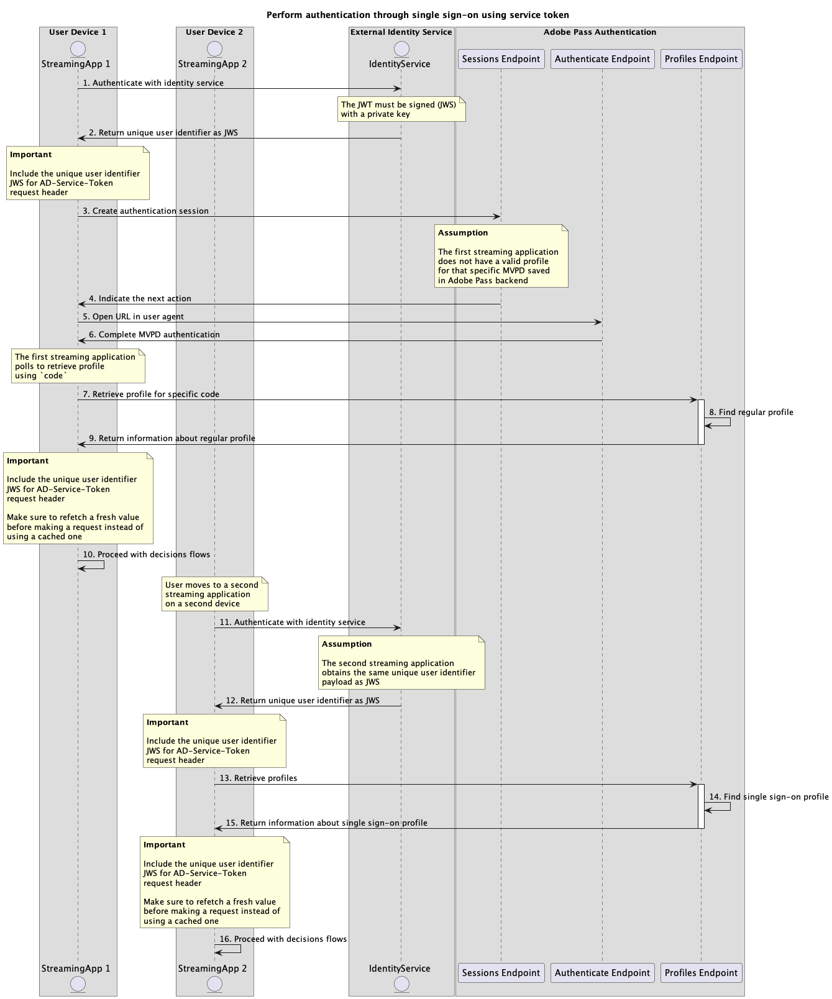

# Single Sign-on mit Service-Token-Flüssen{#single-sign-on-service-token-full-flows}

>[!IMPORTANT]
>
> Der Inhalt dieser Seite dient nur Informationszwecken. Für die Verwendung dieser API ist eine aktuelle Lizenz von Adobe erforderlich. Eine unbefugte Anwendung ist nicht zulässig.

>[!IMPORTANT]
>
> Die REST API V2-Implementierung wird durch die Dokumentation zum [Drosselungsmechanismus](/help/authentication/integration-guide-programmers/throttling-mechanism.md) begrenzt.

Die Service Token-Methode ermöglicht es mehreren Anwendungen, eine eindeutige Benutzer-ID zu verwenden, um Single Sign-on (SSO) über mehrere Geräte und Plattformen hinweg bei der Verwendung von Adobe Pass-Diensten zu erreichen.

Die Anwendungen sind für das Abrufen der Payload der eindeutigen Benutzerkennung mithilfe externer Identitätsdienste außerhalb von Adobe Pass-Systemen verantwortlich, z. B.:

* Ein Direct-to-Consumer-Dienst (DTC), bei dem sich Benutzer auf jedem Gerät mit denselben Anmeldeinformationen anmelden und mit derselben Benutzer-ID oder demselben Benutzernamen verknüpft sind.
* Ein Authentifizierungsdienst von Drittanbietern, z. B. Google oder Facebook, bei dem sich Benutzer auf jedem Gerät mit denselben Anmeldeinformationen anmelden und dieselbe E-Mail-Adresse erhalten.

Die Anwendungen sind dafür verantwortlich, diese Payload der eindeutigen Benutzerkennung als Teil der Kopfzeile `AD-Service-Token` für alle Anforderungen einzuschließen, die sie angeben.

Weitere Informationen zum Header `AD-Service-Token` finden Sie in der Dokumentation zu [AD-Service-Token](../../appendix/headers/rest-api-v2-appendix-headers-ad-service-token.md) .

## Führen Sie die Authentifizierung über Single Sign-on mithilfe des Service-Tokens durch. {#performing-authentication-flow-using-service-token-single-sign-on-method}

### Voraussetzungen {#prerequisites-scenario-performing-authentication-flow-using-service-token-single-sign-on-method}

Stellen Sie vor dem Ausführen des Authentifizierungsflusses durch Single Sign-on mithilfe eines Service-Tokens sicher, dass die folgenden Voraussetzungen erfüllt sind:

* Der externe Identitätsdienst muss konsistente Informationen als `JWS`-Payload für alle Anwendungen über mehrere Geräte und Plattformen zurückgeben.
* Die erste Streaming-Anwendung muss die eindeutige Benutzer-ID abrufen und die `JWS` -Payload als Teil des Headers [AD-Service-Token](../../appendix/headers/rest-api-v2-appendix-headers-ad-service-token.md) für alle Anforderungen einschließen, die sie angeben.
* Die erste Streaming-Anwendung muss einen MVPD auswählen.
* Die erste Streaming-Anwendung muss eine Authentifizierungssitzung starten, um sich mit dem ausgewählten MVPD anzumelden.
* Die erste Streaming-Anwendung muss sich mit dem ausgewählten MVPD in einem Benutzeragenten authentifizieren.
* Die zweite Streaming-Anwendung muss die eindeutige Benutzer-ID abrufen und die `JWS` -Payload als Teil des Headers [AD-Service-Token](../../appendix/headers/rest-api-v2-appendix-headers-ad-service-token.md) für alle Anforderungen einschließen, die sie angeben.

>[!IMPORTANT]
>
> Annahmen
> 
>  
> 
> * Die erste Streaming-Anwendung unterstützt Benutzerinteraktionen zur Auswahl eines MVPD.
> * Die erste Streaming-Anwendung unterstützt Benutzerinteraktionen, um sich mit dem ausgewählten MVPD in einem Benutzeragenten zu authentifizieren.

### Workflow {#workflow-steps-scenario-performing-authentication-flow-using-service-token-single-sign-on-method}

Führen Sie die angegebenen Schritte aus, um den Authentifizierungsfluss durch Single Sign-on mithilfe eines Service-Tokens zu implementieren, wie im folgenden Diagramm dargestellt.

*Führen Sie die Authentifizierung über Single Sign-on mithilfe des Service-Tokens durch*

1. **Mit Identitätsdienst authentifizieren:** Die erste Streaming-Anwendung ruft den Identitätsdienst außerhalb der Adobe Pass-Systeme auf, um die `JWS` -Payload abzurufen, die mit der eindeutigen Benutzer-ID verknüpft ist.

1. **Rückgabe der eindeutigen Benutzer-ID als JWS:** Die erste Streaming-Anwendung validiert die Antwortdaten, um sicherzustellen, dass die grundlegenden Sicherheitsbedingungen erfüllt sind:
   * Die Nutzlast ist nicht abgelaufen.
   * Nutzlast wird signiert.

1. **Erstellen einer Authentifizierungssitzung:** Die erste Streaming-Anwendung erfasst alle erforderlichen Daten, um eine Authentifizierungssitzung durch Aufruf des Sitzungsendpunkts zu initiieren.

   >[!IMPORTANT]
   >
   > Weitere Informationen finden Sie in der API-Dokumentation zum [Erstellen einer Authentifizierungssitzung](../../apis/sessions-apis/rest-api-v2-sessions-apis-create-authentication-session.md) .
   >
   > * Alle _erforderlichen_ Parameter, wie `serviceProvider`, `mvpd`, `domainName` und `redirectUrl`
   > * Alle _erforderlichen_ Kopfzeilen, wie `Authorization`, `AP-Device-Identifier`
   > * Alle Parameter und Kopfzeilen von _optional_
   >
   >  
   > 
   > Die Streaming-Anwendung muss sicherstellen, dass sie einen gültigen Wert für die eindeutige Benutzer-ID enthält, bevor eine Anfrage gestellt wird.
   >
   >  
   > 
   > Weitere Informationen zum Header `AD-Service-Token` finden Sie in der Dokumentation zu [AD-Service-Token](../../appendix/headers/rest-api-v2-appendix-headers-ad-service-token.md) .

1. **Geben Sie die nächste Aktion an:** Die Sitzungsendpunktantwort enthält die erforderlichen Daten, um die erste Streaming-Anwendung in Bezug auf die nächste Aktion zu leiten.

   >[!IMPORTANT]
   >
   > Weitere Informationen zu den in einer Sitzungsantwort bereitgestellten Informationen finden Sie in der Dokumentation zur API zur [Erstellen einer Authentifizierungssitzung](../../apis/sessions-apis/rest-api-v2-sessions-apis-create-authentication-session.md) .
   >
   >  
   > 
   > Der Sitzungsendpunkt validiert die Anfragedaten, um sicherzustellen, dass die grundlegenden Bedingungen erfüllt sind:
   >
   > * Die Parameter und Header _required_ müssen gültig sein.
   > * Die Integration zwischen dem bereitgestellten `serviceProvider` und `mvpd` muss aktiv sein.
   >
   >  
   > 
   > Wenn die Validierung fehlschlägt, wird eine Fehlerantwort generiert, die zusätzliche Informationen bereitstellt, die der Dokumentation [Verbesserte Fehlercodes](../../../../features-standard/error-reporting/enhanced-error-codes.md) entsprechen.

1. **URL im Benutzeragenten öffnen:** Die Sitzungsendpunktantwort enthält die folgenden Daten:
   * Der `url` , der verwendet werden kann, um die interaktive Authentifizierung innerhalb der MVPD-Anmeldeseite zu initiieren.
   * Das Attribut `actionName` ist auf &quot;Authentifizieren&quot;festgelegt.
   * Das Attribut `actionType` ist auf &quot;interaktiv&quot;festgelegt.

   Wenn das Adobe Pass-Backend kein gültiges Profil angibt, öffnet die erste Streaming-Anwendung einen Benutzeragenten, der den bereitgestellten `url` lädt, und sendet eine Anfrage an den Authenticate-Endpunkt. Dieser Ablauf kann mehrere Umleitungen umfassen, die den Benutzer letztendlich zur MVPD-Anmeldeseite führen und gültige Anmeldeinformationen angeben.

1. **Vollständige MVPD-Authentifizierung:** Wenn der Authentifizierungsfluss erfolgreich ist, speichert die Benutzeragenten-Interaktion ein reguläres Profil im Adobe Pass-Backend und erreicht die bereitgestellte `redirectUrl`.

1. **Profil für bestimmten Code abrufen:** Die erste Streaming-Anwendung erfasst alle erforderlichen Daten, um Profilinformationen abzurufen, indem eine Anfrage an den Endpunkt Profile gesendet wird.

   >[!IMPORTANT]
   >
   > Weitere Informationen finden Sie in der Dokumentation zur [Abrufen des Profils für bestimmte Code-API](../../apis/profiles-apis/rest-api-v2-profiles-apis-retrieve-profile-for-specific-code.md) .
   > 
   > * Alle _erforderlichen_ Parameter, wie `serviceProvider`, `code`
   > * Alle _erforderlichen_ Kopfzeilen, wie `Authorization`, `AP-Device-Identifier`
   > * Alle Parameter und Kopfzeilen von _optional_

   >[!TIP]
   >
   > Empfehlung: Die Streaming-Anwendung kann warten, bis der Benutzeragent den bereitgestellten &quot;`redirectUrl`&quot;erreicht, um zu überprüfen, ob das reguläre Profil erfolgreich generiert und gespeichert wurde.

1. **Reguläres Profil suchen:** Der Adobe Pass-Server identifiziert anhand der empfangenen Parameter und Kopfzeilen ein gültiges Profil.

1. **Informationen zum regulären Profil zurückgeben:** Die Profil-Endpunktantwort enthält Informationen zum gefundenen Profil, das mit den empfangenen Parametern und Kopfzeilen verknüpft ist.

   >[!IMPORTANT]
   >
   > Weitere Informationen zu den Informationen, die in einer Profilantwort bereitgestellt werden, finden Sie in der Dokumentation zur API für spezifischen Code-Code-Abruf-Profil](../../apis/profiles-apis/rest-api-v2-profiles-apis-retrieve-profile-for-specific-code.md) .[
   >
   >  
   > 
   > Der Endpunkt Profile validiert die Anfragedaten, um sicherzustellen, dass die grundlegenden Bedingungen erfüllt sind:
   >
   > * Die Parameter und Header _required_ müssen gültig sein.
   >
   >  
   > 
   > Wenn die Validierung fehlschlägt, wird eine Fehlerantwort generiert, die zusätzliche Informationen bereitstellt, die der Dokumentation [Verbesserte Fehlercodes](../../../../features-standard/error-reporting/enhanced-error-codes.md) entsprechen.

1. **Fahren Sie mit den Entscheidungsflüssen fort:** Die erste Streaming-Anwendung kann mit nachfolgenden Entscheidungsflüssen fortfahren.

   >[!IMPORTANT]
   >
   > Die Streaming-Anwendung muss sicherstellen, dass sie einen gültigen Wert für die eindeutige Benutzer-ID enthält, bevor eine Anfrage gestellt wird.
   >
   >  
   > 
   > Weitere Informationen zum Header `AD-Service-Token` finden Sie in der Dokumentation zu [AD-Service-Token](../../appendix/headers/rest-api-v2-appendix-headers-ad-service-token.md) .

1. **Mit Identitätsdienst authentifizieren:** Die zweite Streaming-Anwendung ruft den Identitätsdienst außerhalb der Adobe Pass-Systeme auf, um die mit der eindeutigen Benutzer-ID verknüpfte `JWS` Payload abzurufen.

1. **Rückgabe der eindeutigen Benutzer-ID als JWS:** Die zweite Streaming-Anwendung validiert die Antwortdaten, um sicherzustellen, dass die grundlegenden Sicherheitsbedingungen erfüllt sind:
   * Die Nutzlast ist nicht abgelaufen.
   * Nutzlast wird signiert.

1. **Profile abrufen:** Die zweite Streaming-Anwendung erfasst alle erforderlichen Daten, um alle Profilinformationen abzurufen, indem eine Anfrage an den Endpunkt Profile gesendet wird.

   >[!IMPORTANT]
   >
   > Weitere Informationen finden Sie in der API-Dokumentation zum [Abrufen von Profilen](../../apis/profiles-apis/rest-api-v2-profiles-apis-retrieve-profiles.md) :
   >
   > * Alle _erforderlichen_ Parameter, z. B. `serviceProvider`
   > * Alle _erforderlichen_ Kopfzeilen, wie `Authorization`, `AP-Device-Identifier`
   > * Alle Parameter und Kopfzeilen von _optional_
   >
   >  
   > 
   > Die Streaming-Anwendung muss sicherstellen, dass sie einen gültigen Wert für die eindeutige Benutzer-ID enthält, bevor eine Anfrage gestellt wird.
   >
   >  
   > 
   > Weitere Informationen zum Header `AD-Service-Token` finden Sie in der Dokumentation zu [AD-Service-Token](../../appendix/headers/rest-api-v2-appendix-headers-ad-service-token.md) .

1. **Single Sign-On-Profil suchen:** Der Adobe Pass-Server identifiziert anhand der empfangenen Parameter und Kopfzeilen ein gültiges Single-Sign-On-Profil.

1. **Rückgabe von Informationen zum Single Sign-On-Profil:** Die Profil-Endpunktantwort enthält Informationen zum gefundenen Profil, das mit den empfangenen Parametern und Kopfzeilen verknüpft ist.

   >[!IMPORTANT]
   >
   > Weitere Informationen zu den Informationen, die in einer Profilantwort bereitgestellt werden, finden Sie in der Dokumentation zur API zum [Abrufen von Profilen](../../apis/profiles-apis/rest-api-v2-profiles-apis-retrieve-profiles.md) .
   > 
   >  
   > 
   > Der Endpunkt Profile validiert die Anfragedaten, um sicherzustellen, dass die grundlegenden Bedingungen erfüllt sind:
   >
   > * Die Parameter und Header _required_ müssen gültig sein.
   >
   >  
   > 
   > Wenn die Validierung fehlschlägt, wird eine Fehlerantwort generiert, die zusätzliche Informationen bereitstellt, die der Dokumentation [Verbesserte Fehlercodes](../../../../features-standard/error-reporting/enhanced-error-codes.md) entsprechen.

1. **Fahren Sie mit den Entscheidungsflüssen fort:** Die zweite Streaming-Anwendung kann mit nachfolgenden Entscheidungsflüssen fortfahren.

   >[!IMPORTANT]
   >
   > Die Streaming-Anwendung muss sicherstellen, dass sie einen gültigen Wert für die eindeutige Benutzer-ID enthält, bevor eine Anfrage gestellt wird.
   >
   >  
   > 
   > Weitere Informationen zum Header `AD-Service-Token` finden Sie in der Dokumentation zu [AD-Service-Token](../../appendix/headers/rest-api-v2-appendix-headers-ad-service-token.md) .

## Abrufen von Autorisierungsentscheidungen über Single Sign-on mithilfe des Service-Tokens {#performing-authorization-flow-using-service-token-single-sign-on-method}

### Voraussetzungen {#prerequisites-scenario-performing-authorization-flow-using-service-token-single-sign-on-method}

Bevor Sie den Autorisierungsfluss durch Single Sign-on mit einem Service-Token durchführen, stellen Sie sicher, dass die folgenden Voraussetzungen erfüllt sind:

* Der externe Identitätsdienst muss konsistente Informationen als `JWS`-Payload für alle Anwendungen über mehrere Geräte und Plattformen zurückgeben.
* Die erste Streaming-Anwendung muss die eindeutige Benutzer-ID abrufen und die `JWS` -Payload als Teil des Headers [AD-Service-Token](../../appendix/headers/rest-api-v2-appendix-headers-ad-service-token.md) für alle Anforderungen einschließen, die sie angeben.
* Die zweite Streaming-Anwendung muss eine Autorisierungsentscheidung abrufen, bevor eine vom Benutzer ausgewählte Ressource wiedergegeben wird.

>[!IMPORTANT]
>
> Annahmen
>
>  
> 
> * Die erste Streaming-Anwendung hat eine Authentifizierung durchgeführt und einen gültigen Wert für den Anforderungsheader [AD-Service-Token](../../appendix/headers/rest-api-v2-appendix-headers-ad-service-token.md) enthalten.

### Workflow {#workflow-steps-scenario-performing-authorization-flow-using-service-token-single-sign-on-method}

Führen Sie die angegebenen Schritte aus, um den Autorisierungsfluss durch Single Sign-on mithilfe eines Service-Tokens zu implementieren, wie in der folgenden Abbildung dargestellt.

*Abrufen von Autorisierungsentscheidungen über Single Sign-on mithilfe des Service-Tokens*

1. **Mit Identitätsdienst authentifizieren:** Die zweite Streaming-Anwendung ruft den Identitätsdienst außerhalb der Adobe Pass-Systeme auf, um die mit der eindeutigen Benutzer-ID verknüpfte `JWS` Payload abzurufen.

1. **Rückgabe der eindeutigen Benutzer-ID als JWS:** Die zweite Streaming-Anwendung validiert die Antwortdaten, um sicherzustellen, dass die grundlegenden Sicherheitsbedingungen erfüllt sind:
   * Die Nutzlast ist nicht abgelaufen.
   * Nutzlast wird signiert.

1. **Autorisierungsentscheidung abrufen:** Die zweite Streaming-Anwendung erfasst alle erforderlichen Daten, um eine Autorisierungsentscheidung für eine bestimmte Ressource zu erhalten, indem sie den Endpunkt Entscheidungsautorisierung aufruft.

   >[!IMPORTANT]
   >
   > Weitere Informationen finden Sie in der Dokumentation zur API [Abrufen von Autorisierungsentscheidungen mithilfe einer bestimmten mvpd](../../apis/decisions-apis/rest-api-v2-decisions-apis-retrieve-authorization-decisions-using-specific-mvpd.md) -API:
   >
   > * Alle _erforderlichen_ Parameter, wie `serviceProvider`, `mvpd` und `resources`
   > * Alle _erforderlichen_ Kopfzeilen, wie `Authorization` und `AP-Device-Identifier`
   > * Alle Parameter und Kopfzeilen von _optional_
   >
   >  
   > 
   > Die Streaming-Anwendung muss sicherstellen, dass sie einen gültigen Wert für die eindeutige Benutzer-ID enthält, bevor eine Anfrage gestellt wird.
   >
   >  
   > 
   > Weitere Informationen zum Header `AD-Service-Token` finden Sie in der Dokumentation zu [AD-Service-Token](../../appendix/headers/rest-api-v2-appendix-headers-ad-service-token.md) .

1. **Single Sign-On-Profil suchen:** Der Adobe Pass-Server identifiziert anhand der empfangenen Parameter und Kopfzeilen ein gültiges Single-Sign-On-Profil.

1. **MVPD-Entscheidung für angeforderte Ressource abrufen:** Der Adobe Pass-Server ruft den MVPD-Autorisierungsendpunkt auf, um eine `Permit` - oder `Deny` -Entscheidung für die spezifische Ressource zu erhalten, die von der Streaming-Anwendung empfangen wurde.

1. **Rückgabe `Permit` -Entscheidung mit Medien-Token:** Die Antwort des Endpunkts Entscheidungsautorisierung enthält eine `Permit` -Entscheidung und ein Medien-Token.

   >[!IMPORTANT]
   >
   > Weitere Informationen zu den in einer Entscheidungsantwort bereitgestellten Informationen finden Sie in der Dokumentation zur [Abrufen von Autorisierungsentscheidungen mithilfe einer bestimmten mvpd](../../apis/decisions-apis/rest-api-v2-decisions-apis-retrieve-authorization-decisions-using-specific-mvpd.md) -API .
   > 
   >  
   > 
   > Der Endpunkt Entscheidungsautorisierung validiert die Anfragedaten, um sicherzustellen, dass die grundlegenden Bedingungen erfüllt sind:
   >
   > * Die Parameter und Header _required_ müssen gültig sein.
   > * Die Integration zwischen dem bereitgestellten `serviceProvider` und `mvpd` muss aktiv sein.
   >
   >  
   > 
   > Wenn die Validierung fehlschlägt, wird eine Fehlerantwort generiert, die zusätzliche Informationen bereitstellt, die der Dokumentation [Verbesserte Fehlercodes](../../../../features-standard/error-reporting/enhanced-error-codes.md) entsprechen.

1. **Stream mit Medien-Token starten:** Die zweite Streaming-Anwendung verwendet das Medien-Token, um den Inhalt wiederzugeben.

1. **Rückgabe `Deny` -Entscheidung mit Details:** Die Antwort des Endpunkts Entscheidungsautorisierung enthält eine `Deny` -Entscheidung und eine Fehler-Payload, die der Dokumentation [Verbesserte Fehlercodes](../../../../features-standard/error-reporting/enhanced-error-codes.md) entspricht.

   >[!IMPORTANT]
   >
   > Weitere Informationen zu den in einer Entscheidungsantwort bereitgestellten Informationen finden Sie in der Dokumentation zur [Abrufen von Autorisierungsentscheidungen mithilfe einer bestimmten mvpd](../../apis/decisions-apis/rest-api-v2-decisions-apis-retrieve-authorization-decisions-using-specific-mvpd.md) -API .
   > 
   >  
   > 
   > Der Endpunkt Entscheidungsautorisierung validiert die Anfragedaten, um sicherzustellen, dass die grundlegenden Bedingungen erfüllt sind:
   >
   > * Die Parameter und Header _required_ müssen gültig sein.
   > * Die Integration zwischen dem bereitgestellten `serviceProvider` und `mvpd` muss aktiv sein.
   >
   >  
   > 
   > Wenn die Validierung fehlschlägt, wird eine Fehlerantwort generiert, die zusätzliche Informationen bereitstellt, die der Dokumentation [Verbesserte Fehlercodes](../../../../features-standard/error-reporting/enhanced-error-codes.md) entsprechen.

1. **Entscheidungsdetails verarbeiten `Deny`:** Die zweite Streaming-Anwendung verarbeitet die Fehlerinformationen aus der Antwort und kann sie verwenden, um optional eine bestimmte Meldung auf der Benutzeroberfläche anzuzeigen.

>[!NOTE]
>
> Die Schritte für den Vorautorisierungsfluss sind mit denen für den Autorisierungsfluss identisch, mit dem Unterschied, dass der verwendete Endpunkt derjenige ist, der in der Dokumentation zum [Abrufen von Vorautorisierungsentscheidungen mithilfe bestimmter mvpd](../../apis/decisions-apis/rest-api-v2-decisions-apis-retrieve-preauthorization-decisions-using-specific-mvpd.md) beschrieben wird.
