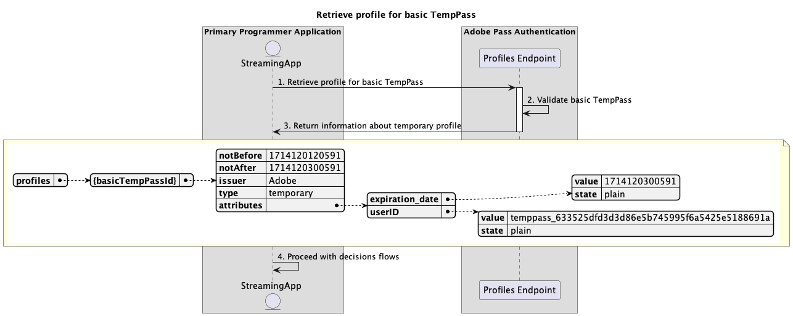

# Temporäre Zugriffsflüsse {#temporary-access-flows}

>[!IMPORTANT]
>
> Der Inhalt dieser Seite dient nur zu Informationszwecken. Die Verwendung dieser API erfordert eine aktuelle Lizenz von Adobe. Eine unbefugte Nutzung ist nicht zulässig.

>[!IMPORTANT]
>
> Die REST-API-V2-Implementierung ist an die Dokumentation [Drosselungsmechanismus](/help/authentication/integration-guide-programmers/throttling-mechanism.md) gebunden.

>[!MORELIKETHIS]
>
> Stellen Sie sicher, dass Sie auch die häufig gestellten Fragen [REST API V2](/help/authentication/integration-guide-programmers/rest-apis/rest-api-v2/rest-api-v2-faqs.md#authentication-phase-faqs-general) besuchen.

Mit TempPass können Programmierer temporären Zugriff auf ihre geschützten Inhalte gewähren, ohne die Benutzer zur Authentifizierung mit einem gültigen MVPD-Konto aufzufordern.

Weitere Informationen zur TempPass-Funktion finden Sie in der Dokumentation [TempPass](../../../../features-premium/temporary-access/temp-pass-feature.md).

Temporäre Zugriffsflüsse ermöglichen die Abfrage für die folgenden Szenarien:

* [Abrufen von Autorisierungsentscheidungen mit einfachem TempPass](#retrieve-authorization-decisions-using-basic-temppass)
* [Abrufen von Autorisierungsentscheidungen mithilfe von Werbe-TempPass](#retrieve-authorization-decisions-using-promotional-temppass)
* [Maximale Ressourcenanzahl mit Werbe-TempPass verbrauchen](#consume-maximum-number-of-resources-using-promotional-temppass)
* [Abrufen von Autorisierungsentscheidungen bei Ablauf von Standard- oder Promotion-TempPass](#retrieve-authorization-decisions-when-basic-or-promotional-temppass-expires)
* [Profil für einfache TempPass-Funktion abrufen](#retrieve-profile-for-basic-temppass)
* [Profil für Werbe-TempPass abrufen](#retrieve-profile-for-promotional-temppass)

## Abrufen von Autorisierungsentscheidungen mit einfachem TempPass {#retrieve-authorization-decisions-using-basic-temppass}

### Voraussetzungen {#prerequisites-retrieve-authorization-decisions-using-basic-temppass}

Stellen Sie vor dem Abrufen von Autorisierungsentscheidungen mit Basic TempPass sicher, dass die folgenden Voraussetzungen erfüllt sind:

* Die Streaming-Anwendung möchte einen temporären Zugriff bereitstellen, um Inhalte wiederzugeben, ohne den Benutzer zur Authentifizierung aufzufordern.
* Die Streaming-Anwendung muss eine Autorisierungsentscheidung abrufen, bevor eine vom Benutzer ausgewählte Ressource wiedergegeben wird.

>[!IMPORTANT]
>
> Annahmen
> 
>  
> 
> * Es muss eine gültige Konfigurationseinstellung von Basic TempPass vorhanden sein, die auf die Integration zwischen den bereitgestellten `serviceProvider` und `mvpd` angewendet wird.
> * Die für „Basic TempPass“ konfigurierte Time-to-Live (TTL) ist noch nicht abgelaufen.

### Workflow {#workflow-retrieve-authorization-decisions-using-basic-temppass}

Führen Sie die angegebenen Schritte aus, um den Autorisierungsfluss mit einfachem TempPass zu implementieren, wie im folgenden Diagramm dargestellt.

*Abrufen von Autorisierungsentscheidungen mit einfachem TempPass*

1. **Autorisierungsentscheidung abrufen:** Die Streaming-Anwendung erfasst alle erforderlichen Daten, um eine Autorisierungsentscheidung für eine bestimmte Ressource zu erhalten, indem sie den Decisions Authorize-Endpunkt aufruft.

   >[!IMPORTANT]
   >
   > Weitere Informationen zu folgenden Themen finden [ in der API](../../apis/decisions-apis/rest-api-v2-decisions-apis-retrieve-authorization-decisions-using-specific-mvpd.md)Dokumentation zum Abrufen von Autorisierungsentscheidungen mithilfe bestimmter MVPD:
   > 
   > * Alle _erforderlichen_ Parameter wie `serviceProvider`, `mvpd` und `resources`
   > * Alle _erforderlichen_ Kopfzeilen wie `Authorization` und `AP-Device-Identifier`
   > * Alle _optionalen_ Parameter und Kopfzeilen

1. **Einfache TempPass validieren:** Der Adobe Pass-Server überprüft, ob eine gültige Konfigurationseinrichtung von einfachem TempPass vorhanden ist, die auf die Integration zwischen den bereitgestellten `serviceProvider` und `mvpd` angewendet wird.

1. **Rückgabe `Permit` Entscheidung mit Medien-Token:** Die Endpunktantwort „Entscheidungen autorisieren“ enthält eine `Permit` Entscheidung und ein Medien-Token.

   >[!IMPORTANT]
   >
   > Weitere Informationen zu den [ in einer Entscheidungsantwort bereitgestellten Informationen finden Sie in der API](../../apis/decisions-apis/rest-api-v2-decisions-apis-retrieve-authorization-decisions-using-specific-mvpd.md)Dokumentation zum Abrufen von Autorisierungsentscheidungen mithilfe einer bestimmten mvpd.
   >
   >  
   > 
   > Der Decisions-Autorisierungs-Endpunkt validiert die Anfragedaten, um sicherzustellen, dass grundlegende Bedingungen erfüllt werden:
   >
   > * Die _erforderlichen_ Parameter und Kopfzeilen müssen gültig sein.
   > * Die Integration zwischen den bereitgestellten `serviceProvider` und `mvpd` muss aktiv sein.
   >
   >  
   > 
   > Wenn die einfache Validierung fehlschlägt, wird eine Fehlerantwort generiert, die zusätzliche Informationen entsprechend der Dokumentation [Erweiterte Fehlercodes](../../../../features-standard/error-reporting/enhanced-error-codes.md) bereitstellt.
   >
   >  
   > 
   > Der Endpunkt Decisions-Autorisierung verwendet die Anfragedaten, um zu überprüfen, ob temporäre Zugriffsbedingungen erfüllt sind:
   >
   > * Die für den grundlegenden TempPass konfigurierte Time-to-Live (TTL) darf nicht abgelaufen sein.
   >
   >  
   > 
   > Wenn die Validierung des temporären Zugriffs fehlschlägt, wird eine Fehlerantwort generiert, die zusätzliche Informationen entsprechend der Dokumentation [Erweiterte Fehler-Codes](../../../../features-standard/error-reporting/enhanced-error-codes.md) bereitstellt.

1. **Stream mit Medien-Token starten:** Die Streaming-Anwendung verwendet das Medien-Token, um den Inhalt wiederzugeben.

## Abrufen von Autorisierungsentscheidungen mithilfe von Werbe-TempPass {#retrieve-authorization-decisions-using-promotional-temppass}

### Voraussetzungen {#prerequisites-retrieve-authorization-decisions-using-promotional-temppass}

Stellen Sie vor dem Abrufen von Autorisierungsentscheidungen mit dem Werbe-TempPass sicher, dass die folgenden Voraussetzungen erfüllt sind:

* Die Streaming-Anwendung möchte einen temporären Zugriff bereitstellen, um eine maximale Anzahl von Ressourcen abzuspielen, ohne den Benutzer zur Authentifizierung aufzufordern.
* Die Streaming-Anwendung muss beim Abrufen einer Autorisierungsentscheidung eindeutige Informationen zur Identität des Benutzers enthalten.
* Die Streaming-Anwendung muss eine Autorisierungsentscheidung abrufen, bevor eine vom Benutzer ausgewählte Ressource wiedergegeben wird.

>[!IMPORTANT]
>
> Annahmen
>
>  
> 
> * Es muss eine gültige Konfigurationseinrichtung für den temporären Werbepass vorhanden sein, die auf die Integration zwischen der bereitgestellten `serviceProvider` und `mvpd` angewendet wird.
> * Die für den Werbe-TempPass konfigurierte Time-to-Live (TTL) ist noch nicht abgelaufen.
> * Die maximale Anzahl von Ressourcen, die für den Werbe-TempPass konfiguriert sind, wurde nicht verbraucht.

### Workflow {#workflow-retrieve-authorization-decisions-using-promotional-temppass}

Führen Sie die angegebenen Schritte aus, um den Autorisierungsfluss mithilfe von Promotion-TempPass zu implementieren, wie im folgenden Diagramm dargestellt.

*Abrufen von Autorisierungsentscheidungen mithilfe von Werbe-TempPass*

1. **Autorisierungsentscheidung abrufen:** Die Streaming-Anwendung erfasst alle erforderlichen Daten, um eine Autorisierungsentscheidung für eine bestimmte Ressource zu erhalten, indem sie den Decisions Authorize-Endpunkt aufruft.

   >[!IMPORTANT]
   >
   > Weitere Informationen zu folgenden Themen finden [ in der API](../../apis/decisions-apis/rest-api-v2-decisions-apis-retrieve-authorization-decisions-using-specific-mvpd.md)Dokumentation zum Abrufen von Autorisierungsentscheidungen mithilfe bestimmter MVPD:
   >
   > * Alle _erforderlichen_ Parameter wie `serviceProvider`, `mvpd` und `resources`
   > * Alle _erforderlichen_ Kopfzeilen wie `Authorization` und `AP-Device-Identifier`
   > * Alle _optionalen_ Parameter und Kopfzeilen
   >
   >  
   >
   > Der Endpunkt Decisions Authorize erfordert bei Verwendung von Werbe-TempPass das Vorhandensein `AP-TempPass-Identity` -Headers. Die Kopfzeile enthält eindeutige Informationen über die Identität des Benutzers, der auf den Inhalt zugreift.
   > 
   >  
   > 
   > Weitere Informationen zu `AP-TempPass-Identity`-Header finden Sie in der Dokumentation [AP-TempPass-Identity](../../appendix/headers/rest-api-v2-appendix-headers-ap-temppass-identity.md).

1. **Promotion-TempPass validieren:** Der Adobe Pass-Server überprüft, ob eine gültige Konfigurationseinrichtung für Promotion-TempPass vorhanden ist, die auf die Integration zwischen den bereitgestellten `serviceProvider` und `mvpd` angewendet wird.

1. **Rückgabe `Permit` Entscheidung mit Medien-Token:** Die Endpunktantwort „Entscheidungen autorisieren“ enthält eine `Permit` Entscheidung und ein Medien-Token.

   >[!IMPORTANT]
   >
   > Weitere Informationen zu den [ in einer Entscheidungsantwort bereitgestellten Informationen finden Sie in der API](../../apis/decisions-apis/rest-api-v2-decisions-apis-retrieve-authorization-decisions-using-specific-mvpd.md)Dokumentation zum Abrufen von Autorisierungsentscheidungen mithilfe einer bestimmten mvpd.
   > 
   >  
   > 
   > Der Decisions-Autorisierungs-Endpunkt validiert die Anfragedaten, um sicherzustellen, dass grundlegende Bedingungen erfüllt werden:
   >
   > * Die _erforderlichen_ Parameter und Kopfzeilen müssen gültig sein.
   > * Die Integration zwischen den bereitgestellten `serviceProvider` und `mvpd` muss aktiv sein.
   >
   >  
   > 
   > Wenn die einfache Validierung fehlschlägt, wird eine Fehlerantwort generiert, die zusätzliche Informationen entsprechend der Dokumentation [Erweiterte Fehlercodes](../../../../features-standard/error-reporting/enhanced-error-codes.md) bereitstellt.
   >
   >  
   > 
   > Der Endpunkt Decisions-Autorisierung verwendet die Anfragedaten, um zu überprüfen, ob temporäre Zugriffsbedingungen erfüllt sind:
   >
   > * Die für den Werbe-TempPass konfigurierte Time-to-Live (TTL) darf nicht abgelaufen sein.
   > * Die maximale Anzahl von Ressourcen, die für den Werbe-TempPass konfiguriert sind, darf nicht verbraucht werden.
   >
   >  
   > 
   > Wenn die Validierung des temporären Zugriffs fehlschlägt, wird eine Fehlerantwort generiert, die zusätzliche Informationen entsprechend der Dokumentation [Erweiterte Fehler-Codes](../../../../features-standard/error-reporting/enhanced-error-codes.md) bereitstellt.

1. **Stream mit Medien-Token starten:** Die Streaming-Anwendung verwendet das Medien-Token, um den Inhalt wiederzugeben.

## Maximale Ressourcenanzahl mit Werbe-TempPass verbrauchen {#consume-maximum-number-of-resources-using-promotional-temppass}

### Voraussetzungen {#prerequisites-consume-maximum-number-of-resources-using-promotional-temppass}

Bevor Sie eine maximale Anzahl von Ressourcen mit dem Werbe-TempPass verbrauchen, stellen Sie sicher, dass die folgenden Voraussetzungen erfüllt sind:

* Die Streaming-Anwendung möchte einen temporären Zugriff bereitstellen, um eine maximale Anzahl von Ressourcen abzuspielen, ohne den Benutzer zur Authentifizierung aufzufordern.
* Die Streaming-Anwendung muss beim Abrufen einer Autorisierungsentscheidung eindeutige Informationen zur Identität des Benutzers enthalten.
* Die Streaming-Anwendung muss eine Autorisierungsentscheidung abrufen, bevor eine vom Benutzer ausgewählte Ressource wiedergegeben wird.

>[!IMPORTANT]
>
> Annahmen
>
>  
> 
> * Es muss eine gültige Konfigurationseinrichtung für den temporären Werbepass vorhanden sein, die auf die Integration zwischen der bereitgestellten `serviceProvider` und `mvpd` angewendet wird.
> * Die für den Werbe-TempPass konfigurierte Time-to-Live (TTL) ist noch nicht abgelaufen.
> * Die maximale Anzahl von Ressourcen, die für den Werbe-TempPass konfiguriert sind, ist 1.

### Workflow {#workflow-consume-maximum-number-of-resources-using-promotional-temppass}

Befolgen Sie die angegebenen Schritte, um den Autorisierungsfluss zu implementieren, wenn Sie eine maximale Anzahl von Ressourcen mit dem Werbe-TempPass verbrauchen, wie im folgenden Diagramm dargestellt.

*Verwenden Sie die maximale Anzahl von Ressourcen mit dem Werbe-TempPass*

1. **Profil für Werbe-TempPass abrufen:** Die Streaming-Anwendung sammelt alle erforderlichen Daten, um Profilinformationen für Werbe-TempPass abzurufen, indem sie eine Anfrage an den Endpunkt „Profiles“ sendet.

   >[!IMPORTANT]
   >
   > Weitere Informationen zu folgenden Themen finden [ in der API](../../apis/profiles-apis/rest-api-v2-profiles-apis-retrieve-profile-for-specific-mvpd.md)Dokumentation zum Abrufen von Profilen für bestimmte MVPD:
   >
   > * Alle _erforderlichen_ Parameter wie `serviceProvider` und `mvpd`
   > * Alle _erforderlichen_ Kopfzeilen wie `Authorization` und `AP-Device-Identifier`
   > * Alle _optionalen_ Parameter und Kopfzeilen
   >
   >  
   > 
   > Die Abfrage des Profilendpunkts ist optional und kann verwendet werden, um festzustellen, wie viele Ressourcen mit dem Werbe-TempPass noch wiedergegeben werden können.

1. **Promotion-TempPass validieren:** Der Adobe Pass-Server überprüft, ob eine gültige Konfigurationseinrichtung für Promotion-TempPass vorhanden ist, die auf die Integration zwischen den bereitgestellten `serviceProvider` und `mvpd` angewendet wird.

1. **Rückgabeinformationen zum temporären Profil:** Die Antwort des Endpunkts „Profiles“ enthält Informationen zum temporären Profil, einschließlich des Attributs, das auf „temporär“ festgelegt `type`.

   >[!IMPORTANT]
   >
   > Weitere Informationen zu [ in einer Profilantwort angegebenen Informationen finden Sie in der API](../../apis/profiles-apis/rest-api-v2-profiles-apis-retrieve-profile-for-specific-mvpd.md)Dokumentation zum Abrufen von Profilen für bestimmte mvpd.
   > 
   >  
   > 
   > Der Profiles-Endpunkt validiert die Anfragedaten, um sicherzustellen, dass die grundlegenden Bedingungen erfüllt sind:
   >
   > * Die _erforderlichen_ Parameter und Kopfzeilen müssen gültig sein.
   > * Die Integration zwischen den bereitgestellten `serviceProvider` und `mvpd` muss aktiv sein.
   > 
   >  
   >
   > Wenn die einfache Validierung fehlschlägt, wird eine Fehlerantwort generiert, die zusätzliche Informationen entsprechend der Dokumentation [Erweiterte Fehlercodes](../../../../features-standard/error-reporting/enhanced-error-codes.md) bereitstellt.
   >
   >  
   > 
   > Der Profilendpunkt verwendet die Anfragedaten, um zu überprüfen, ob temporäre Zugriffsbedingungen erfüllt sind:
   >
   > * Die für den Werbe-TempPass konfigurierte Time-to-Live (TTL) darf nicht abgelaufen sein.
   > * Die maximale Anzahl von Ressourcen, die für den Werbe-TempPass konfiguriert sind, darf nicht verbraucht werden.
   >
   >  
   > 
   > Wenn die Validierung des temporären Zugriffs fehlschlägt, wird eine Fehlerantwort generiert, die zusätzliche Informationen entsprechend der Dokumentation [Erweiterte Fehler-Codes](../../../../features-standard/error-reporting/enhanced-error-codes.md) bereitstellt.

1. **Fahren Sie mit Entscheidungsflüssen fort:** Wenn die Antwort des Endpunkts „Profile“ ein Profil enthält, verwendet die Streaming-Anwendung die temporären Profilinformationen, um mit nachfolgenden Entscheidungsflüssen fortzufahren.

1. **Autorisierungsentscheidung abrufen:** Die Streaming-Anwendung erfasst alle erforderlichen Daten, um eine Autorisierungsentscheidung für eine bestimmte Ressource zu erhalten, indem sie den Decisions Authorize-Endpunkt aufruft.

   >[!IMPORTANT]
   > 
   > Weitere Informationen zu folgenden Themen finden [ in der API](../../apis/decisions-apis/rest-api-v2-decisions-apis-retrieve-authorization-decisions-using-specific-mvpd.md)Dokumentation zum Abrufen von Autorisierungsentscheidungen mithilfe bestimmter MVPD:
   >
   > * Alle _erforderlichen_ Parameter wie `serviceProvider`, `mvpd` und `resources`
   > * Alle _erforderlichen_ Kopfzeilen wie `Authorization` und `AP-Device-Identifier`
   > * Alle _optionalen_ Parameter und Kopfzeilen
   >
   >  
   > 
   > Der Endpunkt Decisions Authorize erfordert bei Verwendung von Werbe-TempPass das Vorhandensein `AP-TempPass-Identity` -Headers. Die Kopfzeile enthält eindeutige Informationen über die Identität des Benutzers, der auf den Inhalt zugreift.
   > 
   >  
   > 
   > Weitere Informationen zu `AP-TempPass-Identity`-Header finden Sie in der Dokumentation [AP-TempPass-Identity](../../appendix/headers/rest-api-v2-appendix-headers-ap-temppass-identity.md).

1. **Promotion-TempPass validieren:** Der Adobe Pass-Server überprüft, ob eine gültige Konfigurationseinrichtung für Promotion-TempPass vorhanden ist, die auf die Integration zwischen den bereitgestellten `serviceProvider` und `mvpd` angewendet wird.

1. **Rückgabe `Permit` Entscheidung mit Medien-Token:** Die Endpunktantwort „Entscheidungen autorisieren“ enthält eine `Permit` Entscheidung und ein Medien-Token.

   >[!IMPORTANT]
   >
   > Weitere Informationen zu den [ in einer Entscheidungsantwort bereitgestellten Informationen finden Sie in der API](../../apis/decisions-apis/rest-api-v2-decisions-apis-retrieve-authorization-decisions-using-specific-mvpd.md)Dokumentation zum Abrufen von Autorisierungsentscheidungen mithilfe einer bestimmten mvpd.
   > 
   >  
   > 
   > Der Decisions-Autorisierungs-Endpunkt validiert die Anfragedaten, um sicherzustellen, dass grundlegende Bedingungen erfüllt werden:
   >
   > * Die _erforderlichen_ Parameter und Kopfzeilen müssen gültig sein.
   > * Die Integration zwischen den bereitgestellten `serviceProvider` und `mvpd` muss aktiv sein.
   >
   >  
   > 
   > Wenn die einfache Validierung fehlschlägt, wird eine Fehlerantwort generiert, die zusätzliche Informationen entsprechend der Dokumentation [Erweiterte Fehlercodes](../../../../features-standard/error-reporting/enhanced-error-codes.md) bereitstellt.
   > 
   >  
   > 
   > Der Endpunkt Decisions-Autorisierung verwendet die Anfragedaten, um zu überprüfen, ob temporäre Zugriffsbedingungen erfüllt sind:
   >
   > * Die für den Werbe-TempPass konfigurierte Time-to-Live (TTL) darf nicht abgelaufen sein.
   > * Die maximale Anzahl von Ressourcen, die für den Werbe-TempPass konfiguriert sind, darf nicht verbraucht werden.
   >
   >  
   > 
   > Wenn die Validierung des temporären Zugriffs fehlschlägt, wird eine Fehlerantwort generiert, die zusätzliche Informationen entsprechend der Dokumentation [Erweiterte Fehler-Codes](../../../../features-standard/error-reporting/enhanced-error-codes.md) bereitstellt.

1. **Autorisierungsentscheidung abrufen:** Die Streaming-Anwendung erfasst alle erforderlichen Daten, um eine Autorisierungsentscheidung für eine bestimmte Ressource zu erhalten, indem sie den Decisions Authorize-Endpunkt aufruft.

   >[!IMPORTANT]
   >
   > Weitere Informationen zu folgenden Themen finden [ in der API](../../apis/decisions-apis/rest-api-v2-decisions-apis-retrieve-authorization-decisions-using-specific-mvpd.md)Dokumentation zum Abrufen von Autorisierungsentscheidungen mithilfe bestimmter MVPD:
   >
   > * Alle _erforderlichen_ Parameter wie `serviceProvider`, `mvpd` und `resources`
   > * Alle _erforderlichen_ Kopfzeilen wie `Authorization` und `AP-Device-Identifier`
   > * Alle _optionalen_ Parameter und Kopfzeilen
   >
   >  
   > 
   > Der Endpunkt Decisions Authorize erfordert bei Verwendung von Werbe-TempPass das Vorhandensein `AP-TempPass-Identity` -Headers. Die Kopfzeile enthält eindeutige Informationen über die Identität des Benutzers, der auf den Inhalt zugreift.
   >
   >  
   > 
   > Weitere Informationen zu `AP-TempPass-Identity`-Header finden Sie in der Dokumentation [AP-TempPass-Identity](../../appendix/headers/rest-api-v2-appendix-headers-ap-temppass-identity.md).

1. **Promotion-TempPass validieren:** Der Adobe Pass-Server überprüft, ob eine gültige Konfigurationseinrichtung für Promotion-TempPass vorhanden ist, die auf die Integration zwischen den bereitgestellten `serviceProvider` und `mvpd` angewendet wird.

1. **Rückgabe `Deny` Entscheidung mit Details:** Die Endpunktantwort „Decisions Authorize“ enthält eine `Deny` Entscheidung und eine Fehler-Payload, die der Dokumentation zu [Enhanced Error Codes](../../../../features-standard/error-reporting/enhanced-error-codes.md) entsprechen.

   >[!IMPORTANT]
   >
   > Weitere Informationen zu den [ in einer Entscheidungsantwort bereitgestellten Informationen finden Sie in der API](../../apis/decisions-apis/rest-api-v2-decisions-apis-retrieve-authorization-decisions-using-specific-mvpd.md)Dokumentation zum Abrufen von Autorisierungsentscheidungen mithilfe einer bestimmten mvpd.
   > 
   >  
   > 
   > Der Decisions-Autorisierungs-Endpunkt validiert die Anfragedaten, um sicherzustellen, dass grundlegende Bedingungen erfüllt werden:
   >
   > * Die _erforderlichen_ Parameter und Kopfzeilen müssen gültig sein.
   > * Die Integration zwischen den bereitgestellten `serviceProvider` und `mvpd` muss aktiv sein.
   >
   >  
   > 
   > Wenn die einfache Validierung fehlschlägt, wird eine Fehlerantwort generiert, die zusätzliche Informationen entsprechend der Dokumentation [Erweiterte Fehlercodes](../../../../features-standard/error-reporting/enhanced-error-codes.md) bereitstellt.
   >
   >  
   > 
   > Der Endpunkt Decisions-Autorisierung verwendet die Anfragedaten, um zu überprüfen, ob temporäre Zugriffsbedingungen erfüllt sind:
   >
   > * Die für den Werbe-TempPass konfigurierte Time-to-Live (TTL) darf nicht abgelaufen sein.
   > * Die maximale Anzahl von Ressourcen, die für den Werbe-TempPass konfiguriert sind, darf nicht verbraucht werden.
   >
   >  
   > 
   > Wenn die Validierung des temporären Zugriffs fehlschlägt, wird eine Fehlerantwort generiert, die zusätzliche Informationen entsprechend der Dokumentation [Erweiterte Fehler-Codes](../../../../features-standard/error-reporting/enhanced-error-codes.md) bereitstellt.

1. **Handhabung `Deny` Entscheidungsdetails:** Die Streaming-Anwendung verarbeitet die Fehlerinformationen aus der Antwort und kann sie verwenden, um optional eine bestimmte Nachricht auf der Benutzeroberfläche anzuzeigen.

   >[!TIP]
   >
   > Die Streaming-Anwendung kann Benutzende darüber informieren, dass die maximale Anzahl von Ressourcen überschritten wurde, und ihnen empfehlen, einen einfachen Authentifizierungsfluss mithilfe einer regulären MVPD einzuleiten, um den Überwachungsvorgang fortzusetzen.

## Abrufen von Autorisierungsentscheidungen bei Ablauf von Standard- oder Promotion-TempPass {#retrieve-authorization-decisions-when-basic-or-promotional-temppass-expires}

### Voraussetzungen {#prerequisites-retrieve-authorization-decisions-when-basic-or-promotional-temppass-expires}

Stellen Sie vor dem Abrufen von Autorisierungsentscheidungen bei Ablauf des Standard- oder Promotion-TempPass sicher, dass die folgenden Voraussetzungen erfüllt sind:

* [Voraussetzungen vor dem Abrufen von Autorisierungsentscheidungen mit Basic TempPass](#prerequisites-retrieve-authorization-decisions-using-basic-temppass).
* [Voraussetzungen vor dem Abrufen von Autorisierungsentscheidungen mithilfe von Werbe-TempPass](#prerequisites-retrieve-authorization-decisions-using-promotional-temppass).

>[!IMPORTANT]
>
> Annahmen
> 
>  
> 
> * Es muss eine gültige Konfigurationseinstellung von Basic oder Promotion TempPass vorhanden sein, die auf die Integration zwischen den bereitgestellten `serviceProvider` und `mvpd` angewendet wird.
> * Die Time-to-Live (TTL), die für die Standard- oder Werbeanzeige konfiguriert wurde. Die zeitweilige Zugriffsdauer wurde überschritten.

### Workflow {#workflow-retrieve-authorization-decisions-when-basic-or-promotional-temppass-expires}

Befolgen Sie die angegebenen Schritte, um den Autorisierungsfluss zu implementieren, wenn der Standard- oder Promotion-TempPass abläuft, wie in der folgenden Abbildung dargestellt.

*Abrufen von Autorisierungsentscheidungen bei Ablauf von Standard- oder Promotion-TempPass*

1. **Autorisierungsentscheidung abrufen:** Die Streaming-Anwendung erfasst alle erforderlichen Daten, um eine Autorisierungsentscheidung für eine bestimmte Ressource zu erhalten, indem sie den Decisions Authorize-Endpunkt aufruft.

   >[!IMPORTANT]
   >
   > Weitere Informationen zu folgenden Themen finden [ in der API](../../apis/decisions-apis/rest-api-v2-decisions-apis-retrieve-authorization-decisions-using-specific-mvpd.md)Dokumentation zum Abrufen von Autorisierungsentscheidungen mithilfe bestimmter MVPD:
   > 
   > * Alle _erforderlichen_ Parameter wie `serviceProvider`, `mvpd` und `resources`
   > * Alle _erforderlichen_ Kopfzeilen wie `Authorization` und `AP-Device-Identifier`
   > * Alle _optionalen_ Parameter und Kopfzeilen
   >
   >  
   > 
   > Der Endpunkt Decisions Authorize erfordert bei Verwendung von Werbe-TempPass das Vorhandensein `AP-TempPass-Identity` -Headers. Die Kopfzeile enthält eindeutige Informationen über die Identität des Benutzers, der auf den Inhalt zugreift.
   > 
   >  
   > 
   > Weitere Informationen zu `AP-TempPass-Identity`-Header finden Sie in der Dokumentation [AP-TempPass-Identity](../../appendix/headers/rest-api-v2-appendix-headers-ap-temppass-identity.md).

1. **Validieren von Standard- oder Promotion-TempPass:** Der Adobe Pass-Server überprüft, ob eine gültige Konfigurationseinrichtung von Standard- oder Promotion-TempPass vorhanden ist, die auf die Integration zwischen den bereitgestellten `serviceProvider` und `mvpd` angewendet wird.

1. **Rückgabe `Deny` Entscheidung mit Details:** Die Endpunktantwort „Decisions Authorize“ enthält eine `Deny` Entscheidung und eine Fehler-Payload, die der Dokumentation zu [Enhanced Error Codes](../../../../features-standard/error-reporting/enhanced-error-codes.md) entsprechen.

   >[!IMPORTANT]
   >
   > Weitere Informationen zu den [ in einer Entscheidungsantwort bereitgestellten Informationen finden Sie in der API](../../apis/decisions-apis/rest-api-v2-decisions-apis-retrieve-authorization-decisions-using-specific-mvpd.md)Dokumentation zum Abrufen von Autorisierungsentscheidungen mithilfe einer bestimmten mvpd.
   > 
   >  
   > 
   > Der Decisions-Autorisierungs-Endpunkt validiert die Anfragedaten, um sicherzustellen, dass grundlegende Bedingungen erfüllt werden:
   >
   > * Die _erforderlichen_ Parameter und Kopfzeilen müssen gültig sein.
   > * Die Integration zwischen den bereitgestellten `serviceProvider` und `mvpd` muss aktiv sein.
   >
   >  
   > 
   > Wenn die einfache Validierung fehlschlägt, wird eine Fehlerantwort generiert, die zusätzliche Informationen entsprechend der Dokumentation [Erweiterte Fehlercodes](../../../../features-standard/error-reporting/enhanced-error-codes.md) bereitstellt.
   >
   >  
   > 
   > Der Endpunkt Decisions-Autorisierung verwendet die Anfragedaten, um zu überprüfen, ob temporäre Zugriffsbedingungen erfüllt sind:
   >
   > * Die für den Standard- oder Werbe-TempPass konfigurierte Time-to-Live (TTL) darf nicht abgelaufen sein.
   > * Die maximale Anzahl von Ressourcen, die für den Werbe-TempPass konfiguriert sind, darf nicht verbraucht werden.
   >
   >  
   > 
   > Wenn die Validierung des temporären Zugriffs fehlschlägt, wird eine Fehlerantwort generiert, die zusätzliche Informationen entsprechend der Dokumentation [Erweiterte Fehler-Codes](../../../../features-standard/error-reporting/enhanced-error-codes.md) bereitstellt.

1. **Handhabung `Deny` Entscheidungsdetails:** Die Streaming-Anwendung verarbeitet die Fehlerinformationen aus der Antwort und kann sie verwenden, um optional eine bestimmte Nachricht auf der Benutzeroberfläche anzuzeigen.

   >[!TIP]
   >
   > Die Streaming-Anwendung kann Benutzende darüber informieren, dass der temporäre Zugriff abgelaufen ist, und ihnen empfehlen, einen einfachen Authentifizierungsfluss mithilfe einer regulären MVPD einzuleiten, um den Überwachungsvorgang fortzusetzen.

## Profil für einfache TempPass-Funktion abrufen {#retrieve-profile-for-basic-temppass}

>[!IMPORTANT]
>
> Die Abfrage des Profilendpunkts ist für einfache TempPass-Abfragen optional.

### Voraussetzungen {#prerequisites-retrieve-profile-for-basic-temppass}

Stellen Sie vor dem Abrufen des Profils für Basic TempPass sicher, dass die folgenden Voraussetzungen erfüllt sind:

* Die Streaming-Anwendung möchte das temporäre Profil abrufen, um sicherzustellen, dass der temporäre Zugriff nicht abgelaufen ist.

>[!IMPORTANT]
>
> Annahmen
> 
>  
> 
> * Es muss eine gültige Konfigurationseinstellung von Basic TempPass vorhanden sein, die auf die Integration zwischen den bereitgestellten `serviceProvider` und `mvpd` angewendet wird.
> * Die für den grundlegenden TempPass konfigurierte Time-to-Live (TTL) darf nicht abgelaufen sein.

### Workflow {#workflow-retrieve-profile-information-for-basic-temppass}

Führen Sie die angegebenen Schritte aus, um den Fluss zum Abrufen von Profilen für einfache TempPass zu implementieren, wie im folgenden Diagramm dargestellt.

*Profil für einfachen TempPass abrufen*

1. **Profil für einfache TempPass abrufen:** Die Streaming-Anwendung sammelt alle erforderlichen Daten, um Profilinformationen für einfache TempPass abzurufen, indem sie eine Anfrage an den Endpunkt „Profiles“ sendet.

   >[!IMPORTANT]
   >
   > Weitere Informationen zu folgenden Themen finden [ in der API](../../apis/profiles-apis/rest-api-v2-profiles-apis-retrieve-profile-for-specific-mvpd.md)Dokumentation zum Abrufen von Profilen für bestimmte MVPD:
   > 
   > * Alle _erforderlichen_ Parameter wie `serviceProvider` und `mvpd`
   > * Alle _erforderlichen_ Kopfzeilen wie `Authorization` und `AP-Device-Identifier`
   > * Alle _optionalen_ Parameter und Kopfzeilen

1. **Einfache TempPass validieren:** Der Adobe Pass-Server überprüft, ob eine gültige Konfigurationseinrichtung von einfachem TempPass vorhanden ist, die auf die Integration zwischen den bereitgestellten `serviceProvider` und `mvpd` angewendet wird.

1. **Rückgabeinformationen zum temporären Profil:** Die Antwort des Endpunkts „Profiles“ enthält Informationen zum temporären Profil, einschließlich des Attributs, das auf „temporär“ festgelegt `type`.

   >[!IMPORTANT]
   >
   > Weitere Informationen zu [ in einer Profilantwort angegebenen Informationen finden Sie in der API](../../apis/profiles-apis/rest-api-v2-profiles-apis-retrieve-profile-for-specific-mvpd.md)Dokumentation zum Abrufen von Profilen für bestimmte mvpd.
   > 
   >  
   > 
   > Der Profiles-Endpunkt validiert die Anfragedaten, um sicherzustellen, dass die grundlegenden Bedingungen erfüllt sind:
   >
   > * Die _erforderlichen_ Parameter und Kopfzeilen müssen gültig sein.
   > * Die Integration zwischen den bereitgestellten `serviceProvider` und `mvpd` muss aktiv sein.
   >
   >  
   > 
   > Wenn die einfache Validierung fehlschlägt, wird eine Fehlerantwort generiert, die zusätzliche Informationen entsprechend der Dokumentation [Erweiterte Fehlercodes](../../../../features-standard/error-reporting/enhanced-error-codes.md) bereitstellt.
   >
   >  
   > 
   > Der Profilendpunkt verwendet die Anfragedaten, um zu überprüfen, ob temporäre Zugriffsbedingungen erfüllt sind:
   >
   > * Die für den grundlegenden TempPass konfigurierte Time-to-Live (TTL) darf nicht abgelaufen sein.
   >
   >  
   > 
   > Wenn die Validierung des temporären Zugriffs fehlschlägt, wird eine Fehlerantwort generiert, die zusätzliche Informationen entsprechend der Dokumentation [Erweiterte Fehler-Codes](../../../../features-standard/error-reporting/enhanced-error-codes.md) bereitstellt.

1. **Fahren Sie mit Entscheidungsflüssen fort:** Wenn die Antwort des Endpunkts „Profile“ ein Profil enthält, verwendet die Streaming-Anwendung die temporären Profilinformationen, um mit nachfolgenden Entscheidungsflüssen fortzufahren.

## Profil für Werbe-TempPass abrufen {#retrieve-profile-for-promotional-temppass}

>[!IMPORTANT]
>
> Die Abfrage des Profilendpunkts ist für Werbe-TempPass optional.

### Voraussetzungen {#prerequisites-retrieve-profile-for-promotional-temppass}

Stellen Sie vor dem Abrufen des Profils für den Werbe-TempPass sicher, dass die folgenden Voraussetzungen erfüllt sind:

* Die Streaming-Anwendung möchte das temporäre Profil abrufen, um sicherzustellen, dass der temporäre Zugriff nicht abgelaufen ist, oder um zu bestimmen, wie viele Ressourcen noch wiedergegeben werden können.

>[!IMPORTANT]
>
> Annahmen
>
>  
> 
> * Es muss eine gültige Konfigurationseinrichtung für den temporären Werbepass vorhanden sein, die auf die Integration zwischen der bereitgestellten `serviceProvider` und `mvpd` angewendet wird.
> * Die für den Werbe-TempPass konfigurierte Time-to-Live (TTL) ist noch nicht abgelaufen.
> * Die maximale Anzahl von Ressourcen, die für den Werbe-TempPass konfiguriert sind, wurde nicht verbraucht.

### Workflow {#workflow-retrieve-profile-information-for-promotional-temppass}

Führen Sie die angegebenen Schritte aus, um den Fluss zum Abrufen von Profilen für den Werbe-TempPass zu implementieren, wie in der folgenden Abbildung dargestellt.

*Profil für Werbe-TempPass abrufen*

1. **Profil für Werbe-TempPass abrufen:** Die Streaming-Anwendung sammelt alle erforderlichen Daten, um Profilinformationen für Werbe-TempPass abzurufen, indem sie eine Anfrage an den Endpunkt „Profiles“ sendet.

   >[!IMPORTANT]
   >
   > Weitere Informationen zu folgenden Themen finden [ in der API](../../apis/profiles-apis/rest-api-v2-profiles-apis-retrieve-profile-for-specific-mvpd.md)Dokumentation zum Abrufen von Profilen für bestimmte MVPD:
   > 
   > * Alle _erforderlichen_ Parameter wie `serviceProvider` und `mvpd`
   > * Alle _erforderlichen_ Kopfzeilen wie `Authorization` und `AP-Device-Identifier`
   > * Alle _optionalen_ Parameter und Kopfzeilen

1. **Promotion-TempPass validieren:** Der Adobe Pass-Server überprüft, ob eine gültige Konfigurationseinrichtung für Promotion-TempPass vorhanden ist, die auf die Integration zwischen den bereitgestellten `serviceProvider` und `mvpd` angewendet wird.

1. **Rückgabeinformationen zum temporären Profil:** Die Antwort des Endpunkts „Profiles“ enthält Informationen zum temporären Profil, einschließlich des Attributs, das auf „temporär“ festgelegt `type`.

   >[!IMPORTANT]
   >
   > Weitere Informationen zu [ in einer Profilantwort angegebenen Informationen finden Sie in der API](../../apis/profiles-apis/rest-api-v2-profiles-apis-retrieve-profile-for-specific-mvpd.md)Dokumentation zum Abrufen von Profilen für bestimmte mvpd.
   > 
   >  
   > 
   > Der Profiles-Endpunkt validiert die Anfragedaten, um sicherzustellen, dass die grundlegenden Bedingungen erfüllt sind:
   >
   > * Die _erforderlichen_ Parameter und Kopfzeilen müssen gültig sein.
   > * Die Integration zwischen den bereitgestellten `serviceProvider` und `mvpd` muss aktiv sein.
   >
   >  
   > 
   > Wenn die einfache Validierung fehlschlägt, wird eine Fehlerantwort generiert, die zusätzliche Informationen entsprechend der Dokumentation [Erweiterte Fehlercodes](../../../../features-standard/error-reporting/enhanced-error-codes.md) bereitstellt.
   >
   >  
   > 
   > Der Profilendpunkt verwendet die Anfragedaten, um zu überprüfen, ob temporäre Zugriffsbedingungen erfüllt sind:
   >
   > * Die für den Werbe-TempPass konfigurierte Time-to-Live (TTL) darf nicht abgelaufen sein.
   > * Die maximale Anzahl von Ressourcen, die für den Werbe-TempPass konfiguriert sind, darf nicht verbraucht werden.
   >
   >  
   > 
   > Wenn die Validierung des temporären Zugriffs fehlschlägt, wird eine Fehlerantwort generiert, die zusätzliche Informationen entsprechend der Dokumentation [Erweiterte Fehler-Codes](../../../../features-standard/error-reporting/enhanced-error-codes.md) bereitstellt.

1. **Fahren Sie mit Entscheidungsflüssen fort:** Wenn die Antwort des Endpunkts „Profile“ ein Profil enthält, verwendet die Streaming-Anwendung die temporären Profilinformationen, um mit nachfolgenden Entscheidungsflüssen fortzufahren.
