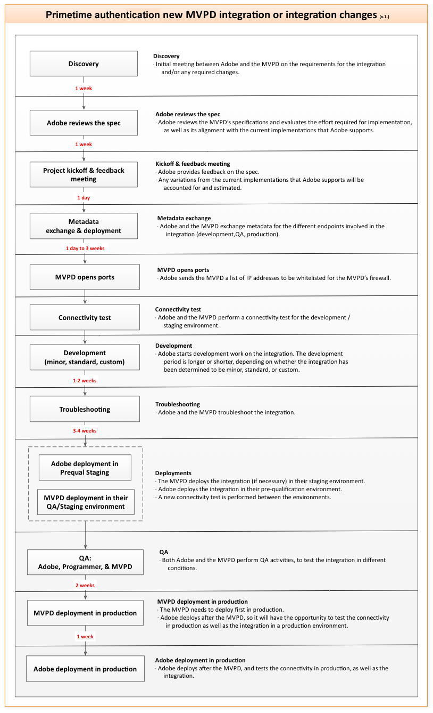

# Schnellstartanleitung für MVPD {#mvpd-kickstart-guide}

>[!IMPORTANT]
>
> Der Inhalt dieser Seite dient nur zu Informationszwecken. Die Verwendung dieser API erfordert eine aktuelle Lizenz von Adobe. Eine unbefugte Nutzung ist nicht zulässig.

Dieses Schnellstartanleitung ist für Multichannel Video Programming Distributors (MVPDs) gedacht, die eine Integration mit der Adobe® Pass-Authentifizierung planen.

In diesem Dokument werden die wichtigsten ersten Schritte für einen reibungslosen und effizienten Start des Integrationsprozesses beschrieben. Sie soll die Erwartungen verdeutlichen und Anleitungen dazu geben, wie wir mit Partnern zusammenarbeiten werden, um erfolgreiche Integrationen zu erreichen.

Adobe bietet eine Reihe von Ressourcen, die Ihnen bei der Integration mit der Adobe Pass-Authentifizierung helfen. Bitte beachten Sie die **„Sie geben Folgendes an** und **&quot;Adobe stellt Folgendes bereit** in jedem folgenden Abschnitt.

>[!CAUTION]
>
> Jedes Mal, wenn ein Benutzer einen Berechtigungsfluss initiiert, wird ihm eine einzige, undurchsichtige, eindeutige Benutzer-ID zugewiesen. Diese vom MVPD stammende ID wird verwendet, um den Benutzer in der App eines Programmierers zu identifizieren.
>
>  
>
> Die Benutzer-ID darf keine personenbezogenen Daten (PII) oder Daten enthalten, die allein oder in Kombination mit anderen Details verwendet werden könnten, um den Benutzer zu identifizieren, zu kontaktieren oder zu finden.

## Einrichtungsprozess {#setup-process}

Der Einrichtungsprozess umfasst unter anderem die folgenden Schritte:

Integrationsprozess für die 

Integrationsprozess für die *Adobe®-Pass-Authentifizierung*

### Start {#kickoff}

**Sie geben** in der Kickoff-Phase Folgendes an:

* **Anzeigename**

  Dies ist eine Zeichenfolge, die auf Programmierer-Websites oder -Anwendungen angezeigt wird, wenn Benutzer aufgefordert werden, ihren Pay-TV-Anbieter auszuwählen.

* **Logo-URL**

  Hierbei handelt es sich um eine Datei mit einer Größe von 112 x 33 Pixel, die das Logo enthält, das auf den Websites oder Anwendungen von Programmierern angezeigt wird, wenn die Benutzer aufgefordert werden, ihren Pay-TV-Anbieter auszuwählen.

* **Time-to-Live (TTL)**

  Die TTL ist ein Wert, der normalerweise von MVPD im Rahmen der Authentifizierungs- oder Autorisierungsprozesse festgelegt wird. Adobe kann diese TTL-Werte jedoch überschreiben und unterschiedliche Werte bereitstellen, je nachdem, was sowohl vom Programmierer als auch von MVPD vereinbart wurde.

* **Berechtigungssätze**

  Hierbei handelt es sich um Anmeldeinformationen, die zur Authentifizierung und Autorisierung oder nur zur Authentifizierung des Benutzers bei der MVPD verwendet werden. Normalerweise bestehen diese Anmeldeinformationen aus einem Benutzernamen und einem Kennwort, die für beide Profile (Staging und Produktion) angegeben werden müssen.

### Metadatenaustausch (SAML) {#metadata-exchange-saml}

**Adobe stellt während** Phase des Metadatenaustauschs Folgendes bereit:

* **Staging-Umgebung - Metadaten**

  Die SP-Metadaten von Adobe können unter https://sp.auth-staging.adobe.com/sp/metadata abgerufen werden.

* **Metadaten der Produktionsumgebung**

  Die SP-Metadaten von Adobe können unter https://sp.auth.adobe.com/sp/metadata abgerufen werden.

**Sie geben während** Phase des Metadatenaustauschs Folgendes an:

* **Staging-Metadaten**

  Die Metadaten von MVPD für die Staging-Umgebung.

* **Produktionsmetadaten**

  Die Metadaten von MVPD für die Produktionsumgebung.

### Konnektivität {#connectivity}

**Sie stellen eine** zur Zulassungsliste von IPs von Adobe bereit, da für die Adobe Pass-Authentifizierung Firewalls erforderlich sind, die den Traffic über die Ports 80 und 443 zulassen, um den Zugriff auf eingeschränkte Ressourcen sowohl während des Authentifizierungs- als auch während des Autorisierungsprozesses zu ermöglichen.

**Sie stellen** Bereitstellung im Staging-Profil bereit, um die Verbindung zu testen.

### Entwicklung {#development}

**Adobe gewährt dem Engineering** Zeit, eng mit MVPD zusammenzuarbeiten, um sicherzustellen, dass die technische Integration korrekt eingerichtet ist. Dieser Prozess umfasst die Entwicklung von benutzerdefiniertem Code, der auf die spezifischen Anforderungen von MVPD zugeschnitten ist.

### Staging-Bereitstellung {#deployment-staging}

**Adobe stellt einen Build** den erforderlichen Code-Aktualisierungen bereit, der zuerst in der PRE-QUAL-Staging-Umgebung bereitgestellt wird. In dieser Phase werden auch die erforderlichen Konfigurationsänderungen implementiert, um die MVPD zu Testzwecken mit dem `TestDistributors`-Dienstleister zu integrieren.

**Sie und Adobe stellen** Qualitätssicherung (QA) Zeit zur Verfügung, um sicherzustellen, dass die Integration in der STAGING-Umgebung von PRE-QUAL erfolgreich getestet wurde. Nach dieser Phase wird die MVPD in die Staging-Umgebung der Version verschoben, um sie mit einem tatsächlichen Programmierer weiter zu testen.

### Bereitstellung in der Produktion {#deployment-production}

**Sie stellen** Bereitstellung im Produktionsprofil bereit, um die Konnektivität zu testen.

**Adobe stellt** Build mit den erforderlichen Code-Aktualisierungen bereit, die in der Pre-QUAL-Produktionsumgebung bereitgestellt werden.

**Sie und Adobe stellen** Qualitätssicherung (QA) Zeit zur Verfügung, um sicherzustellen, dass die Integration mithilfe des Produktionsprofils erfolgreich getestet wurde. Wenn zu diesem Zeitpunkt alles in Ordnung ist, kann Adobe die Integration in die RELEASE-Produktionsumgebung („Live„) verschieben, die für alle Benutzenden verfügbar ist.

>[!IMPORTANT]
>
> Sobald die Integration in der RELEASE-Produktionsumgebung verfügbar ist, ist es von größter Bedeutung, ein optimales Kundenerlebnis aufrechtzuerhalten. Um Serverausfallszenarien effektiv zu beheben, müssen MVPDs Adobe eine detaillierte Dokumentation zu Eskalationsverfahren bereitstellen, um solche Probleme zu beheben.
>
> Im Gegenzug stellt Adobe sicher, dass MVPDs die neueste Version des Adobe Pass-Authentifizierungs-Eskalationsprozesses erhalten, um die Problembehebung zu optimieren.

## Zugriff auf Umgebungen {#access-environments}

**Adobe bietet** Zugriff auf Umgebungen für verschiedene Phasen des Entwicklungsprozesses:

* **Präqualifikation (PRE-QUAL)**

  Die PRE-QUAL-Umgebung hostet den nächsten Release-Kandidaten und dient als erste Integrationsplattform für neue Partner. Bevor Partner zur RELEASE-Umgebung wechseln, erhalten sie Zeit, ihre Integration in PRE-QUAL zu testen.

* **Version (RELEASE)**

  Die RELEASE-Umgebung hostet den aktuellen (stabilen) Produktions-Build.

Weitere Informationen zur Verwendung dieser Umgebungen finden Sie in der Dokumentation [Grundlagen zu den Adobe-Umgebungen](/help/authentication/notes-technical/environments/understanding-the-adobe-environments.md).

>[!IMPORTANT]
> 
> Konfigurationsänderungen an diesen Umgebungen müssen gemäß dem etablierten Änderungsanforderungsprozess explizit von Ihrem Adobe-Support-Mitarbeiter angefordert werden.

## Zugriff auf den Support {#access-customer-support}

**Adobe bietet** Zugriff auf unser Kundensupportsystem über [Zendesk](https://tve.zendesk.com/home). Um auf Zendesk zugreifen zu können, müssen Sie sich registrieren und ein Konto unter https://tve.zendesk.com/home erstellen.

Das Adobe Pass-Authentifizierungsteam steht zur Verfügung, um alle Fragen oder technischen Probleme zu behandeln, auf die wir während des Integrationsprozesses stoßen können. Bitte kontaktieren Sie uns unter [tve-support@adobe.com](mailto:tve-support@adobe.com).

## Zugriff auf die Dokumentation {#access-documentation}

**Adobe bietet** Zugriff auf unsere öffentliche Dokumentation über [Adobe Experience League](https://experienceleague.adobe.com/en/docs/pass/authentication/home).

Das Adobe Pass-Authentifizierungsteam bietet unter dem Abschnitt [Integrationshandbuch für MVPDs“ eine umfassende Dokumentation ](/help/authentication/integration-guide-mvpds/mvpd-integration-guide-overview.md) verfügbaren Funktionen und Workflows. Links zu detaillierten Informationen zu den einzelnen Themen finden Sie im Inhaltsverzeichnis unter diesem Abschnitt .

## Zugriff auf das Test-Tool {#access-testing-tool}

**Adobe bietet** Zugriff auf unser API-Explorations-Tool über die [Adobe Developer](https://developer.adobe.com/adobe-pass/)-Website.
