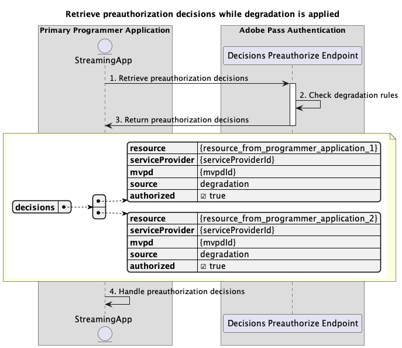
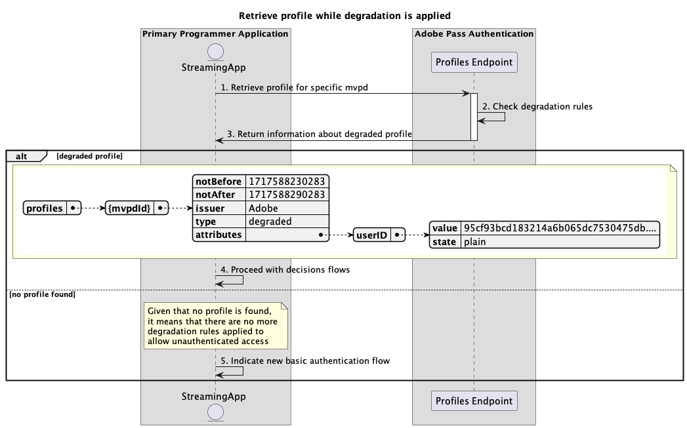

# Verringerte Zugriffsflüsse {#degraded-access-flows}

Die Verschlechterung ermöglicht die vorübergehende Umgehung bestimmter MVPD-Authentifizierungs- und Autorisierungsendpunkte. Normalerweise startet der Programmierer diese Aktion, aber unabhängig davon, wer ein Degradation-Ereignis Trigger, hängt die Aktion von vorherigen Vereinbarungen mit den betroffenen MVPDs ab.

Weitere Informationen zur Funktion zur Verschlechterung finden Sie in der Dokumentation zu [Abbau](../../../degradation-api-overview.md) .

Bei eingeschränkten Zugriffsabläufen können Sie nach folgenden Szenarien abfragen:

* [Führen Sie eine Authentifizierung durch, während die Verschlechterung angewendet wird](#perform-authentication-while-degradation-is-applied)
* [Abrufen von Autorisierungsentscheidungen bei Anwendung der Verschlechterung](#retrieve-authorization-decisions-while-degradation-is-applied)
* [Vorabgenehmigungsentscheidungen abrufen, während die Verschlechterung angewendet wird](#retrieve-preauthorization-decisions-while-degradation-is-applied)
* [Profil abrufen, während der Abbau angewendet wird](#retrieve-profile-while-degradation-is-applied)

## Führen Sie eine Authentifizierung durch, während die Verschlechterung angewendet wird {#perform-authentication-while-degradation-is-applied}

### Voraussetzungen {#prerequisites-perform-authentication-while-degradation-is-applied}

Stellen Sie vor dem Ausführen des Authentifizierungsflusses bei Anwendung der Verschlechterung sicher, dass die folgenden Voraussetzungen erfüllt sind:

* Die Streaming-Anwendung muss eine Authentifizierungssitzung starten, wenn sie sich mit dem MVPD anmelden muss.

>[!IMPORTANT]
> 
> Annahmen
> 
>  
> 
> * Die Streaming-Anwendung verfügt nicht über ein gültiges Profil für diesen spezifischen MVPD, der im Adobe Pass-Backend gespeichert wird.
> * Es gibt eine AuthNAll-Abbauregel, die auf die Integration zwischen den bereitgestellten `serviceProvider` und `mvpd` angewendet wird.

### Workflow {#workflow-perform-authentication-while-degradation-is-applied}

Führen Sie die angegebenen Schritte aus, um den Authentifizierungsfluss zu implementieren, während der Abbau angewendet wird, wie im folgenden Diagramm dargestellt.

*Führen Sie eine Authentifizierung durch, während der Abbau angewendet wird*

1. **Erstellen einer Authentifizierungssitzung:** Die Streaming-Anwendung erfasst alle erforderlichen Daten, um eine Authentifizierungssitzung durch Aufruf des Sitzungsendpunkts zu starten.

   Weitere Informationen finden Sie in der API-Dokumentation zum [Erstellen einer Authentifizierungssitzung](../../apis/sessions-apis/rest-api-v2-sessions-apis-create-authentication-session.md) .
   * Alle _erforderlichen_ Parameter, wie `serviceProvider`, `mvpd`, `domainName` und `redirectUrl`
   * Alle _erforderlichen_ Kopfzeilen, wie `Authorization` und `AP-Device-Identifier`
   * Alle Parameter und Kopfzeilen von _optional_

1. **Überprüfen Sie die Abbauregeln:** Der Adobe Pass-Server überprüft, ob eine AuthNAll-Abbauregel auf die Integration zwischen den bereitgestellten `serviceProvider` und `mvpd` angewendet wird.

1. **Geben Sie die nächste Aktion an:** Die Sitzungsendpunktantwort enthält die erforderlichen Daten, um die Streaming-Anwendung in Bezug auf die nächste Aktion zu leiten:
   * Das Attribut `actionName` ist auf &quot;Autorisieren&quot;festgelegt.
   * Das Attribut `actionType` ist auf &quot;direct&quot;festgelegt.

   Weitere Informationen zu den in einer Sitzungsantwort bereitgestellten Informationen finden Sie in der Dokumentation zur API zur [Erstellen einer Authentifizierungssitzung](../../apis/sessions-apis/rest-api-v2-sessions-apis-create-authentication-session.md) .

   >[!IMPORTANT]
   >
   > Der Sitzungsendpunkt validiert die Anfragedaten, um sicherzustellen, dass die grundlegenden Bedingungen erfüllt sind:
   >
   > * Die Parameter und Header _required_ müssen gültig sein.
   > * Die Integration zwischen dem bereitgestellten `serviceProvider` und `mvpd` muss aktiv sein.
   >
   >  
   > 
   > Wenn die grundlegende Validierung fehlschlägt, wird eine Fehlerantwort generiert, die zusätzliche Informationen bereitstellt, die der Dokumentation [Verbesserte Fehlercodes](../../../enhanced-error-codes.md) entsprechen.
   >
   >  
   > 
   > Der Sitzungsendpunkt verwendet die Anfragedaten, um zu überprüfen, ob die eingeschränkten Zugriffsbedingungen erfüllt sind:
   >
   > * Für die Integration zwischen den bereitgestellten `serviceProvider` und `mvpd` muss eine AuthNAll-Abbauregel angewendet werden.
   >
   >  
   > 
   > Wenn die Validierung des beschädigten Zugriffs fehlschlägt, wird die Antwort standardmäßig auf den grundlegenden Authentifizierungsfluss eingestellt.

1. **Fahren Sie mit den Entscheidungsflüssen fort:** Die Streaming-Anwendung kann mit nachfolgenden Entscheidungsflüssen fortfahren.

## Abrufen von Autorisierungsentscheidungen bei Anwendung der Verschlechterung {#retrieve-authorization-decisions-while-degradation-is-applied}

### Voraussetzungen {#prerequisites-retrieve-authorization-decisions-while-degradation-is-applied}

Bevor Autorisierungsentscheidungen abgerufen werden, während die Verschlechterung angewendet wird, stellen Sie sicher, dass die folgenden Voraussetzungen erfüllt sind:

* Die Streaming-Anwendung muss eine Autorisierungsentscheidung abrufen, bevor eine vom Benutzer ausgewählte Ressource wiedergegeben wird.

>[!IMPORTANT]
>
> Annahmen
> 
>  
> 
> * Die Streaming-Anwendung hat kein gültiges Profil für diesen MVPD.
> * Es gibt eine AuthZAll- oder AuthNAll-Abbauregel, die auf die Integration zwischen den bereitgestellten `serviceProvider` und `mvpd` angewendet wird.

### Workflow {#workflow-retrieve-authorization-decisions-while-degradation-is-applied}

Führen Sie die angegebenen Schritte aus, um den Autorisierungsfluss zu implementieren, während der Abbau angewendet wird, wie in der folgenden Abbildung dargestellt.

*Abrufen von Autorisierungsentscheidungen bei Anwendung des Abbaus*

1. **Autorisierungsentscheidung abrufen:** Die Streaming-Anwendung erfasst alle erforderlichen Daten, um eine Autorisierungsentscheidung für eine bestimmte Ressource zu erhalten, indem sie den Endpunkt Entscheidungsautorisierung aufruft.

   Weitere Informationen finden Sie in der Dokumentation zur API [Abrufen von Autorisierungsentscheidungen mithilfe einer bestimmten mvpd](../../apis/decisions-apis/rest-api-v2-decisions-apis-retrieve-authorization-decisions-using-specific-mvpd.md) -API:
   * Alle _erforderlichen_ Parameter, wie `serviceProvider`, `mvpd` und `resources`
   * Alle _erforderlichen_ Kopfzeilen, wie `Authorization` und `AP-Device-Identifier`
   * Alle Parameter und Kopfzeilen von _optional_

1. **Überprüfen Sie die Abbauregeln:** Der Adobe Pass-Server überprüft, ob eine Herabbauregel AuthZAll oder AuthNAll auf die Integration zwischen den bereitgestellten Werten `serviceProvider` und `mvpd` angewendet wird.

1. **Rückgabe `Permit` -Entscheidung mit Medien-Token:** Die Antwort des Endpunkts Entscheidungsautorisierung enthält eine `Permit` -Entscheidung und ein Medien-Token.

   Weitere Informationen zu den in einer Entscheidungsantwort bereitgestellten Informationen finden Sie in der Dokumentation zur [Abrufen von Autorisierungsentscheidungen mithilfe einer bestimmten mvpd](../../apis/decisions-apis/rest-api-v2-decisions-apis-retrieve-authorization-decisions-using-specific-mvpd.md) -API .

   >[!IMPORTANT]
   >
   > Der Endpunkt Entscheidungsautorisierung validiert die Anfragedaten, um sicherzustellen, dass die grundlegenden Bedingungen erfüllt sind:
   >
   > * Die Parameter und Header _required_ müssen gültig sein.
   > * Die Integration zwischen dem bereitgestellten `serviceProvider` und `mvpd` muss aktiv sein.
   >
   >  
   > 
   > Wenn die grundlegende Validierung fehlschlägt, wird eine Fehlerantwort generiert, die zusätzliche Informationen bereitstellt, die der Dokumentation [Verbesserte Fehlercodes](../../../enhanced-error-codes.md) entsprechen.
   >
   >  
   >
   > Der Endpunkt Entscheidungsautorisierung verwendet die Anfragedaten, um zu überprüfen, ob die eingeschränkten Zugriffsbedingungen erfüllt sind:
   >
   > * Für die Integration zwischen den bereitgestellten `serviceProvider` und `mvpd` muss eine AuthZAll- oder AuthNAll-Abbauregel angewendet werden.
   >
   >  
   > 
   > Wenn die Validierung des eingeschränkten Zugriffs fehlschlägt, wird die Antwort standardmäßig auf den grundlegenden Autorisierungsfluss eingestellt.

1. **Stream mit Medien-Token starten:** Die Streaming-Anwendung verwendet das Medien-Token zur Wiedergabe des Inhalts.

## Vorabgenehmigungsentscheidungen abrufen, während die Verschlechterung angewendet wird {#retrieve-preauthorization-decisions-while-degradation-is-applied}

### Voraussetzungen {#prerequisites-retrieve-preauthorization-decisions-while-degradation-is-applied}

Stellen Sie vor dem Abrufen von Entscheidungen über die Vorabgenehmigung bei Anwendung der Verschlechterung sicher, dass die folgenden Voraussetzungen erfüllt sind:

* Die Streaming-Anwendung möchte Entscheidungen zur Vorabautorisierung abrufen, um eine Liste der Ressourcen mit den zugehörigen Status anzuzeigen.

>[!IMPORTANT]
>
> Annahmen
>
>  
> 
> * Die Streaming-Anwendung hat kein gültiges Profil für diesen MVPD.
> * Es gibt eine AuthZAll- oder AuthNAll-Abbauregel, die auf die Integration zwischen den bereitgestellten `serviceProvider` und `mvpd` angewendet wird.

### Workflow {#workflow-retrieve-preauthorization-decisions-while-degradation-is-applied}

Führen Sie die angegebenen Schritte aus, um den Vorautorisierungsfluss zu implementieren, während der Abbau angewendet wird, wie in der folgenden Abbildung dargestellt.

*Vorabautorisierungsentscheidungen abrufen, während der Abbau angewendet wird*

1. **Vorabautorisierungsentscheidungen abrufen:** Die Streaming-Anwendung erfasst alle erforderlichen Daten, um Vorautorisierungsentscheidungen für eine Liste von Ressourcen zu erhalten, indem sie den Endpunkt Entscheidungsvorautorisierung aufruft.

   Weitere Informationen finden Sie in der Dokumentation zur API [Abrufen von Vorautorisierungsentscheidungen mithilfe einer bestimmten mvpd](../../apis/decisions-apis/rest-api-v2-decisions-apis-retrieve-preauthorization-decisions-using-specific-mvpd.md) -API .
   * Alle _erforderlichen_ Parameter, wie `serviceProvider`, `mvpd` und `resources`
   * Alle _erforderlichen_ Kopfzeilen, wie `Authorization` und `AP-Device-Identifier`
   * Alle Parameter und Kopfzeilen von _optional_

1. **Überprüfen Sie die Abbauregeln:** Der Adobe Pass-Server überprüft, ob eine Herabbauregel AuthZAll oder AuthNAll auf die Integration zwischen den bereitgestellten Werten `serviceProvider` und `mvpd` angewendet wird.

1. **Rückgabe von Entscheidungen zur Vorabautorisierung:** Die Antwort zum Vorabautorisieren des Endpunkts Entscheidungen enthält eine `Permit` -Entscheidung für jede Ressource.

   Weitere Informationen zu den Informationen in einer Entscheidungsantwort finden Sie in der Dokumentation zur API [Abrufen von Vorautorisierungsentscheidungen mithilfe einer bestimmten mvpd](../../apis/decisions-apis/rest-api-v2-decisions-apis-retrieve-preauthorization-decisions-using-specific-mvpd.md) -API.

   >[!IMPORTANT]
   >
   > Der Endpunkt Entscheidungsvorautorisierung validiert die Anfragedaten, um sicherzustellen, dass die grundlegenden Bedingungen erfüllt sind:
   >
   > * Die Parameter und Header _required_ müssen gültig sein.
   > * Die Integration zwischen dem bereitgestellten `serviceProvider` und `mvpd` muss aktiv sein.
   >
   >  
   > 
   > Wenn die grundlegende Validierung fehlschlägt, wird eine Fehlerantwort generiert, die zusätzliche Informationen bereitstellt, die der Dokumentation [Verbesserte Fehlercodes](../../../enhanced-error-codes.md) entsprechen.
   >
   >  
   >
   > Der Endpunkt Entscheidungsvorautorisierung verwendet die Anfragedaten, um zu überprüfen, ob die eingeschränkten Zugriffsbedingungen erfüllt sind:
   >
   > * Für die Integration zwischen den bereitgestellten `serviceProvider` und `mvpd` muss eine AuthZAll- oder AuthNAll-Abbauregel angewendet werden.
   >
   >  
   > 
   > Wenn die Validierung eines eingeschränkten Zugriffs fehlschlägt, wird die Antwort standardmäßig auf den grundlegenden Ablauf der Vorabautorisierung festgelegt.

1. **Vorautorisierungsentscheidungen verarbeiten:** Die Streaming-Anwendung verarbeitet die Antwort und kann sie verwenden, um optional den entsprechenden Status für jede Ressource in der Benutzeroberfläche anzuzeigen.

## Profil abrufen, während der Abbau angewendet wird {#retrieve-profile-while-degradation-is-applied}

>[!IMPORTANT]
>
> Die Abfrage des Endpunkts Profile ist optional, während der Abbau angewendet wird.
>
>  
> 
> Die Antwort des Sitzungsendpunkts weist die Anwendung an, mit den Entscheidungsflüssen fortzufahren, während die Verschlechterung angewendet wird. Weitere Informationen finden Sie im Abschnitt [Authentifizierung bei Anwendung des Abbaus durchführen](#perform-authentication-while-degradation-is-applied) .

### Voraussetzungen {#prerequisites-retrieve-profile-while-degradation-is-applied}

Bevor das Profil für einen bestimmten MVPD abgerufen wird, während der Abbau angewendet wird, stellen Sie sicher, dass die folgenden Voraussetzungen erfüllt sind:

* Die Streaming-Anwendung, die über eine ausgewählte oder zwischengespeicherte `mvpd` -Kennung verfügt, möchte das Profil für einen bestimmten MVPD abrufen.

>[!IMPORTANT]
>
> Annahmen
>
>  
> 
> * Die Streaming-Anwendung hat kein gültiges Profil für diesen MVPD.
> * Es gibt eine AuthNAll-Abbauregel, die auf die Integration zwischen den bereitgestellten `serviceProvider` und `mvpd` angewendet wird.

### Workflow {#workflow-retrieve-profile-while-degradation-is-applied}

Führen Sie die angegebenen Schritte aus, um den Abruffluss des Profils für einen bestimmten MVPD zu implementieren, während der Abbau angewendet wird, wie in der folgenden Abbildung dargestellt.

*Profil abrufen, während der Abbau angewendet wird*

1. **Profil für bestimmte MVPD abrufen:** Die Streaming-Anwendung erfasst alle erforderlichen Daten, um Profilinformationen für diese bestimmte MVPD abzurufen, indem eine Anfrage an den Endpunkt Profile gesendet wird.

   Weitere Informationen finden Sie in der Dokumentation zur API [Abrufen des Profils für bestimmte mvpd](../../apis/profiles-apis/rest-api-v2-profiles-apis-retrieve-profiles-for-specific-mvpd.md) :
   * Alle _erforderlichen_ Parameter, wie `serviceProvider` und `mvpd`
   * Alle _erforderlichen_ Kopfzeilen, wie `Authorization` und `AP-Device-Identifier`
   * Alle Parameter und Kopfzeilen von _optional_

1. **Überprüfen Sie die Abbauregeln:** Der Adobe Pass-Server überprüft, ob eine AuthNAll-Abbauregel auf die Integration zwischen den bereitgestellten `serviceProvider` und `mvpd` angewendet wird.

1. **Zurückgeben von Informationen zum beschädigten Profil:** Die Profil-Endpunktantwort enthält Informationen zum beschädigten Profil, einschließlich des Attributs `type`, das auf &quot;herabgestuft&quot;gesetzt ist.

   Weitere Informationen zu den Informationen in einer Profilantwort finden Sie in der Dokumentation zur API [Profil für bestimmte mvpd](../../apis/profiles-apis/rest-api-v2-profiles-apis-retrieve-profiles-for-specific-mvpd.md) -API.

   >[!IMPORTANT]
   >
   > Der Endpunkt Profile validiert die Anfragedaten, um sicherzustellen, dass die grundlegenden Bedingungen erfüllt sind:
   >
   > * Die Parameter und Header _required_ müssen gültig sein.
   > * Die Integration zwischen dem bereitgestellten `serviceProvider` und `mvpd` muss aktiv sein.
   >
   >  
   > 
   > Wenn die grundlegende Validierung fehlschlägt, wird eine Fehlerantwort generiert, die zusätzliche Informationen bereitstellt, die der Dokumentation [Verbesserte Fehlercodes](../../../enhanced-error-codes.md) entsprechen.
   >
   >  
   > 
   > Der Endpunkt Profile verwendet die Anfragedaten, um zu überprüfen, ob die eingeschränkten Zugriffsbedingungen erfüllt sind:
   >
   > * Für die Integration zwischen den bereitgestellten `serviceProvider` und `mvpd` muss eine AuthNAll-Abbauregel angewendet werden.
   >
   >  
   > 
   > Wenn die Validierung des beschädigten Zugriffs fehlschlägt, wird die Antwort standardmäßig auf den grundlegenden Abruffflow des Profils festgelegt.

1. **Mit Entscheidungsflüssen fortfahren:** Wenn die Profil-Endpunktantwort ein Profil enthält, verwendet die Streaming-Anwendung die beschädigten Profilinformationen, um mit nachfolgenden Entscheidungsflüssen fortzufahren.

1. **Neuen grundlegenden Authentifizierungsfluss angeben:** Wenn die Profil-Endpunktantwort kein Profil enthält, zeigt die Streaming-Anwendung an, dass der Benutzer einen neuen einfachen Authentifizierungsfluss initiiert.

>[!NOTE]
>
> Die Schritte für den Abruf des Profils für einen bestimmten Authentifizierungscode sind dieselben wie oben, mit dem Unterschied, dass der verwendete Endpunkt derjenige ist, der in der Dokumentation [Profil für bestimmten Code abrufen](../../apis/profiles-apis/rest-api-v2-profiles-apis-retrieve-profiles-for-specific-code.md) beschrieben wird.
