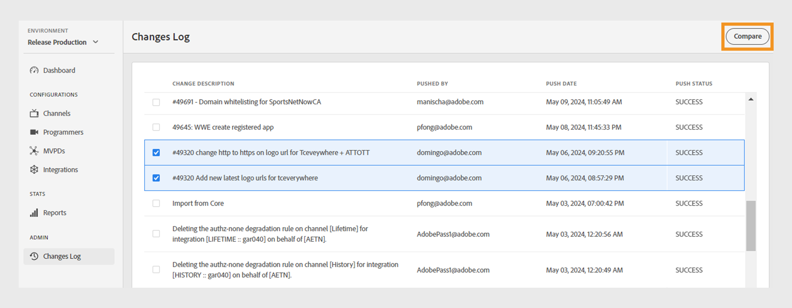

# Änderungsprotokoll {#changes-log}

>[!NOTE]
>
>Der Inhalt dieser Seite dient nur Informationszwecken. Für die Verwendung dieser API ist eine aktuelle -Lizenz von Adobe erforderlich. Eine unbefugte Anwendung ist nicht zulässig.

Die **Änderungsprotokoll** im TVE-Dashboard können Sie die Konfigurationsänderungen anzeigen, die über das TVE-Dashboard an die Adobe Pass-Authentifizierungsumgebung gesendet werden. Sie können auch zwei verschiedene Konfigurationsänderungen vergleichen.

Die **Änderungsprotokoll** im linken Bereich eine Liste aller Konfigurationsänderungen angezeigt, die über ein bestimmtes Konto des TVE-Dashboards vorgenommen wurden. Diese Liste von Änderungen enthält die folgenden Details:

* **Beschreibung ändern**: Eine kurze Beschreibung des Umfangs der Konfigurationsänderung.
* **Überstürzt von**: Eine E-Mail-ID des Benutzers, der für die Änderung verantwortlich ist.
* **Push-Datum**: Das Datum der Konfigurationsänderung.
* **Push-Status**: Gibt an, ob der Push-Vorgang erfolgreich, ausstehend oder fehlgeschlagen war.

## Änderungen vergleichen {#compare-changes}

Gehen Sie wie folgt vor, um Änderungen zu vergleichen:

1. Wählen Sie zwei Konfigurationsänderungen aus der Liste aus, die Sie vergleichen möchten.

   

   *Konfigurationsänderungen vergleichen*

1. Auswählen **Vergleichen** oben rechts im Bildschirm.

   Die **Konfigurationsänderungen** zeigt den Entitätstyp, die Entitäts-ID, die Eigenschaft und den Status des Änderungsvorgangs für jede Änderung an.

1. Bewegen Sie den Mauszeiger über die Konfigurationsänderung, die Sie anzeigen möchten.
1. Auswählen **Ansicht** , um auf die geänderten Werte zuzugreifen.

   

   *Konfigurationsänderungen anzeigen*

Im Folgenden finden Sie ein Beispiel für eine Änderung, die in der ausgewählten Konfiguration vorgenommen wurde. Sie können den Unterschied zwischen den alten und neuen Werten innerhalb der Änderung anzeigen.

*Alter und neuer Wert*

