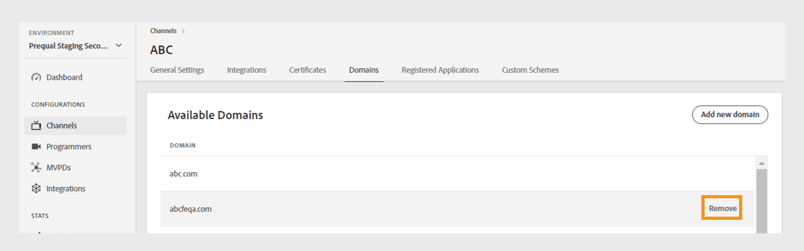

# Kanäle {#channels}

>[!NOTE]
>
>Der Inhalt dieser Seite dient nur Informationszwecken. Für die Verwendung dieser API ist eine aktuelle -Lizenz von Adobe erforderlich. Eine unbefugte Anwendung ist nicht zulässig.

Die **Kanäle** im TVE-Dashboard können Sie die Einstellungen für die Kanäle anzeigen und verwalten, die mit einem bestimmten Programmierer verbunden sind. Sie können auch [neuen Kanal hinzufügen](#add-new-channel) gemäß Ihren Anforderungen.

Die **Kanäle** im linken Bereich eine Liste der verknüpften Kanäle mit den folgenden Details angezeigt:

* **Anzeigename**: Der Markenname des für kommerzielle Zwecke verwendeten Kanals.
* **Kanal-ID**: Eine eindeutige Kennung, die auch als Anforderer-ID bezeichnet wird.
* **Integrationen**: Die Anzahl der Verbindungen, die mit [MVPDs](/help/authentication/glossary.md#mvpd).

*Liste der vorhandenen Kanäle*

Geben Sie den Namen des Kanals im **Suche** oberhalb der Liste, um mehr über den Kanal zu erfahren.

## Verwalten von Kanalkonfigurationen {#manage-channel-conf}

Führen Sie die Schritte zum Verwalten verschiedener Einstellungen eines bestimmten Kanals aus.

1. Wählen Sie die **Kanäle** im linken Bereich.
1. Wählen Sie den Kanal aus der verfügbaren Liste aus.
1. Wählen Sie eine der folgenden Registerkarten aus, um die entsprechenden Einstellungen des ausgewählten Kanals anzuzeigen und zu bearbeiten:

   * [Allgemeine Einstellungen](#general-settings)
   * [Integrationen](#integrations)
   * [Zertifikate](#certificates)
   * [Domänen](#domains)
   * [Registrierte Anwendungen](#registered-applications)
   * [Benutzerdefinierte Schemata](#custom-schemes)

   

   *Kanaleinstellungen*

>[!IMPORTANT]
>
> Ansicht [Änderungen überprüfen und pushen](/help/authentication/tve-dashboard-review-push-changes.md) Weitere Informationen zum Aktivieren der Konfigurationsänderungen.

### Allgemeine Einstellungen {#general-settings}

Diese Registerkarte zeigt **Kanalinformationen** und **Analytics-Konfiguration**.

#### Kanalinformationen {#channel-information}

In diesem Abschnitt können Sie die folgenden Details bearbeiten:

* **Anzeigename**: Der Markenname des für kommerzielle Zwecke verwendeten Kanals.

* **Standard-Umleitungs-URL**: Die Backup-Umleitungs-URL für Authentifizierung und Abmeldung.

* **Fehlerberichte**: Bei Auswahl **Ja**, senden die Adobe Pass-SDKs Fehlerberichte zur Analyse an das Adobe Pass-Backend.

*Kanalinformationen bearbeiten*

#### Analytics-Konfiguration {#analytics-configuration}

In diesem Abschnitt können Sie die Weiterleitung von Adobe Pass-Authentifizierungsereignissen an Adobe Analytics konfigurieren.

Aktivieren **Analytics-Konfiguration** Wenden Sie sich an Ihren technischen Kundenbetreuer (TAM), um weitere Informationen zum Einrichten der Report Suite-ID (RSID) zu erhalten.

*Aktivieren von Analytics-Konfigurationen*

Auswählen **Neue Analysekonfiguration hinzufügen** , um mehrere Konfigurationen hinzuzufügen.

Eine neue Konfigurationsänderung wurde erstellt und kann jetzt aktualisiert werden. So verwenden Sie die neue Analytics-Konfiguration aus dem **Analytics-Konfiguration** und fahren Sie mit dem [Änderungen überprüfen und pushen](/help/authentication/tve-dashboard-review-push-changes.md) Fluss.

### Integrationen {#integrations}

In diesem Tab wird eine Liste der verfügbaren Integrationen zwischen dem aktuell ausgewählten Kanal und den MVPDs angezeigt. Die Liste zeigt jede Integration mit ihrem Status an und zeigt an, ob sie aktiviert ist oder nicht. Wählen Sie eine bestimmte Integration aus dieser Liste aus, um auf detaillierte Informationen im Abschnitt [Integrationen](tve-dashboard-integrations.md) Abschnitt.

*Liste der verfügbaren Integrationen*

### Zertifikate {#certificates}

Auf dieser Registerkarte wird eine Liste der [verfügbare Zertifikate](#available-certificates) und [geerbte verfügbare Zertifikate](#inherited-avail-certificates) wird in den Verschlüsselungsabläufen für Benutzermetadaten verwendet. Es werden Details zu jedem Zertifikat angezeigt, das Folgendes enthält:

* Der Status (ob für **Anwendermetadaten-Verschlüsselung** Verwendung oder nicht)
* Seriennummer
* Name der Organisation des Emittenten
* Name der Betrefforganisation
* Ausgegebener Zeitpunkt
* Ablaufdatum
* Ein Dropdown-Menü zum Verschlüsseln von Benutzermetadaten (wenn Sie **Ja**, verschlüsselt das Zertifikat vertrauliche Benutzerinformationen, wie z. B. Postleitzahlenwerte).

#### Verfügbare Zertifikate {#available-certificates}

Diese Zertifikate dienen als private oder öffentliche Schlüssel und werden zur Verschlüsselung von Benutzermetadaten verwendet.
Sie können die folgenden Änderungen im Abschnitt &quot;Verfügbare Zertifikate&quot;vornehmen:

* [Neues Zertifikat hinzufügen](#add-new-certificate)
* [Zertifikat löschen](#delete-certificate)

##### Neues Zertifikat hinzufügen {#add-new-certificate}

Gehen Sie wie folgt vor, um ein neues Zertifikat hinzuzufügen:

1. Auswählen **Neues Zertifikat hinzufügen** oben im **Verfügbare Zertifikate** Abschnitt.

   

   *Neues Zertifikat hinzufügen*

1. Fügen Sie den öffentlichen Schlüssel Ihres Zertifikats in den **Neues Zertifikat** Dialogfeld.
1. Auswählen **Zertifikat hinzufügen**.

   Eine neue Konfigurationsänderung wurde erstellt und kann jetzt aktualisiert werden. So verwenden Sie das neue Zertifikat, das im **Verfügbare Zertifikate** und fahren Sie mit dem [Änderungen überprüfen und pushen](/help/authentication/tve-dashboard-review-push-changes.md) Fluss.

1. Suchen Sie das neue Zertifikat in der Liste der **Verfügbare Zertifikate**.

   >[!IMPORTANT]
   >
   > Stellen Sie sicher, dass Ihre Systeme auf dem neuesten Stand sind und das neue Zertifikat verwenden können.

1. Auswählen **Ja** von **Dient zum Verschlüsseln von Benutzermetadaten** Dropdown-Menü, um ein neues Zertifikat zu aktivieren.

##### Zertifikat löschen {#delete-certificate}

Führen Sie die folgenden Schritte aus, um ein Zertifikat zu löschen.

1. Bewegen Sie den Mauszeiger über das Zertifikat, das Sie aus der Liste der **Verfügbare Zertifikate**.
1. Auswählen **Entfernen**.

   

   *Das ausgewählte Zertifikat entfernen*

1. Auswählen **Löschen** aus dem **Aktives Zertifikat löschen** Dialogfeld.

Eine neue Konfigurationsänderung wurde erstellt und kann jetzt aktualisiert werden. Das Zertifikat wird aus dem **Verfügbare Zertifikate** Abschnitt nur nach [Änderungen überprüfen und pushen](/help/authentication/tve-dashboard-review-push-changes.md).

#### Vererbte verfügbare Zertifikate {#inherited-avail-certificates}

Medienunternehmen definieren diese Zertifikate auf ihrer eigenen Ebene. Alle mit demselben Medienunternehmen verknüpften Kanäle können diese Zertifikate verwenden.

*Vererbte verfügbare Zertifikate*

### Domänen {#domains}

Auf dieser Registerkarte wird eine Liste der verfügbaren Domänen angezeigt, über die der jeweilige Kanal mit der Adobe Pass-Authentifizierung kommuniziert.

Sie können die folgenden Änderungen an Domänen vornehmen:

* [Neue Domäne hinzufügen](#add-domains)
* [Domain löschen](#delete-domain)

>[!TIP]
>
> Vermeiden Sie das Hinzufügen einer neuen Subdomain, wenn eine allgemeinere Domäne in der Liste vorhanden ist.

#### Neue Domäne hinzufügen {#add-domains}

Führen Sie die folgenden Schritte aus, um eine Domäne hinzuzufügen.

1. Auswählen **Neue Domäne hinzufügen** oben rechts im **Verfügbare Domänen** Abschnitt.

   

   *Neue Domäne hinzufügen*

1. Geben Sie den Namen Ihrer Domäne in die **Neue Domäne** Dialogfeld.

1. Auswählen **Domain hinzufügen** , um eine neue Domäne für den ausgewählten Kanal hinzuzufügen.

Eine neue Konfigurationsänderung wurde erstellt und kann jetzt aktualisiert werden. So verwenden Sie die neue Domäne, die im **Verfügbare Domänen** und fahren Sie mit dem [Änderungen überprüfen und pushen](/help/authentication/tve-dashboard-review-push-changes.md) Fluss.

#### Domain löschen {#delete-domain}

Führen Sie die folgenden Schritte aus, um eine Domäne zu löschen.

1. Bewegen Sie den Mauszeiger über die Domäne, die Sie aus der Liste der **Verfügbare Domänen**.
1. Auswählen **Entfernen**.

   

   *Die ausgewählte Domäne entfernen*

1. Auswählen **Löschen** auf **Domain löschen** Dialogfeld.

Eine neue Konfigurationsänderung wurde erstellt und kann jetzt aktualisiert werden. Die Domäne wird aus der **Verfügbare Domänen** Abschnitt nur nach [Änderungen überprüfen und pushen](/help/authentication/tve-dashboard-review-push-changes.md).

Die ausgewählte Domäne ist nicht mehr verfügbar. Daher verliert die mit dieser Domäne verknüpfte Anwendung den Zugriff auf die Adobe Pass-Authentifizierungsdienste.

### Registrierte Anwendungen {#registered-applications}

Dieser Tab enthält eine Liste der Registrierungen für Anwendungen. Ansicht [Dynamisches Client-Registrierungs-Management](/help/authentication/dynamic-client-registration-management.md) für weitere Informationen.

### Benutzerdefinierte Schemata {#custom-schemes}

Auf dieser Registerkarte wird eine Liste benutzerdefinierter Schemata angezeigt. Ansicht [Registrierung der iOS/tvOS-Anwendung](/help/authentication/iostvos-application-registration.md) und [Dynamisches Client-Registrierungs-Management](/help/authentication/dynamic-client-registration-management.md) für weitere Informationen.

## Neuen Kanal hinzufügen {#add-new-channel}

Führen Sie diese Schritte aus, um einen neuen Kanal hinzuzufügen.

1. Wählen Sie die **Kanäle** im linken Bereich.
1. Auswählen **Neuen Kanal hinzufügen** oben rechts im **Kanäle** Abschnitt.

   

   *Neuen Kanal hinzufügen*

1. Auswählen **Programmierer-ID** aus dem Dropdown-Menü im **Neuer Kanal** Dialogfeld.

1. Geben Sie einen eindeutigen Bezeichner in **Kanal-ID**.
1. Geben Sie den Markennamen des für kommerzielle Zwecke verwendeten Kanals in das Feld **Anzeigename**.
1. Auswählen **Kanal hinzufügen**.

Eine neue Konfigurationsänderung wurde erstellt und kann jetzt aktualisiert werden. So verwenden Sie den neuen Kanal, der im **Kanäle** und fahren Sie mit dem [Änderungen überprüfen und pushen](/help/authentication/tve-dashboard-review-push-changes.md) Fluss.

