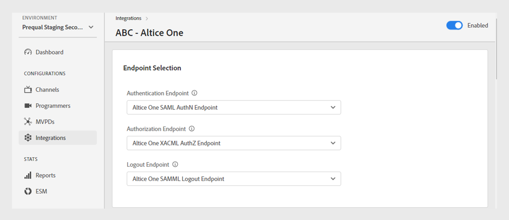

# Integrationen

>[!NOTE]
>
>Der Inhalt dieser Seite dient nur Informationszwecken. Für die Verwendung dieser API ist eine aktuelle -Lizenz von Adobe erforderlich. Eine unbefugte Anwendung ist nicht zulässig.

Die **Integrationen** im TVE-Dashboard können Sie die Einstellungen für die Integrationen zwischen Ihren Kanälen und MVPDs anzeigen und verwalten. Sie können auch [eine neue Integration erstellen](#create-new-integration) gemäß Ihren Anforderungen.

Die **Integrationen** im linken Bereich eine Liste der vorhandenen Integrationen mit den folgenden Details angezeigt:

* Status, der angibt, ob die Integration aktuell aktiv oder inaktiv ist
* Integration von bestimmten Kanälen mit entsprechenden MVPDs
* Kanalname mit Kanal-ID
* MVPD-Anzeigename und MVPD-ID

*Liste vorhandener Integrationen*

Geben Sie den Namen des Kanals oder MVPD in die **Suche** oberhalb der Liste, um mehr über die Integration zu erfahren.

## Verwalten von Integrationskonfigurationen {#manage-integration-conf}

Führen Sie diese Schritte aus, um eine bestimmte Integration zu verwalten.

1. Wählen Sie die **Integrationen** im linken Bereich.
1. Wählen Sie eine Integration aus der bereitgestellten Liste aus, um verschiedene Einstellungen in den folgenden Abschnitten anzuzeigen und zu bearbeiten:

   * [Endpunktauswahl](#endpoint-selection)
   * [Plattformeinstellungen](#platform-settings)
   * [Benutzermetadaten](#user-metadata)

>[!IMPORTANT]
>
> Ansicht [Änderungen überprüfen und pushen](/help/authentication/tve-dashboard-review-push-changes.md) Weitere Informationen zum Aktivieren der Konfigurationsänderungen.

### Endpunktauswahl {#endpoint-selection}

In diesem Abschnitt können Sie die Endpunkte des MVPD auswählen, der für die Authentifizierung, Autorisierung und Abmeldung über die entsprechenden Dropdown-Menüs verwendet wird.

*Endpunkte für Authentifizierungs-, Autorisierungs- und Abmeldevorgänge*

>[!NOTE]
>
>MVPDs können einen oder mehrere Endpunkte für jeden Fluss bereitstellen. Bei der Integration eines neuen Kanals muss der MVPD für jeden Fluss seinen bevorzugten Endpunkt angeben.

>[!IMPORTANT]
>
>Jede Änderung an Endpunkten wirkt sich auf das Gesamtverhalten einer Integration aus. Diese Änderungen sollten erst nach Bestätigung durch den MVPD implementiert werden.

### Plattformeinstellungen {#platform-settings}

In diesem Abschnitt können Sie Integrationseinstellungen für alle [Plattformen](/help/authentication/tve-dashboard-reports.md#platforms). Sie können diese Einstellungen anhand einzelner Plattformen ändern. Sie können beispielsweise die Dauer der Autorisierungs-TTL unter Android anpassen und dabei einen Standardwert für eine andere Plattform beibehalten.

Jede Eigenschaft in den Plattformeinstellungen übernimmt einen vom MVPD festgelegten Standardwert, kann aber bei Bedarf angepasst werden.

>[!IMPORTANT]
>
>Es ist eine Vereinbarung mit dem MVPD erforderlich, um die für jede Eigenschaft in den Plattformeinstellungen festgelegten Werte zu bestimmen.

>[!IMPORTANT]
>
> Die Einstellungsvererbung folgt einer Kette von MVPD-Einstellungen (die am häufigsten verwendet werden), dann von MVPD-Endpunkt, Integration, Plattformkategorie und Plattform (die den spezifischsten Wert enthält).

**Plattformeinstellungen** wird verwendet, um Einstellungen für jede Ebene in der Vererbungskette zu überschreiben. Die verfügbaren Ebenen in der Kette sind wie folgt gruppiert:

* **Standard für alle**: Legen Sie Werte für Eigenschaften fest, die unabhängig von den Implementierungen des Programmierers universell auf alle Plattformen anwendbar sind, wenn bestimmte Plattformwerte nicht definiert sind.

* **Desktop-Geräte**: Legen Sie Werte für Eigenschaften fest, die für alle Desktop- und Laptop-Computer unabhängig von der Programmiermethode (JS SDK oder REST API) gelten.

* **Mobilgeräte**: Legen Sie Werte für Eigenschaften fest, die für alle Mobilgeräte gelten, einschließlich **iOS**, **Android**, und andere, unabhängig vom Programmierungsansatz (SDK oder REST-API).

* **TV-vernetzte Geräte**: Legen Sie Werte für Eigenschaften fest, die für alle TV-angeschlossenen Geräte gelten, einschließlich **tvOS**, **Roku**, **FireTV** und andere, unabhängig von der Programmiermethode (SDK oder REST-API).

* **Nicht identifizierte Geräte**: Legen Sie Werte für Eigenschaften fest, die für alle Geräte gelten, auf denen der aktuelle Mechanismus die Plattform nicht genau identifizieren kann. In solchen Fällen wenden Sie die restriktivsten Regeln an, die vom MVPD definiert werden.

  

  *Kategorie der Plattformen und ihrer Geräte*

Auswählen  rechts neben jeder Eigenschaft, um die Eigenschaften zu durchsuchen, die für die oben beschriebenen Vererbungsstufen verwendet werden.

#### Am häufigsten verwendete Geschäftsabläufe {#most-used-flows}

Die **Plattformeinstellungen** bietet eine Reihe von Eigenschaften, die in verschiedenen Geschäftsabläufen verwendet werden. Die tatsächlichen Eigenschaften können je nach den in der jeweiligen Integration ausgewählten MVPDs variieren. Nachfolgend finden Sie die am häufigsten verwendeten Flüsse:

**AuthN TTL und AuthZ TTL auf allen Plattformen**

>[!IMPORTANT]
>
>TTL-Werte für Authentifizierung (AuthN) TTL und Autorisierung (AuthZ) müssen konsistent mit MVPD-Einstellungen übereinstimmen.

Führen Sie diese Schritte aus, um die TTL für Authentifizierung und Autorisierung für alle Plattformen für eine bestimmte Integration zu ändern.

1. Wählen Sie die **Integrationen** im linken Bereich.
1. Wählen Sie die Integration aus, für die Sie die Werte AuthN TTL und AuthZ TTL ändern möchten.
1. Navigieren Sie zum **Plattformeinstellungen** Abschnitt.

1. Auswählen **Standard für alle** Registerkarte unter **Plattformeinstellungen**.

   >[!NOTE]
   >
   >Wenn Sie die Dauer von **AuthN TTL** und **AuthZ TTL** Wählen Sie für eine Plattformkategorie oder eine bestimmte Plattform die Plattform entsprechend aus.

   

   *Ändern der AuthN TTL AuthZ TTL-Dauer für alle Plattformen*

   **A.** AuthN TTL-Eigenschaft **B.** AuthZ TTL-Eigenschaft

1. Wählen Sie die Nach-oben- und Nach-unten-Pfeile aus, um die Dauer für die Anzahl der Tage, Stunden, Minuten und Sekunden in der **AuthN TTL** und **AuthZ TTL** Eigenschaften.

Die Dauer für **AuthN TTL** und **AuthZ TTL** auf allen Plattformen aktualisiert werden, erst nachdem [Änderungen überprüfen und pushen](/help/authentication/tve-dashboard-review-push-changes.md).

**Aktivieren der Plattform-SSO**

>[!IMPORTANT]
>
>**Single Sign-on aktivieren** -Eigenschaft wird ausschließlich unterstützt für *iOS, tvOS, Roku und FireTV* Plattformen. Dies gilt nur für Integrationen mit MVPDs, die Single Sign-on für diese Plattformen unterstützen.

Führen Sie diese Schritte aus, um SSO für eine bestimmte Integration und Plattform zu aktivieren oder zu deaktivieren.

1. Wählen Sie die **Integrationen** im linken Bereich.
1. Wählen Sie die Integration aus, für die Sie Single Sign-on aktivieren oder deaktivieren möchten.

1. Navigieren Sie zum **Plattformeinstellungen** Abschnitt.

1. Wählen Sie eine bestimmte Plattform oder Kategorie von Plattformen aus, für die Sie die einmalige Anmeldung unter aktivieren möchten **Plattformeinstellungen**.

   

   *Single Sign-On für eine bestimmte Plattform aktivieren*

   **A.** Single Sign-On-Eigenschaft **B.** Eigenschaft für Plattformberechtigungen erzwingen

1. Auswählen **Ja** aktivieren oder **Nein** , um über die **Single Sign-on aktivieren** Dropdown-Menü.

1. Auswählen **Ja** aktivieren oder **Nein** , um über die **Erzwingen der Plattformberechtigungen** Dropdown-Menü.

   **Erzwingen der Plattformberechtigungen** -Eigenschaft steuert, ob der Benutzer **Zulassen** oder **Ablehnen** der Plattformzugriff auf ihr TV Provider-Abonnement respektiert wird.

   Wenn zum Beispiel die Variable **Single Sign-on aktivieren** und **Erzwingen der Plattformberechtigungen** aktiviert sind und der Benutzer sich dafür entscheidet, den Plattformzugriff auf sein TV-Provider-Abonnement zu verweigern, kann die entsprechende Anwendung (Kanal) das Adobe Pass-Authentifizierungstoken nicht verwenden, das von einer anderen Anwendung (Kanal) abgerufen wurde.

Die **Single Sign-On** -Eigenschaft für eine ausgewählte Plattform wird erst aktiviert oder deaktiviert, nachdem [Änderungen überprüfen und pushen](/help/authentication/tve-dashboard-review-push-changes.md).

**Eigene Authentifizierung aktivieren**

Führen Sie diese Schritte aus, um die Authentifizierung für OAuth2-basierte MVPDs zu aktivieren oder zu deaktivieren.

1. Wählen Sie die **Integrationen** im linken Bereich.
1. Wählen Sie die Integration aus, für die Sie die Authentifizierung für die Startseite aktivieren oder deaktivieren möchten.
1. Navigieren Sie zum **Plattformeinstellungen** Abschnitt.
1. Wählen Sie eine bestimmte Plattform oder Kategorie von Plattformen aus, für die Sie die Authentifizierung für die Startseite unter aktivieren möchten. **Plattformeinstellungen**.

   

   *Aktivieren der Authentifizierung für eine bestimmte Plattform*

   **A.** HBA-Eigenschaft versuchen **B.** HBA AuthN TTL-Eigenschaft

1. Auswählen **Ja** aktivieren und **Nein** , um über die **Attempt HBA** Dropdown-Menü.

>[!IMPORTANT]
>
>Ändern der Dauer von **HBA AuthN TTL** -Eigenschaft vermeiden. Dies kann zu unerwarteten Fehlern im Autorisierungsprozess führen.

Die **Attempt HBA** -Eigenschaft für einen bestimmten MVPD nur aktiviert oder deaktiviert wird, nachdem [Änderungen überprüfen und pushen](/help/authentication/tve-dashboard-review-push-changes.md).

#### Hinzufügen weiterer Eigenschaften {#add-more-properties}

Die **Hinzufügen weiterer Eigenschaften** bietet die Flexibilität, zusätzliche spezifische Eigenschaften für Integrationen einzubeziehen, insbesondere für weniger häufige Flüsse.

Sie können die folgenden Eigenschaften hinzufügen:

* Wählen Sie für alle Plattformen **Standard für alle** auf der linken Seite.
* Wählen Sie für eine Plattformkategorie **Desktop-Geräte**, **Mobilgeräte** oder **TV-vernetzte Geräte** auf der linken Seite.
* Wählen Sie für ein bestimmtes Gerät die Option **iOS**, **Android**, **tvOS**, **Roku** oder **FireTV** auf der linken Seite.

Im Folgenden finden Sie einige Beispiele für verschiedene Flüsse, die durch Hinzufügen der folgenden Eigenschaften aktiviert werden können:

**Anzahl der vorab autorisierten Ressourcen ändern**

Die meisten MVPDs unterstützen standardmäßig einen Preflight authZ-Aufruf mit bis zu 5 Ressourcen-IDs.
Wenn MVPDs jedoch zustimmen, diese Grenze zu erhöhen, können Sie zum **Hinzufügen weiterer Eigenschaften** und wählen **Max. Ressourcen für Preflight** aus dem Menü &quot;Optionen&quot;aus.

**Max. Ressourcen für Preflight** fügt ein neues Attribut hinzu, in dem das vereinbarte Limit mit dem MVPD angegeben werden kann.

*Eigenschaft &quot;Preflight Max Resources&quot;hinzufügen*

Die **Max. Ressourcen für Preflight** -Eigenschaft wird nur hinzugefügt, nachdem [Änderungen überprüfen und pushen](/help/authentication/tve-dashboard-review-push-changes.md).

**Ändern des MVPD-Anzeigenamens oder der Logo-URL**

Bei Programmieranwendungen, die nicht ihren MVPD-Picker erstellen möchten und stattdessen auf bereitgestellte Konfigurationen angewiesen sind, können Sie zur **Hinzufügen weiterer Eigenschaften** und wählen **Anzeigename** oder **Logo-URL** , um den erforderlichen Anzeigenamen oder Logo-URLs für jeden MVPD über das Menü &quot;Optionen&quot;hinzuzufügen.

Je nach Geräteplattform und gewünschtem Benutzererlebnis können für dasselbe MVPD unterschiedliche Werte für diese Eigenschaften verwendet werden.

*Anzeigename oder Logo-URL-Eigenschaft hinzufügen*

Die **Anzeigename** oder **Logo-URL** -Eigenschaft wird nur hinzugefügt, nachdem [Änderungen überprüfen und pushen](/help/authentication/tve-dashboard-review-push-changes.md).

**Anfordern eines neuen Authentifizierungsflusses beim Wechseln des Programms (Kanal)**

Wenn Sie beim Wechsel zwischen Apps eine neue Authentifizierung erzwingen möchten. In diesem Fall können Sie zum **Hinzufügen weiterer Eigenschaften**, wählen Sie die **Autorisierung pro Aggregator** -Eigenschaft.

Hinzufügen **Autorisierung pro Aggregator** effektiv das Single Sign-on für den jeweiligen Kanal unterbricht.

*Hinzufügen von Auth pro Aggregator-Eigenschaft*

Die **Autorisierung pro Aggregator** -Eigenschaft wird nur hinzugefügt, nachdem [Änderungen überprüfen und pushen](/help/authentication/tve-dashboard-review-push-changes.md).

Wählen Sie nach dem Hinzufügen **Ja** aktivieren **Autorisierung pro Aggregator** -Eigenschaft für eine ausgewählte Integration.

#### Eigenschaften löschen {#delete-properties}

Auswählen  rechts neben jeder Eigenschaft, um nicht mehr benötigte Eigenschaften zu löschen.

>[!NOTE]
>
>Bestimmte Eigenschaften können nicht entfernt werden, da sie obligatorische Anforderungen für den ausgewählten MVPD sind.

Die Eigenschaft wird aus der **Plattformeinstellungen** Abschnitt nur nach [Änderungen überprüfen und pushen](/help/authentication/tve-dashboard-review-push-changes.md).

### Benutzermetadaten {#user-metadata}

In diesem Abschnitt können Sie Einstellungen für jeden Benutzer-Metadatenparameter aktualisieren, der vom MVPD freigegeben wird.

>[!NOTE]
>
>Jeder MVPD kann verschiedene Parameter gemeinsam nutzen. Weitere Informationen zu den Parametern, die ein bestimmter MVPD freigeben kann, erhalten Sie von Ihrem Adobe-Support-Mitarbeiter.

Im Abschnitt für Benutzermetadaten werden die folgenden Spalten angezeigt:

**Schlüssel**: Stellt die tatsächlichen Benutzer-Metadatenparameter dar, die in der API zum Extrahieren von Werten verwendet werden sollen.

**Beschreibung**: Bietet eine kurze Beschreibung der einzelnen Benutzer-Metadatenparameter.

**Verschlüsselt**: In dieser Spalte können Sie Parameter in der API durch Auswahl von **Ja** oder **Nein** aus dem Dropdown-Menü aus. Auswählen für **Ja** gibt an, dass der Parameterwert in der API verschlüsselt wird. Die Verschlüsselung wird mithilfe eines Zertifikats durchgeführt, das durch ein **Benutzermetadaten** Umfang.

>[!TIP]
>
>
> Stellen Sie immer sicher, dass **ZIP** -Parameter verschlüsselt ist.

Weitere Informationen zu verfügbaren Zertifikaten finden Sie unter [Programmierer](/help/authentication/tve-dashboard-programmers.md#available-certificates) und [Kanäle](/help/authentication/tve-dashboard-channels.md#available-certificates) Abschnitte.

**Aktiviert**: In dieser Spalte können Sie die Parameter in der API durch Auswahl von **Ja** oder **Nein** bzw. aus dem Dropdown-Menü.

*Für Benutzermetadaten verfügbare Parameter*

## Neue Integration erstellen {#create-new-integration}

Gehen Sie wie folgt vor, um eine neue Integration mit einem neuen MVPD in Ihrem aktuellen Setup zu erstellen:

1. Wählen Sie die **Integrationen** im linken Bereich.
1. Auswählen **Neue Integration erstellen** oben rechts im **Integrationen** Abschnitt.

   

   *Neue Integration erstellen*

   Die folgenden Abschnitte werden angezeigt:

   **Kanal und MVPD auswählen**

   Wählen Sie eine **Kanal** aus dem **Kanal auswählen** Dropdown-Menü, um eine neue Integration hinzuzufügen. Nachdem Sie den Kanal ausgewählt haben, wählen Sie die erforderlichen **MVPD** aus dem **MVPD auswählen** Dropdown-Menü, das in den ausgewählten Kanal integriert werden soll.

   

   *Kanal und MVPD auswählen*

   **Endpunkte auswählen**

   Nach Auswahl des erforderlichen MVPD **Endpunkt auswählen**  wird mit den für diesen MVPD konfigurierten Standard-Endpunkten vorausgefüllt.

   >[!IMPORTANT]
   >
   >Ändern Sie die Standard-Endpunkte in keinem Fluss, es sei denn, dies wird speziell vom MVPD angegeben.

   

   *Endpunkte auswählen*

   **Zusätzliche Informationen**

   Dieser Abschnitt enthält verschiedene Eigenschaften, die für das ausgewählte MVPD im **Kanal und MVPD auswählen** Abschnitt.

   >[!NOTE]
   >
   > Die tatsächlichen Eigenschaften können je nach den in der Variablen **Kanal und MVPD auswählen** Abschnitt.

   Sie können beispielsweise die **AuthN TTL** oder **Partner-ID** (Kanal-ID) für Co-Branding-Zwecke auf der MVPD-Anmeldeseite in der folgenden Abbildung.

   

   *Zusätzliche Informationen bearbeiten*

   Auswählen **Integration speichern** oben rechts im **Neue Integration erstellen** Abschnitt.

Eine neue Integration wird erst erstellt, nachdem [Änderungen überprüfen und pushen](/help/authentication/tve-dashboard-review-push-changes.md).

## Integration deaktivieren {#disable-integratgion}

Gehen Sie wie folgt vor, um eine Integration zu deaktivieren:

1. Wählen Sie die **Integrationen** im linken Bereich.
1. Wählen Sie die Integration aus, die Sie deaktivieren möchten.
1. Deaktivieren Sie den Umschalter, der oben rechts in der ausgewählten Integration verfügbar ist.

   

   *Integration deaktivieren*

Die Integration wird erst deaktiviert, nachdem [Änderungen überprüfen und pushen](/help/authentication/tve-dashboard-review-push-changes.md).

Nachdem die Integration deaktiviert wurde, verlieren Endbenutzer die Möglichkeit, sich mit dem spezifischen MVPD zu authentifizieren oder zu autorisieren.

