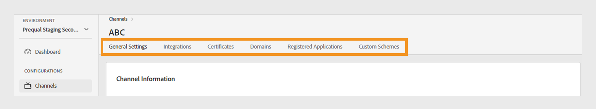
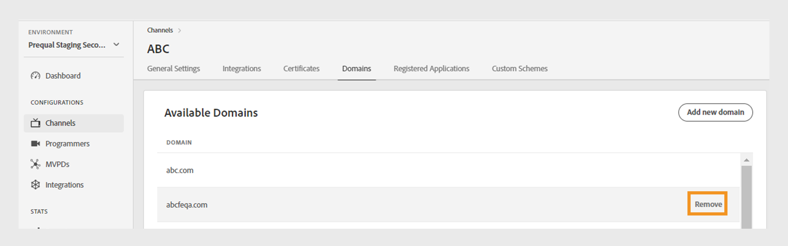
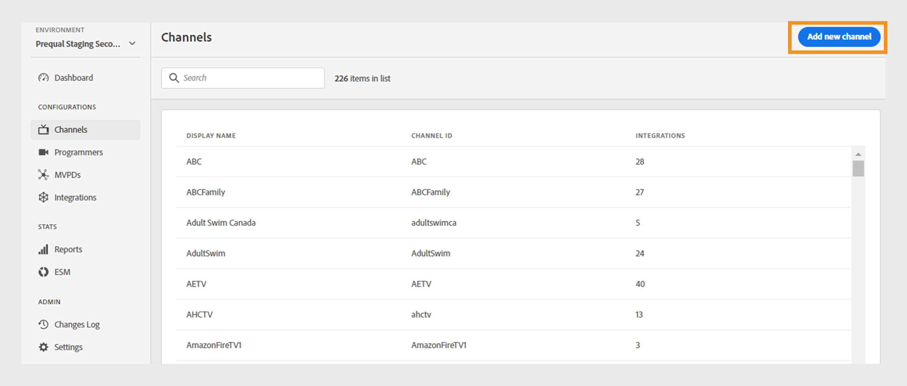

# Kanäle {#channels}

>[!NOTE]
>
>Der Inhalt dieser Seite dient nur Informationszwecken. Für die Verwendung dieser API ist eine aktuelle -Lizenz von Adobe erforderlich. Eine unbefugte Anwendung ist nicht zulässig.

Im Bereich **Kanäle** des TVE-Dashboards können Sie Einstellungen für die Kanäle anzeigen und verwalten, die einem bestimmten Programmierer zugeordnet sind. Sie können entsprechend Ihren Anforderungen auch [einen neuen Kanal hinzufügen](#add-new-channel).

Auf der Registerkarte **Kanäle** im linken Bereich wird eine Liste der verknüpften Kanäle mit den folgenden Details angezeigt:

* **Anzeigename**: Der Markenname des für kommerzielle Zwecke verwendeten Kanals.
* **Kanal-ID**: Eine eindeutige Kennung, die auch als Anforderer-ID bezeichnet wird.
* **Integrationen**: Die Anzahl der Verbindungen, die mit [MVPDs](/help/authentication/glossary.md#mvpd) hergestellt wurden.

*Liste der vorhandenen Kanäle*

Geben Sie den Namen des Kanals in die Leiste **Suchen** oberhalb der Liste ein, um mehr über den Kanal zu erfahren.

## Verwalten von Kanalkonfigurationen {#manage-channel-conf}

Führen Sie die Schritte zum Verwalten verschiedener Einstellungen eines bestimmten Kanals aus.

1. Wählen Sie im linken Bereich die Registerkarte **Kanäle** aus.

1. Wählen Sie den Kanal aus der verfügbaren Liste aus.

1. Wählen Sie eine der folgenden Registerkarten aus, um die entsprechenden Einstellungen des ausgewählten Kanals anzuzeigen und zu bearbeiten:

   * [Allgemeine Einstellungen](#general-settings)
   * [Integrationen](#integrations)
   * [Zertifikate](#certificates)
   * [Domänen](#domains)
   * [Registrierte Anwendungen](#registered-applications)
   * [Benutzerdefinierte Schemata](#custom-schemes)

   

   *Kanaleinstellungen*

>[!IMPORTANT]
>
> Weitere Informationen zum Aktivieren der Konfigurationsänderungen finden Sie unter [Überprüfen und Pushen von Änderungen](/help/authentication/tve-dashboard/new-tve-dashboard/tve-dashboard-review-push-changes.md) .

### Allgemeine Einstellungen {#general-settings}

Auf dieser Registerkarte werden **Kanalinformationen** und **Analytics-Konfiguration** angezeigt.

#### Kanalinformationen {#channel-information}

In diesem Abschnitt können Sie die folgenden Details bearbeiten:

* **Anzeigename**: Der Markenname des für kommerzielle Zwecke verwendeten Kanals.

* **Standard-Umleitungs-URL**: Die Backup-Umleitungs-URL für Authentifizierung und Abmeldung.

* **Fehlerberichterstellung**: Bei Auswahl von **Ja** senden die Adobe Pass-SDKs Fehlerberichte an das Adobe Pass-Backend für Analysen.

*Kanalinformationen bearbeiten*

#### Analytics-Konfiguration {#analytics-configuration}

In diesem Abschnitt können Sie die Weiterleitung von Adobe Pass-Authentifizierungsereignissen an Adobe Analytics konfigurieren.

Wenden Sie sich zur Aktivierung von **Analytics-Konfiguration** an Ihren technischen Kundenbetreuer (TAM), um weitere Informationen zum Einrichten der Report Suite-ID (RSID) zu erhalten.

*Analytics-Konfigurationen aktivieren*

Wählen Sie **Neue Analysekonfiguration hinzufügen** aus, um mehrere Konfigurationen hinzuzufügen.

Eine neue Konfigurationsänderung wurde erstellt und kann jetzt aktualisiert werden. Um die neue Analysekonfiguration aus dem Abschnitt **Analytics-Konfiguration** zu verwenden, fahren Sie mit dem Fluss [Überprüfung und Push-Änderungen](/help/authentication/tve-dashboard/new-tve-dashboard/tve-dashboard-review-push-changes.md) fort.

### Integrationen {#integrations}

In diesem Tab wird eine Liste der verfügbaren Integrationen zwischen dem aktuell ausgewählten Kanal und den MVPDs angezeigt. Die Liste zeigt jede Integration mit ihrem Status an und zeigt an, ob sie aktiviert ist oder nicht. Wählen Sie eine bestimmte Integration aus dieser Liste aus, um auf detaillierte Informationen im Abschnitt [Integrationen](tve-dashboard-integrations.md) zuzugreifen.

*Liste der verfügbaren Integrationen*

### Zertifikate {#certificates}

Auf dieser Registerkarte wird eine Liste der [verfügbaren Zertifikate](#available-certificates) und [vererbten verfügbaren Zertifikate](#inherited-avail-certificates) angezeigt, die in den Verschlüsselungsflüssen für Benutzermetadaten verwendet werden. Es werden Details zu jedem Zertifikat angezeigt, das Folgendes enthält:

* Der Status (ob für die Verwendung der **Benutzer-Metadatenverschlüsselung** aktiviert ist oder nicht)
* Seriennummer
* Name der Organisation des Emittenten
* Name der Betrefforganisation
* Ausgegebener Zeitpunkt
* Ablaufdatum
* Ein Dropdown-Menü zum Verschlüsseln von Benutzermetadaten (wenn Sie **Ja** auswählen, verschlüsselt das Zertifikat vertrauliche Benutzerinformationen wie z. B. Postleitzahlenwerte).

#### Verfügbare Zertifikate {#available-certificates}

Diese Zertifikate dienen als private oder öffentliche Schlüssel und werden zur Verschlüsselung von Benutzermetadaten verwendet.
Sie können die folgenden Änderungen im Abschnitt &quot;Verfügbare Zertifikate&quot;vornehmen:

* [Neues Zertifikat hinzufügen](#add-new-certificate)
* [Zertifikat löschen](#delete-certificate)

##### Neues Zertifikat hinzufügen {#add-new-certificate}

Gehen Sie wie folgt vor, um ein neues Zertifikat hinzuzufügen:

1. Wählen Sie oben im Abschnitt **Verfügbare Zertifikate** die Option **Neues Zertifikat hinzufügen** aus.

   

   *Neues Zertifikat hinzufügen*

1. Fügen Sie den öffentlichen Schlüssel Ihres Zertifikats in das Dialogfeld **Neues Zertifikat** ein.

1. Wählen Sie **Zertifikat hinzufügen** aus.

1. Suchen Sie das neue Zertifikat in der Liste der **Verfügbaren Zertifikate**.

   >[!IMPORTANT]
   >
   > Stellen Sie sicher, dass Ihre Systeme auf dem neuesten Stand sind und das neue Zertifikat verwenden können.

1. Wählen Sie im Dropdown-Menü **Verwendet zum Verschlüsseln von Benutzermetadaten** die Option **Ja** aus, um ein neues Zertifikat zu aktivieren.

Eine neue Konfigurationsänderung wurde erstellt und kann jetzt aktualisiert werden. Um das neue Zertifikat zu verwenden, das im Abschnitt **Verfügbare Zertifikate** aufgeführt ist, fahren Sie mit dem Fluss [Überprüfung und Push-Änderungen](/help/authentication/tve-dashboard/new-tve-dashboard/tve-dashboard-review-push-changes.md) fort.

##### Zertifikat löschen {#delete-certificate}

Führen Sie die folgenden Schritte aus, um ein Zertifikat zu löschen.

1. Bewegen Sie den Mauszeiger über das Zertifikat, das Sie aus der Liste der **Verfügbaren Zertifikate** löschen möchten.

1. Wählen Sie **Entfernen** aus.

   

   *Entfernen Sie das ausgewählte Zertifikat*

1. Wählen Sie **Löschen** aus dem Dialogfeld **Aktives Zertifikat löschen**.

Eine neue Konfigurationsänderung wurde erstellt und kann jetzt aktualisiert werden. Das Zertifikat wird erst aus dem Abschnitt **Verfügbare Zertifikate** gelöscht, nachdem [Änderungen überprüft und gepusht haben](/help/authentication/tve-dashboard/new-tve-dashboard/tve-dashboard-review-push-changes.md).

#### Vererbte verfügbare Zertifikate {#inherited-avail-certificates}

Medienunternehmen definieren diese Zertifikate auf ihrer eigenen Ebene. Alle mit demselben Medienunternehmen verknüpften Kanäle können diese Zertifikate verwenden.

*Vererbte verfügbare Zertifikate*

### Domänen {#domains}

Auf dieser Registerkarte wird eine Liste der verfügbaren Domänen angezeigt, über die der jeweilige Kanal mit der Adobe Pass-Authentifizierung kommuniziert.

Sie können die folgenden Änderungen an Domänen vornehmen:

* [Neue Domäne hinzufügen](#add-domains)
* [Domain löschen](#delete-domain)

>[!TIP]
>
> Vermeiden Sie das Hinzufügen einer neuen Subdomain, wenn eine allgemeinere Domäne in der Liste vorhanden ist.

#### Neue Domäne hinzufügen {#add-domains}

Führen Sie die folgenden Schritte aus, um eine Domäne hinzuzufügen.

1. Wählen Sie oben rechts im Abschnitt **Verfügbare Domänen** die Option **Neue Domäne hinzufügen** aus.

   

   *Neue Domäne hinzufügen*

1. Geben Sie den Namen Ihrer Domäne im Dialogfeld **Neue Domäne** ein.

1. Wählen Sie **Domäne hinzufügen** aus, um eine neue Domäne für den ausgewählten Kanal hinzuzufügen.

Eine neue Konfigurationsänderung wurde erstellt und kann jetzt aktualisiert werden. Um die neue Domäne zu verwenden, die im Abschnitt **Verfügbare Domänen** aufgeführt ist, fahren Sie mit dem Fluss [Überprüfung und Push-Änderungen](/help/authentication/tve-dashboard/new-tve-dashboard/tve-dashboard-review-push-changes.md) fort.

#### Domain löschen {#delete-domain}

Führen Sie die folgenden Schritte aus, um eine Domäne zu löschen.

1. Bewegen Sie den Mauszeiger über die Domäne, die Sie aus der Liste der **Verfügbaren Domänen** löschen möchten.

1. Wählen Sie **Entfernen** aus.

   

   *Entfernen Sie die ausgewählte Domäne*

1. Wählen Sie **Löschen** im Dialogfeld **Domäne löschen** aus.

Eine neue Konfigurationsänderung wurde erstellt und kann jetzt aktualisiert werden. Die Domäne wird erst aus dem Abschnitt **Verfügbare Domänen** gelöscht, nachdem [Änderungen überprüft und gepusht hat](/help/authentication/tve-dashboard/new-tve-dashboard/tve-dashboard-review-push-changes.md).

Die ausgewählte Domäne ist nicht mehr verfügbar. Daher verliert die mit dieser Domäne verknüpfte Anwendung den Zugriff auf die Adobe Pass-Authentifizierungsdienste.

### Registrierte Anwendungen {#registered-applications}

Auf dieser Registerkarte wird eine Liste benutzerdefinierter Schemata angezeigt. Anzeigen der [Registrierung der iOS/tvOS-Anwendung](/help/authentication/iostvos-application-registration.md).

## Neuen Kanal hinzufügen {#add-new-channel}

Führen Sie diese Schritte aus, um einen neuen Kanal hinzuzufügen.

1. Wählen Sie im linken Bereich die Registerkarte **Kanäle** aus.

1. Wählen Sie oben rechts im Abschnitt **Kanäle** die Option **Neuen Kanal hinzufügen** aus.

   

   *Hinzufügen eines neuen Kanals*

1. Wählen Sie **Programmierer-ID** aus dem Dropdown-Menü im Dialogfeld **Neuer Kanal** aus.

1. Geben Sie eine eindeutige Kennung in die **Kanal-ID** ein.

1. Geben Sie den Markennamen des für kommerzielle Zwecke verwendeten Kanals in den **Anzeigenamen** ein.

1. Wählen Sie **Kanal hinzufügen** aus.

Eine neue Konfigurationsänderung wurde erstellt und kann jetzt aktualisiert werden. Um den neuen Kanal zu verwenden, der im Abschnitt **Kanäle** aufgeführt ist, fahren Sie mit dem Fluss [Überprüfung und Push-Änderungen](/help/authentication/tve-dashboard/new-tve-dashboard/tve-dashboard-review-push-changes.md) fort.
