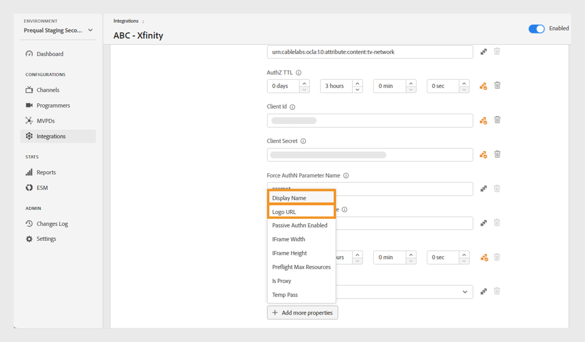

# Integrationen

>[!NOTE]
>
>Der Inhalt dieser Seite dient nur zu Informationszwecken. Die Verwendung dieser API erfordert eine aktuelle Lizenz von Adobe. Eine unbefugte Nutzung ist nicht zulässig.

Der **Integrationen** des TVE-Dashboards ermöglicht die Anzeige und Verwaltung von Einstellungen für die Integrationen zwischen Kanälen und MVPDs. Sie können auch [eine neue Integration erstellen](#create-new-integration) je nach Ihren Anforderungen.

Auf **Registerkarte** Integrationen“ im linken Bereich wird eine Liste vorhandener Integrationen mit den folgenden Details angezeigt:

* Status, der angibt, ob die Integration derzeit aktiv oder inaktiv ist
* Integration, die bestimmte Kanäle mit den jeweiligen MVPDs verknüpft
* Kanalname mit Kanal-ID
* Anzeigename und MVPD-ID für MVPD

*Liste der vorhandenen Integrationen*

Geben Sie den Namen des Kanals oder der MVPD in der Leiste **Suche** über der Liste ein, um mehr über die Integration zu erfahren.

## Integrationskonfigurationen verwalten {#manage-integration-conf}

Führen Sie diese Schritte aus, um eine bestimmte Integration zu verwalten.

1. Wählen Sie **linken Bedienfeld** Integrationen“ aus.
1. Wählen Sie eine Integration aus der bereitgestellten Liste aus, um verschiedene Einstellungen in den folgenden Abschnitten anzuzeigen und zu bearbeiten:

   * [Endpunktauswahl](#endpoint-selection)
   * [Platform-Einstellungen](#platform-settings)
   * [Benutzermetadaten](#user-metadata)

>[!IMPORTANT]
>
> Weitere Informationen [ Aktivieren der Konfigurationsänderungen finden Sie unter ](/help/authentication/user-guide-tve-dashboard/tve-dashboard-review-push-changes.md) und Push-Änderungen .

### Endpunktauswahl {#endpoint-selection}

In diesem Abschnitt können Sie die Endpunkte der für die Authentifizierungs-, Autorisierungs- und Abmeldevorgänge verwendeten MVPD aus den entsprechenden Dropdown-Menüs auswählen.

*Endpunkte für Authentifizierungs-, Autorisierungs- und Abmeldevorgänge*

>[!NOTE]
>
>MVPDs können einen oder mehrere Endpunkte für jeden Fluss bereitstellen. Bei der Integration eines neuen Kanals muss die MVPD für jeden Fluss den jeweiligen bevorzugten Endpunkt angeben.

>[!IMPORTANT]
>
>Jede Änderung an Endpunkten wirkt sich auf das Gesamtverhalten einer Integration aus. Diese Änderungen sollten erst implementiert werden, nachdem Sie eine Bestätigung von der MVPD erhalten haben.

### Platform-Einstellungen {#platform-settings}

In diesem Abschnitt können Sie Integrationseinstellungen für alle (Plattformen[ anzeigen und ](/help/authentication/user-guide-tve-dashboard/tve-dashboard-reports.md#platforms). Sie können diese Einstellungen basierend auf den einzelnen Plattformen ändern. Sie können beispielsweise die Autorisierungs-TTL-Dauer in Android anpassen, während Sie einen Standardwert für eine andere Plattform beibehalten.

Jede Eigenschaft in den Platform-Einstellungen übernimmt einen von der MVPD festgelegten Standardwert, kann jedoch bei Bedarf angepasst werden.

>[!IMPORTANT]
>
>Um in den Plattformeinstellungen Werte für die einzelnen Eigenschaften festzulegen, ist eine Vereinbarung mit der MVPD erforderlich.

>[!IMPORTANT]
>
> Die Einstellungsvererbung folgt einer Kette, die von den (allgemeinsten) MVPD-Einstellungen bis hin zu den Endpunkten, der Integration, der Plattformkategorie und der Plattform (die den spezifischsten Wert enthält) MVPDS beginnt.

**Platform-Einstellungen** wird verwendet, um Einstellungen für jede Ebene in der Vererbungskette zu überschreiben. Die verfügbaren Ebenen in der Kette sind wie folgt gruppiert:

* **Standard für alle**: Legen Sie Werte für Eigenschaften fest, die auf allen Plattformen allgemein anwendbar sind, wenn keine bestimmten Plattformwerte definiert sind, unabhängig von den Implementierungen des Programmierers.

* **Desktop-**: Legen Sie Werte für Eigenschaften fest, die für alle Desktop- und Laptop-Computer gelten, unabhängig von der Programmiermethode (JS SDK oder REST API).

* **Mobilgeräte**: Legen Sie Werte für Eigenschaften fest, die für alle Mobilgeräte gelten, einschließlich **iOS**, **Android** und andere, unabhängig vom Programmierungsansatz (SDK oder REST-API).

* **TV Connected Devices**: Legen Sie Werte für Eigenschaften fest, die für alle mit TV verbundenen Geräte gelten, einschließlich **tvOS**, **Roku**, **FireTV** und andere, unabhängig von der Programmiermethode (SDK oder REST API).

* **Nicht identifizierte Geräte**: Legen Sie Werte für Eigenschaften fest, die für alle Geräte gelten, bei denen der aktuelle Mechanismus die Plattform nicht genau identifizieren kann. Wenden Sie in solchen Fällen die restriktivsten Regeln an, die von der MVPD definiert wurden.

  

  *Kategorie der Plattformen und ihrer Geräte*

Auswählen Klicken Sie  Symbol rechts neben jeder Eigenschaft, um die Eigenschaften zu untersuchen, die für die einzelnen oben beschriebenen Vererbungsebenen verwendet werden.

#### Am häufigsten verwendete Geschäftsabläufe {#most-used-flows}

Der **Platform-Einstellungen** bietet eine Reihe von Eigenschaften, die in verschiedenen Geschäftsabläufen verwendet werden. Die tatsächlichen Eigenschaften können je nach den in der jeweiligen Integration ausgewählten MVPDs variieren. Im Folgenden finden Sie die am häufigsten verwendeten Flüsse:

**AuthN TTL und AuthZ TTL über alle Plattformen hinweg**

>[!IMPORTANT]
>
>Die TTL-Werte für die Authentifizierung (AuthN) und die Autorisierungs-TTL (AuthZ) müssen konsistent mit den MVPD-Einstellungen übereinstimmen.

Führen Sie diese Schritte aus, um die Authentifizierungs- und Autorisierungs-TTL für alle Plattformen für eine bestimmte Integration zu ändern.

1. Wählen Sie **linken Bedienfeld** Integrationen“ aus.

1. Wählen Sie die Integration aus, für die Sie die AuthNZ-TTL- und AuthZ-TTL-Werte ändern möchten.

1. Navigieren Sie zum Abschnitt **Platform-Einstellungen**.

1. Wählen Sie **Registerkarte** Standard für alle“ unter **Plattformeinstellungen** aus.

   >[!NOTE]
   >
   >Wenn Sie die Dauer von **AuthN TTL** und **AuthZ TTL** für eine Plattformkategorie oder eine bestimmte Plattform ändern möchten, wählen Sie die Plattform entsprechend aus.

   

   *Ändern der AuthN-TTL-AuthZ-TTL-Dauer auf allen Plattformen*

   **A.** AuthN TTL-Eigenschaft **B.** AuthZ TTL-Eigenschaft

1. Wählen Sie die Pfeile nach oben und unten aus, um die Dauer für die Anzahl der Tage, Stunden, Minuten und Sekunden in den **AuthN TTL**- und **AuthZ TTL**-Eigenschaften anzupassen.

Die Dauer für **AuthN TTL** und **AuthZ TTL** auf allen Plattformen wird erst nach [Überprüfung und Push-Änderungen) ](/help/authentication/user-guide-tve-dashboard/tve-dashboard-review-push-changes.md).

**Plattform-SSO aktivieren**

>[!IMPORTANT]
>
>**Single Sign-On aktivieren** wird ausschließlich auf *iOS-, tvOS-, Roku- und FireTV*-Plattformen unterstützt. Dies gilt nur für Integrationen mit MVPDs, die Single Sign-on für diese Plattformen unterstützen.

Führen Sie diese Schritte aus, um SSO für eine bestimmte Integration und Plattform zu aktivieren oder zu deaktivieren.

1. Wählen Sie **linken Bedienfeld** Integrationen“ aus.

1. Wählen Sie die Integration aus, für die Sie Single Sign-on aktivieren oder deaktivieren möchten.

1. Navigieren Sie zum Abschnitt **Platform-Einstellungen**.

1. Wählen Sie eine bestimmte Plattform oder Kategorie von Plattformen aus, für die Sie Single Sign-on unter **Plattformeinstellungen** aktivieren möchten.

   

   *Aktivieren von Single Sign-On für eine bestimmte Plattform*

   **a.** Single Sign-On-Eigenschaft **b.** Erzwingen der Platform-Berechtigungseigenschaft

1. Wählen Sie **Ja**, um zu aktivieren, oder **Nein**, um es zu deaktivieren, aus dem **Single Sign-On aktivieren** Dropdown-Menü aus.

1. Wählen Sie **Ja** aus, um zu aktivieren, oder **Nein**, um sie im Dropdown-Menü **Platform-Berechtigung erzwingen** zu deaktivieren.

   **Platform-Berechtigung erzwingen** steuert, ob die Entscheidung der Benutzerin bzw. des Benutzers, den Plattformzugriff auf **TV-Anbieter-Abonnement zu** oder zu **verweigern** respektiert wird.

   Wenn beispielsweise sowohl die **Single Sign-On aktivieren** als auch **Platform-Berechtigung erzwingen** aktiviert sind und der Benutzer sich dafür entscheidet, Platform den Zugriff auf sein TV Provider-Abonnement zu verweigern, kann die entsprechende Anwendung (der Kanal) das von einer anderen Anwendung (dem Kanal) erhaltene Adobe Pass-Authentifizierungstoken nicht verwenden.

Die **Single Sign-On**-Eigenschaft für eine ausgewählte Plattform wird erst nach ([ und Push-Änderungen) ](/help/authentication/user-guide-tve-dashboard/tve-dashboard-review-push-changes.md).

**Startseite-basierte Authentifizierung aktivieren**

Führen Sie diese Schritte aus, um die Home-basierte Authentifizierung für OAuth2-basierte MVPDs zu aktivieren oder zu deaktivieren.

1. Wählen Sie **linken Bedienfeld** Integrationen“ aus.

1. Wählen Sie die Integration aus, für die Sie die Startseiten-basierte Authentifizierung aktivieren oder deaktivieren möchten.

1. Navigieren Sie zum Abschnitt **Platform-Einstellungen**.

1. Wählen Sie unter „Plattformeinstellungen“ eine bestimmte Plattform oder Kategorie von **aus, für die Sie die Startseiten-Authentifizierung** möchten.

   

   *Aktivieren der Home-basierten Authentifizierung für eine bestimmte Plattform*

   **a.** HBA-Eigenschaft versuchen **b.** HBA AuthN TTL-Eigenschaft

1. Wählen Sie **Ja** aus, um zu aktivieren, und **Nein**, um sie im Dropdown-Menü **HBA versuchen** zu deaktivieren.

>[!IMPORTANT]
>
>Eine Änderung der Dauer **Eigenschaft „HBA AuthN TTL** sollte vermieden werden. Dies kann zu unerwarteten Fehlern im Autorisierungsprozess führen.

Die **HBA**-Eigenschaft für eine bestimmte MVPD wird erst nach den Änderungen [Überprüfung und Push-Benachrichtigung) aktiviert oder ](/help/authentication/user-guide-tve-dashboard/tve-dashboard-review-push-changes.md).

#### Weitere Eigenschaften hinzufügen {#add-more-properties}

Der **Weitere Eigenschaften hinzufügen** ermöglicht die Flexibilität, zusätzliche spezifische Eigenschaften für Integrationen einzuschließen, insbesondere für weniger häufige Flüsse.

Sie können die folgenden Eigenschaften hinzufügen:

* Wählen Sie für alle Plattformen **Registerkarte** Standard für alle“ auf der linken Seite aus.
* Wählen Sie für eine Plattformkategorie auf der linken Seite **Desktop**, **Mobile** oder **TV Connected Devices** aus.
* Wählen Sie für ein bestimmtes Gerät die Registerkarte **iOS**, **Android**, **tvOS**, **Roku** oder **FireTV** auf der linken Seite.

Im Folgenden finden Sie einige Beispiele für verschiedene Flüsse, die durch Hinzufügen der folgenden Eigenschaften aktiviert werden können:

**Ändern Sie die Zahl für vorab autorisierte Ressourcen**

Die meisten MVPDs unterstützen einen Preflight-AuthZ-Aufruf mit standardmäßig bis zu 5 Ressourcen-IDs.
In Fällen, in denen MVPDs einer Erhöhung dieses Limits zustimmen, können Sie jedoch zum **Weitere Eigenschaften hinzufügen** navigieren und **Preflight Max Resources** aus dem Optionsmenü auswählen.

**Preflight Max Resources** fügt ein neues Attribut hinzu, in dem das vereinbarte Limit mit der MVPD angegeben werden kann.

*Eigenschaft für maximale Ressourcen von Preflight hinzufügen*

Die **Preflight Max Resources**-Eigenschaft wird erst nach [Überprüfung und Push-Änderungen](/help/authentication/user-guide-tve-dashboard/tve-dashboard-review-push-changes.md) hinzugefügt.

**Ändern des MVPD-Anzeigenamens oder der Logo-URL**

Für Programmieranwendungen, die ihre MVPD-Auswahl nicht erstellen möchten und stattdessen auf die bereitgestellten Konfigurationen angewiesen sind, können Sie zu **Weitere Eigenschaften hinzufügen** navigieren und **Anzeigename** oder **Logo-URL** auswählen, um den erforderlichen Anzeigenamen oder Logo-URLs für jede MVPD aus dem Optionsmenü hinzuzufügen.

Je nach Geräteplattform und dem gewünschten Benutzererlebnis können für dieselbe MVPD unterschiedliche Werte für diese Eigenschaften verwendet werden.

*Anzeigenamen oder Logo-URL-Eigenschaft hinzufügen*

Die Eigenschaft **Anzeigename** oder **Logo-URL** wird erst nach [Überprüfung und Push-Änderungen) ](/help/authentication/user-guide-tve-dashboard/tve-dashboard-review-push-changes.md).

**Fordern Sie einen neuen Authentifizierungsfluss beim Wechsel der App (Kanal) an**

Wenn Sie eine neue Authentifizierung erzwingen möchten, wenn Benutzer zwischen Apps wechseln. In diesem Fall können Sie zur Eigenschaft **Weitere Eigenschaften hinzufügen** navigieren und die Eigenschaft **Auth pro Aggregator** auswählen.

Durch Hinzufügen **Auth pro Aggregator** wird die einmalige Anmeldung für den jeweiligen Kanal effektiv unterbrochen.

*Authentifizierung pro Aggregator-Eigenschaft hinzufügen*

Die **Auth pro Aggregator**-Eigenschaft wird erst nach [Überprüfung und Push-Änderungen) ](/help/authentication/user-guide-tve-dashboard/tve-dashboard-review-push-changes.md).

Wählen Sie nach dem Hinzufügen **Ja**, um die Eigenschaft **Auth pro Aggregator** für eine ausgewählte Integration zu aktivieren.

#### Löschen von Eigenschaften {#delete-properties}

Auswählen  Symbol rechts neben jeder Eigenschaft, um die nicht mehr erforderlichen Eigenschaften zu löschen.

>[!NOTE]
>
>Bestimmte Eigenschaften können nicht entfernt werden, da sie obligatorische Anforderungen für die ausgewählte MVPD sind.

Die Eigenschaft wird aus dem Abschnitt **Platform-Einstellungen** erst nach [Überprüfung und Push-Änderungen](/help/authentication/user-guide-tve-dashboard/tve-dashboard-review-push-changes.md) gelöscht.

### Benutzermetadaten {#user-metadata}

In diesem Abschnitt können Sie die Einstellungen für die einzelnen Benutzer-Metadatenparameter aktualisieren, die von der MVPD gemeinsam verwendet werden.

>[!NOTE]
>
>Jede MVPD kann andere Parameter gemeinsam nutzen. Weitere Informationen zu den Parametern, die eine bestimmte MVPD freigeben kann, erhalten Sie von Ihrem Adobe-Support-Mitarbeiter.

Im Abschnitt Benutzermetadaten werden die folgenden Spalten angezeigt:

**Key**: Stellt die tatsächlichen Benutzer-Metadatenparameter dar, die in der API zum Extrahieren von Werten verwendet werden sollen.

**Beschreibung**: Bietet eine kurze Beschreibung jedes Benutzer-Metadatenparameters.

**Verschlüsselt**: In dieser Spalte können Sie Parameter in der API aktivieren oder deaktivieren, indem Sie **Ja** bzw. **Nein** aus dem Dropdown-Menü auswählen. Wenn Sie sich für **Ja** entscheiden, wird der Parameterwert in der API verschlüsselt. Die Verschlüsselung erfolgt mithilfe eines Zertifikats, das durch den Umfang **Benutzermetadaten“** wird.

>[!TIP]
>
>
> Stellen Sie immer sicher **dass der ZIP**-Parameter verschlüsselt ist.

Weitere Informationen zu verfügbaren Zertifikaten finden Sie in den Abschnitten  und [Kanäle](/help/authentication/user-guide-tve-dashboard/tve-dashboard-channels.md#available-certificates) .

**Aktiviert**: In dieser Spalte können Sie die Parameter in der API aktivieren oder deaktivieren, indem Sie **Ja** bzw. **Nein** aus dem Dropdown-Menü auswählen.

*Für Benutzermetadaten verfügbare Parameter*

## Neue Integration erstellen {#create-new-integration}

Gehen Sie wie folgt vor, um bei Ihrer aktuellen Einrichtung eine neue Integration mit einer neuen MVPD zu erstellen:

1. Wählen Sie **linken Bedienfeld** Integrationen“ aus.

1. Wählen **oben rechts im Abschnitt** Integrationen **die Option Neue Integration erstellen** aus.

   

   *Erstellen einer neuen Integration*

   Die folgenden Abschnitte werden angezeigt:

   **Kanal und MVPD auswählen**

   Wählen Sie einen **Kanal** aus dem Dropdown **Menü Kanal auswählen**, um eine neue Integration hinzuzufügen. Nachdem Sie den Kanal ausgewählt haben, wählen Sie die erforderliche **MVPD** aus dem Dropdown-Menü **MVPD auswählen** aus, um ihn in den ausgewählten Kanal zu integrieren.

   

   *Kanal und MVPD auswählen*

   **Endpunkte auswählen**

   Nach Auswahl des erforderlichen MVPD **Endpunkts auswählen** wird der Abschnitt mit den für diesen bestimmten MVPD konfigurierten Standard-Endpunkten vorab ausgefüllt.

   >[!IMPORTANT]
   >
   >Ändern Sie die Standard-Endpunkte in keinem Fluss, es sei denn, dies wird ausdrücklich von der MVPD angegeben.

   

   *Endpunkte auswählen*

   **Zusätzliche Informationen**

   Dieser Abschnitt enthält verschiedene Eigenschaften, die für die ausgewählte MVPD im Abschnitt **Kanal und MVPD auswählen“ konfiguriert** müssen.

   >[!NOTE]
   >
   > Die tatsächlichen Eigenschaften können je nach den im Abschnitt **Kanal und MVPD auswählen** ausgewählten MVPDs unterschiedlich sein.

   Sie können beispielsweise die **AuthN TTL** oder **Partner-ID** (Kanal-ID) für Co-Branding auf der MVPD-Anmeldeseite in der folgenden Abbildung bearbeiten.

   

   *Zusätzliche Informationen bearbeiten*

   Wählen **oben rechts** Abschnitt **Neue Integration erstellen** die Option „Integration speichern“ aus.

Eine neue Integration wird erst nach ([ und Push-Änderungen) ](/help/authentication/user-guide-tve-dashboard/tve-dashboard-review-push-changes.md).

## Integration deaktivieren {#disable-integration}

Gehen Sie wie folgt vor, um eine Integration zu deaktivieren:

1. Wählen Sie **linken Bedienfeld** Integrationen“ aus.

1. Wählen Sie die Integration aus, die Sie deaktivieren möchten.

1. Deaktivieren Sie den Umschalter oben rechts in der ausgewählten Integration.

   

   *Integration deaktivieren*

Die Integration wird erst nach ([ und Push-Änderungen) ](/help/authentication/user-guide-tve-dashboard/tve-dashboard-review-push-changes.md).

Nachdem die Integration deaktiviert wurde, können sich Endbenutzer nicht mehr mit der jeweiligen MVPD authentifizieren oder autorisieren.
