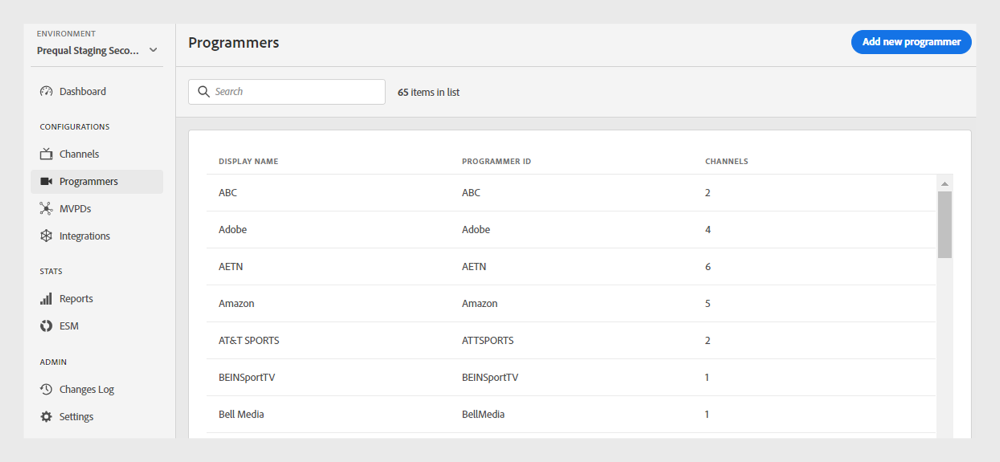
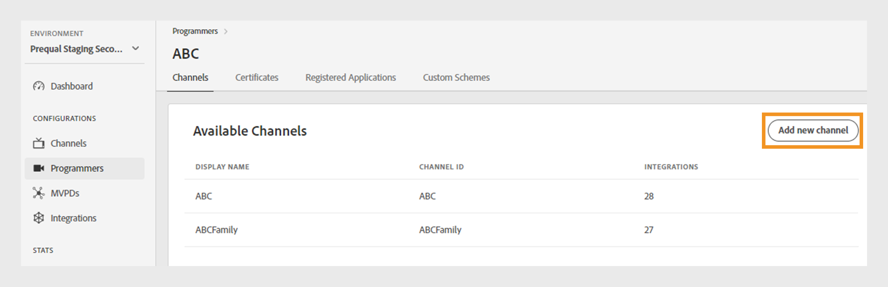
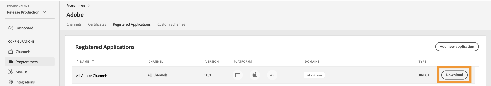

# Programmierer {#programmers}

>[!NOTE]
>
>Der Inhalt dieser Seite dient nur zu Informationszwecken. Die Verwendung dieser API erfordert eine aktuelle Lizenz von Adobe. Eine unbefugte Nutzung ist nicht zulässig.

Der **Programmierer** Abschnitt des TVE-Dashboards ermöglicht Ihnen die Anzeige und Verwaltung der Einstellungen für die [Programmierer](/help/authentication/integration-guide-programmers/rest-apis/rest-api-v2/rest-api-v2-glossary.md#programmer), die mit Ihren Kontoberechtigungen verknüpft sind. Sie können auch [einen neuen Programmierer hinzufügen](#add-new-programmer) je nach Ihren Anforderungen.

Auf **Registerkarte** Programmierer“ im linken Bereich wird eine Liste vorhandener Programmierer mit den folgenden Details angezeigt:

* **Programmierer-ID**: Eine Medienunternehmen-ID im System.
* **Kanäle**: Die Anzahl der zugehörigen Kanäle, die mit einem Programmierer verknüpft sind.

*Liste der vorhandenen Programmierer*

Geben Sie den Namen des Programmierers in die **Suche**-Leiste über der Liste ein, um mehr über einen Programmierer zu erfahren.

## Programmkonfigurationen verwalten {#manage-programmer-conf}

Führen Sie diese Schritte aus, um verschiedene Einstellungen eines bestimmten Programmierers zu verwalten.

1. Wählen Sie **linken Bedienfeld** Registerkarte „Programmierer“ aus.
1. Wählen Sie einen Programmierer aus der Liste aus.
1. Wählen Sie eine der folgenden Registerkarten aus, um die entsprechenden Einstellungen des ausgewählten Programmierers anzuzeigen und zu bearbeiten:

   * [Kanäle](#channels)
   * [Zertifikate](#certificates)
   * [Registrierte Anwendungen](#registered-applications)
   * [Benutzerdefinierte Schemata](#custom-schemes)

   

   *Programmierereinstellungen*

>[!IMPORTANT]
>
> Weitere Informationen [&#x200B; Aktivieren der Konfigurationsänderungen finden Sie unter &#x200B;](/help/authentication/user-guide-tve-dashboard/tve-dashboard-review-push-changes.md) und Push-Änderungen .

### Kanäle {#channels}

Auf dieser Registerkarte wird eine Liste der mit einem aktuellen Programmierer verknüpften Kanäle angezeigt. Wählen Sie einen bestimmten Kanal aus dieser Liste aus, um auf detaillierte Informationen im Abschnitt [Kanäle](/help/authentication/user-guide-tve-dashboard/tve-dashboard-channels.md) zuzugreifen.

Um einen neuen Kanal für den ausgewählten Programmierer hinzuzufügen, wählen Sie **Neuen Kanal hinzufügen** in der oberen rechten Ecke des Abschnitts **Verfügbare Kanäle** aus. Erfahren Sie [wie Sie einen neuen Kanal hinzufügen](/help/authentication/user-guide-tve-dashboard/tve-dashboard-channels.md#add-new-channel).

*Neuen Kanal hinzufügen*

### Zertifikate {#certificates}

Auf dieser Registerkarte wird eine Liste [verfügbaren Zertifikate](#available-certificates) angezeigt, die in den Verschlüsselungsflüssen der Benutzermetadaten verwendet werden. Es werden Details zu jedem Zertifikat angezeigt, das Folgendes enthält:

* Der Status (unabhängig davon, ob er für **Benutzermetadatenverschlüsselung** Verwendung aktiviert ist oder nicht)
* Seriennummer
* Name der ausstellenden Organisation
* Name der betroffenen Organisation
* Ausstellungsdatum
* Ablaufdatum
* Ein Dropdown-Menü zum Verschlüsseln von Benutzermetadaten (Wenn Sie **Ja** auswählen, verschlüsselt das Zertifikat vertrauliche Benutzerinformationen wie Postleitzahlwerte).

#### Verfügbare Zertifikate {#available-certificates}

Diese Zertifikate dienen als private oder öffentliche Schlüssel und werden für die Verschlüsselung von Benutzermetadaten verwendet. Alle Kanäle, die demselben Medienunternehmen zugeordnet sind, können diese Zertifikate verwenden.

Sie können die folgenden Änderungen an verfügbaren Zertifikaten vornehmen:

* [Neues Zertifikat hinzufügen](#add-new-certificate)
* [Zertifikat löschen](#delete-certificate)

##### Neues Zertifikat hinzufügen {#add-new-certificate}

Gehen Sie wie folgt vor, um ein neues Zertifikat hinzuzufügen.

1. Wählen **oben rechts** Abschnitt **Verfügbare Zertifikate** die Option „Neues Zertifikat hinzufügen aus.

   

   *Neues Zertifikat hinzufügen*

1. Fügen Sie den öffentlichen Schlüssel Ihres Zertifikats in das Dialogfeld **Neues Zertifikat** ein.

1. Wählen Sie **Zertifikat hinzufügen** aus.

1. Suchen Sie das neue Zertifikat in der Liste der **verfügbaren Zertifikate**.

   >[!IMPORTANT]
   >
   > Stellen Sie sicher, dass Ihre Systeme auf dem neuesten Stand sind und das neue Zertifikat verwenden können.

1. Wählen Sie **Ja** aus **Dropdown-Menü Wird zum Verschlüsseln von Benutzermetadaten verwendet** aus, um ein neues Zertifikat zu aktivieren.

Eine neue Konfigurationsänderung wurde erstellt und ist für die Server-Aktualisierung bereit. Um das neue Zertifikat zu verwenden, das im Abschnitt **Verfügbare Zertifikate** aufgeführt ist, fahren Sie mit dem Fluss [Überprüfen und Push-Änderungen](/help/authentication/user-guide-tve-dashboard/tve-dashboard-review-push-changes.md) fort.

##### Zertifikat löschen {#delete-certificate}

Gehen Sie wie folgt vor, um ein Zertifikat zu löschen.

1. Bewegen Sie den Mauszeiger über das Zertifikat, das Sie aus der Liste der **verfügbaren Zertifikate“** möchten.

1. Wählen Sie **Entfernen** aus.

   

   *Das ausgewählte Zertifikat entfernen*

1. Wählen **Löschen** im Dialogfeld **Zertifikat löschen** aus.

Eine neue Konfigurationsänderung wurde erstellt und ist für die Server-Aktualisierung bereit. Das Zertifikat wird aus dem Abschnitt **Verfügbare Zertifikate** erst nach [Überprüfung und Push-Änderungen](/help/authentication/user-guide-tve-dashboard/tve-dashboard-review-push-changes.md) gelöscht.

### Registrierte Anwendungen {#registered-applications}

Auf dieser Registerkarte wird eine Liste der registrierten Anwendungen angezeigt. Weitere Informationen zur Verwendung registrierter Anwendungen finden Sie in der Dokumentation [Übersicht über die dynamische Client-Registrierung](../integration-guide-programmers/rest-apis/rest-api-dcr/dynamic-client-registration-overview.md).

Sie können mit registrierten Programmen die folgenden Aktionen durchführen:

* [Neue registrierte Anwendung hinzufügen](#add-registered-applications)
* [Software-Erklärung herunterladen](#download-software-statement)

#### Neue registrierte Anwendung hinzufügen {#add-registered-applications}

Führen Sie diese Schritte aus, um eine neue registrierte Anwendung hinzuzufügen.

1. Wählen **oben rechts** Abschnitt **Registrierte Anwendungen“ die Option „Neue Anwendung**.

   

   *Neue Anwendung hinzufügen*

1. Wählen Sie **Kanal zugewiesen** aus dem Dropdown-Menü im Dialogfeld **Neue Anwendung** aus.

   >[!IMPORTANT]
   >
   > Es wird empfohlen, registrierte Anwendungen mit spezifischeren und eingeschränkteren Berechtigungen zu erstellen, um die Sicherheit zu erhöhen und nicht autorisierten Zugriff zu verhindern. Daher sollten Sie beim Erstellen registrierter Anwendungen die Verwendung engerer Optionen für die zugewiesenen `channel` in Betracht ziehen.

1. Wählen **Plattformen** aus dem Dropdown-Menü aus.

   >[!IMPORTANT]
   >
   > Es wird empfohlen, registrierte Anwendungen mit spezifischeren und eingeschränkteren Berechtigungen zu erstellen, um die Sicherheit zu erhöhen und nicht autorisierten Zugriff zu verhindern. Daher sollten Sie beim Erstellen registrierter Anwendungen die Verwendung engerer Optionen für die zugewiesenen `platforms` in Betracht ziehen.

1. Wählen **Domains** aus dem Dropdown-Menü aus.

   >[!IMPORTANT]
   >
   > Im Rahmen des Client-Registrierungsprozesses kann die Client-Anwendung beantragen, dass ihr die Verwendung einer Umleitungs-URL für die Fertigstellung des Authentifizierungsflusses erlaubt wird. Wenn ein Client-Programm eine bestimmte Umleitungs-URL verwendet, wird es anhand der in dieser Auswahl ausgewählten `domains` validiert.

1. Geben Sie **Name** der Anwendung ein.

1. Geben Sie die **Version** der Anwendung ein.

   >[!IMPORTANT]
   >
   > Es wird empfohlen, für jedes größere Update Ihrer Client-Anwendung eine neue registrierte Anwendung zu erstellen, um deren Lebenszyklus und Nutzung zu verwalten. Erstellen Sie bei Bedarf ein Ticket über unseren [Zendesk](https://adobeprimetime.zendesk.com) und bitten Sie Ihren Technical Account Manager (TAM), eine registrierte Anwendung zu widerrufen, um die Funktionalität einer bestimmten Client-Anwendungsversion zu blockieren.

1. Wählen Sie **Typ** Wert „DIRECT“ aus dem Dropdown-Menü aus.

1. Wählen Sie **Anwendung hinzufügen** aus.

Eine neue Konfigurationsänderung wurde erstellt und ist für die Server-Aktualisierung bereit. Um die neue registrierte Anwendung zu verwenden, die im Abschnitt **Registrierte Anwendungen** aufgeführt ist, fahren Sie mit dem Fluss [Überprüfen und Push-Änderungen](/help/authentication/user-guide-tve-dashboard/tve-dashboard-review-push-changes.md) fort.

#### Software-Erklärung herunterladen {#download-software-statement}

Führen Sie die folgenden Schritte aus, um eine Software-Erklärung herunterzuladen.

1. Bewegen Sie den Mauszeiger über die registrierte Anwendung, die Sie aus der Liste der **registrierten Anwendungen“ herunterladen**.

1. Wählen Sie **Herunterladen** aus.

   

   *Software-Erklärung herunterladen*

### Benutzerdefinierte Schemata {#custom-schemes}

Auf dieser Registerkarte wird eine Liste benutzerdefinierter Schemata angezeigt. Weitere Informationen zur Verwendung benutzerdefinierter Schemata finden Sie unter Registrierung der [iOS-/tvOS-Anwendung](/help/authentication/integration-guide-programmers/legacy/sdks/ios-tvos-sdk/iostvos-application-registration.md).

Sie können die folgenden Änderungen an benutzerdefinierten Schemata vornehmen:

* [Neues benutzerdefiniertes Schema erstellen](#generate-custom-schemes)

#### Neues benutzerdefiniertes Schema erstellen {#generate-custom-schemes}

Führen Sie die folgenden Schritte aus, um ein neues benutzerdefiniertes Schema zu erstellen.

1. Wählen Sie **Neues benutzerdefiniertes Schema erstellen** aus.

   

   *Neues benutzerdefiniertes Schema erstellen*

Eine neue Konfigurationsänderung wurde erstellt und ist für die Server-Aktualisierung bereit. Um das neue benutzerdefinierte Schema zu verwenden, das im Abschnitt **Benutzerdefinierte Schemata** aufgeführt ist, fahren Sie mit dem Fluss [Überprüfung und Push-Änderungen](/help/authentication/user-guide-tve-dashboard/tve-dashboard-review-push-changes.md) fort.

## Neuen Programmierer hinzufügen {#add-new-programmer}

Führen Sie die folgenden Schritte aus, um eine neue Programmiererentität hinzuzufügen.

1. Wählen Sie **linken Bedienfeld** Registerkarte „Programmierer“ aus.

1. Wählen **oben rechts im Abschnitt** Programmierer“ **Programmierer** aus.

   

   *Einen neuen Programmierer hinzufügen*

1. Geben Sie die Medien-Unternehmenskennung in **Programmierer-ID** im Dialogfeld **Neuer**&quot; ein.

1. Geben Sie einen kommerziellen Markennamen ein, der in der Konsole unter „Anzeigename **angezeigt werden**.

1. Wählen Sie **Programmierer hinzufügen** aus.

Eine neue Konfigurationsänderung wurde erstellt und ist für die Server-Aktualisierung bereit. Um den neuen Programmierer zu verwenden, der im Abschnitt **Programmierer** aufgeführt ist, fahren Sie mit dem Fluss [Überprüfen und Push-Änderungen](/help/authentication/user-guide-tve-dashboard/tve-dashboard-review-push-changes.md) fort.
