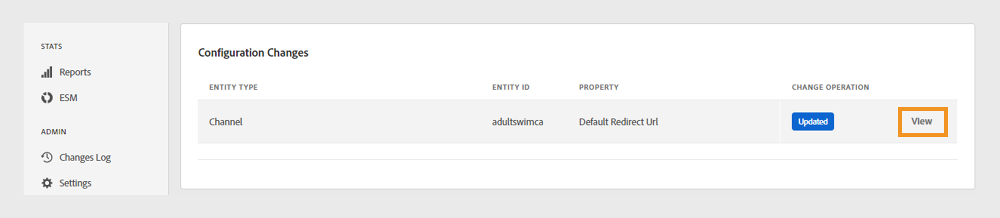

# Überprüfen und Push-Änderungen

>[!NOTE]
>
>Der Inhalt dieser Seite dient nur zu Informationszwecken. Die Verwendung dieser API erfordert eine aktuelle Lizenz von Adobe. Eine unbefugte Nutzung ist nicht zulässig.

Mit dem TVE-Dashboard können Sie Änderungen an der aktuellen Konfiguration überprüfen und dann auf dem Server bereitstellen. Wenn Sie die aktuelle Konfiguration ändern, wird eine Benachrichtigung auf dem Bildschirm angezeigt, in der Sie aufgefordert werden, diese Änderungen zu überprüfen und zu pushen.

Führen Sie diese Schritte aus, um Änderungen zu überprüfen und per Push zu übertragen.

1. Suchen Sie die Benachrichtigung Überprüfen und Push-Änderungen unten auf dem Bildschirm.

   

   *Benachrichtigungsfeld „Überprüfen und Push-Änderungen“*

1. Wählen Sie **Änderungen überprüfen** im Benachrichtigungsfeld **Überprüfung und Push** aus.

1. Geben Sie eine kurze Beschreibung der Änderung in **Konfigurationsbeschreibung** ein, um den Zweck jeder Änderung effektiv zu verfolgen und zu verstehen.

   

   *Fügen Sie eine Konfigurationsbeschreibung hinzu*

1. Navigieren Sie zum Abschnitt **Konfigurationsänderungen**, um eine Zusammenfassung der Änderungen anzuzeigen.

1. Bewegen Sie den Mauszeiger über die Änderung, die Sie überprüfen möchten.

1. Wählen Sie **Anzeigen** aus, um die vorherigen und neuen Werte zu überprüfen, die mit einer Konfigurationsänderung verbunden sind.

   

   *Konfigurationsänderungen anzeigen*

1. Nachdem Sie alle Änderungen überprüft haben und alles korrekt aussieht, wählen Sie **Push-Änderungen** aus, um die aktualisierte Konfiguration auf den Server anzuwenden.

   >[!NOTE]
   >
   >Die Schaltfläche **Änderungen per Push** wird erst nach dem Hinzufügen einer **Konfigurationsbeschreibung)**.

   

   *Änderungen per Push übertragen*

   Alternativ können Sie auf **Änderungen verwerfen** klicken, wenn Sie alle aufgelisteten Konfigurationsänderungen rückgängig machen möchten.
