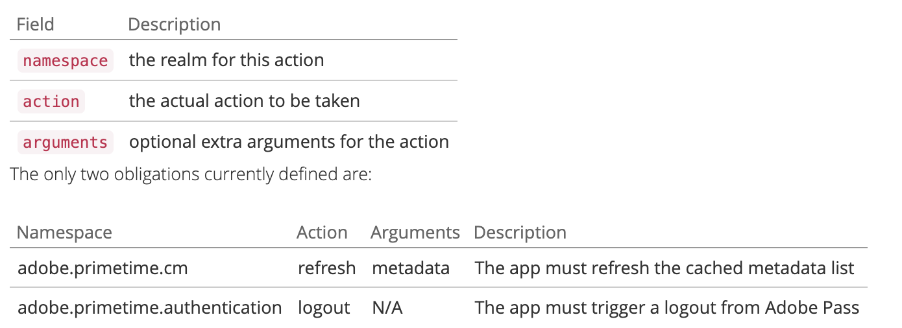

# API-Übersicht {#api-overview}

Weitere Informationen finden Sie in der [Online](https://streams-stage.adobeprimetime.com/swagger-ui/index.html)API-Dokumentation).

## Zweck und Voraussetzungen {#purpose-prerequisites}

Dieses Dokument unterstützt Anwendungsentwickler bei der Verwendung unserer Swagger-API-Spezifikation bei der Implementierung einer Integration mit der gleichzeitigen Überwachung. Es wird dringend empfohlen, dass der Leser ein früheres Verständnis der vom Service definierten Konzepte hat, bevor er diese Richtlinie befolgt. Um dieses Verständnis zu erhalten, ist ein Überblick über die [Produktdokumentation) ](../cm-home.md) die „Swagger [&quot;-](https://streams-stage.adobeprimetime.com/swagger-ui/index.html) erforderlich.

## Einführung {#api-overview-intro}

Während des Entwicklungsprozesses stellt die öffentliche Swagger-Dokumentation die Referenz-Richtlinie zum Verständnis und Testen der API-Flüsse dar. Dies ist ein guter Ausgangspunkt, um einen praxisnahen Ansatz zu haben und sich mit der Art und Weise vertraut zu machen, wie sich reale Anwendungen in verschiedenen Szenarien der Benutzerinteraktion verhalten würden.

Reichen Sie ein Ticket in [Zendesk](mailto:tve-support@adobe.com) ein, um Ihr Unternehmen und Ihre Anträge bei der Parallelitätsüberwachung zu registrieren. Adobe weist jeder Entität eine Anwendungs-ID zu. In diesem Handbuch verwenden wir zwei Referenzanwendungen mit den IDs **demo-app** und **demo-app-2** die sich unter dem Mandanten-Adobe befinden.

### Erste Anwendung {#first-app-use-cases}

Anwendung mit der ID **demo-app** wurde vom Adobe-Team eine Richtlinie mit einer Regel zugewiesen, die die Anzahl der gleichzeitigen Streams auf 3 einschränkt. Eine Richtlinie wird einem bestimmten Programm basierend auf der in Zendesk gesendeten Anfrage zugewiesen.

#### Metadaten werden abgerufen {#retrieve-metadata-use-case}

Der erste Aufruf betrifft die Metadaten-Ressource, um die Liste der Metadatenattribute abzurufen, die während der Sitzungsinitialisierung als Formulardaten übergeben werden müssen. Diese Metadaten werden verwendet, um die für dieses Programm zugewiesenen Richtlinien zu bewerten.

```http
# Request
user = 'demo-app'
pass = ''
curl -i -u ${user}:%{pass} http://streams-stage.adobeprimetime.com/v2/metadata

# Response Code
200
# Response Body
[]
```

Wie wir im Feld Antworttext sehen können, ist die Liste der Metadatenattribute leer. Das bedeutet, dass die vom Design her erforderlichen Attribute ausreichen, um die dieser Anwendung zugewiesene 3-Streams-Richtlinie zu bewerten. Siehe auch die [Standarddokumentation zu Metadatenfeldern](../technical/standard-metadata-attributes.md). Nach diesem Aufruf können wir fortfahren und eine neue Sitzung für die REST-Ressource Sitzungen erstellen.

#### Sitzungsinitialisierung {#session-initial}

Der Sitzungsinitialisierungsaufruf wird von einer Anwendung ausgeführt, nachdem alle erforderlichen Informationen abgerufen wurden, um ihn auszuführen.

```http
# Request
user = 'demo-app'
pass = ''
curl -i -X POST -u ${user}:%{pass} http://streams-stage.adobeprimetime.com/v2/sessions/adobe/12345
```


Es ist nicht erforderlich, beim ersten Aufruf einen Beendigungs-Code anzugeben, da wir keine anderen aktiven Streams haben. Und kein Metadatenattribut, da vom Aufruf zum Abrufen von Metadaten keines zurückgegeben wurde.

Die Parameter **subject** und **idp** sind obligatorisch. Sie werden als URI-Pfadvariablen angegeben. Sie können die Parameter **subject** und **idp** abrufen, indem Sie die Metadatenfelder **mvpd** und **upstreamUserID** aus der Adobe Pass-Authentifizierung aufrufen. Siehe auch die [Übersicht über Metadaten-APIs](https://experienceleague.adobe.com/docs/primetime/authentication/auth-features/user-metadat/user-metadata-feature.html?lang=en#). In diesem Beispiel geben wir den Wert „12345“ als Betreff und „adobe“ als Identitätsanbieter an.

```
# Response Code
  202
# Response Body
  no content
# Response Headers
  {
    "cache-control": "no-store",
    "content-length": "0",
    "date": "Tue, 01 Jan 2022 12:00:00 GMT",
    "expires": "Tue, 01 Jan 2022 12:01:00 GMT",
    "location": "76378b50-4eb0-43b4-b144-51cb62d85563", 
    "content-type": null
  }
```

Alle benötigten Daten sind in den Antwort-Headern enthalten. Der **Location**-Header stellt die ID der neu erstellten Sitzung dar und die **Date**- und **Expires**-Header stellen die Werte dar, mit denen Ihre Anwendung so geplant wird, dass der nächste Heartbeat ausgeführt wird, um die Sitzung am Leben zu erhalten.

Bei jedem Aufruf dürfen Sie alle benötigten Metadaten senden, nicht nur die obligatorischen Metadaten für Ihr Programm. Das Senden von Metadaten kann auf zwei Arten erreicht werden:
* Verwenden von **query** **parameters**:

  ```sh
  curl -i -XPOST -u "user:pass" "https://streams-stage.adobeprimetime.com/v2/sessions/some_idp/some_user?metadata1=value1&metadata2=value2"
  ```

* Verwenden von **request** **body**:

  ```sh
  curl -i -XPOST -u "user:pass" https://streams-stage.adobeprimetime.com/v2/sessions/some_idp/some_user -d "metadata1=value1" -d "metadata2=value2" -H "Content-Type=application/x-www-form-urlencoded"
  ```

#### Herzschlag {#heartbeat}

Heartbeat-Aufruf ausführen. Geben Sie die **Sitzungs-ID** an, die im Sitzungsinitialisierungsaufruf abgerufen wurde, sowie die **subject** und **idp** Parameter.

```http
# Request
user = 'demo-app'
pass = ''
curl -i -X POST -u ${user}:%{pass} http://streams-stage.adobeprimetime.com/v2/sessions/adobe/12345/76378b50-4eb0-43b4-b144-51cb62d85563
```

Für einen Heartbeat-Aufruf können Sie Metadaten auf die gleiche Weise senden wie für die Sitzungsinitialisierung. Es können jederzeit neue Metadaten hinzugefügt und zuvor gesendete Werte mit einigen **aktualisiert**. Die folgenden Werte können nach dem Festlegen nicht mehr geändert werden: **package**, **channel**, **platform**, **assetId**, **idp**, **mvpd**, **hba_status**, **hba**,
**mobileDevice**

Wenn die Sitzung noch gültig ist (sie ist noch nicht abgelaufen oder wurde manuell gelöscht), erhalten Sie ein erfolgreiches Ergebnis:

```
# Response Code
  202
# Response Body
  no content
# Response Headers
  {
    "cache-control": "no-store",
    "content-length": "0",
    "date": "Tue, 01 Jan 2022 12:00:00 GMT",
    "expires": "Tue, 01 Jan 2022 12:01:00 GMT",
    "content-type": null
  }
```

Wie im ersten Fall verwenden wir die Header **Datum** und **Ablauf**, um einen weiteren Heartbeat für diese Sitzung zu planen. Wenn die Sitzung nicht mehr gültig ist, schlägt dieser Aufruf mit einem 410 GONE HTTP Status Code fehl.

Sie können die Option „Keep the stream alive“ verwenden, die in der Swagger-Benutzeroberfläche verfügbar ist, um automatische Heartbeats für eine bestimmte Sitzung auszuführen. Dies kann Ihnen beim Testen einer Regel helfen, ohne sich Gedanken über den Textbaustein machen zu müssen, der für rechtzeitige Sitzungs-Heartbeats erforderlich ist. Diese Schaltfläche wird neben der Schaltfläche „Ausprobieren“ auf der Registerkarte Swagger Heartbeat platziert. Um einen automatischen Heartbeat für alle erstellten Sitzungen festzulegen, müssen Sie diese Sitzungen jeweils in einer separaten Swagger-Benutzeroberfläche planen lassen, die in einer Webbrowser-Registerkarte geöffnet wird.


#### Session Termination {#session-termination}

Der Business-Case Ihres Unternehmens erfordert möglicherweise eine gleichzeitige Überwachung, um eine bestimmte Sitzung zu beenden, z. B. wenn ein Benutzer ein Video nicht mehr ansieht. Dies kann durch einen DELETE-Aufruf auf der Sitzungsressource erfolgen.


```http
# Request
user = 'demo-app'
pass = ''
curl -i -X DELETE -u ${user}:%{pass} http://streams-stage.adobeprimetime.com/v2/sessions/adobe/12345/76378b50-4eb0-43b4-b144-51cb62d85563
```

Verwenden Sie für den Aufruf dieselben Parameter wie für den Sitzungs-Heartbeat. Die HTTP-Status-Codes der Antwort lauten:

* 202 AKZEPTIERT für eine erfolgreiche Antwort
* 410 GONE, wenn die Sitzung bereits angehalten wurde.

#### Alle laufenden Streams abrufen {#get-all-running-streams}

Dieser Endpunkt bietet alle derzeit ausgeführten Sitzungen für einen bestimmten Mandanten für alle seine Programme. Verwenden Sie **Parameter** subject **und idp** für den Aufruf:

```http
# Request
user = 'demo-app'
pass = ''
curl -i -X GET -u ${user}:%{pass} http://streams-stage.adobeprimetime.com/v2/runningStreams/{idp}/{user}
```

Wenn Sie den -Aufruf ausführen, erhalten Sie die folgende Antwort:

```http
# Response Code
  200 
# Response Body
  {
    "runningStreams": [
      {
        "sessionId": "76378b50-4eb0-43b4-b144-51cb62d85563",
        "startTime": 1738760521421,
        "applicationId": "demo-app",
        "applicationName": "Demo application",
        "terminationCode": "94c8f7d9",
        "metadata": {
          "package": "premium"  
        },
      }
    ]
  }
# Response Headers
  {
    "cache-control": "no-store",
    "content-type": "application/json;charset=utf-8",
    "date": "Tue, 01 Jan 2022 12:00:00 GMT",
    "expires": "Tue, 01 Jan 2022 12:01:00 GMT",
  }
```

Für jede Sitzung erhält man den **terminationCode** und vollständige Metadaten.

Beachten Sie die Kopfzeile **Läuft ab**. Das ist der Zeitpunkt, zu dem die erste Sitzung ablaufen sollte, es sei denn, ein Heartbeat wird gesendet.
Das Metadatenfeld wird mit allen Metadaten gefüllt, die beim Start der Sitzung gesendet werden. Wir filtern es nicht, Sie erhalten alles, was Sie gesendet haben.
Die Antwort enthält alle Streams, die in den Apps anderer Mandanten ausgeführt werden, solange die Apps dieselbe Richtlinie verwenden.
Wenn es beim Aufruf keine laufenden Sitzungen für einen bestimmten Benutzer gibt, erhalten Sie diese Antwort:

```http
# Response Code
  200 
# Response Body
  {
    "runningStreams": [],
    "otherStreams": 0
  }
# Response Headers
  {
    "cache-control": "no-store",
    "content-type": "application/json;charset=utf-8",
    "date": "Tue, 01 Jan 2022 12:00:00 GMT",
  }
```

Beachten Sie außerdem, dass in diesem Fall die **Expires**-Kopfzeile nicht vorhanden ist.

Wenn eine Sitzung erstellt wurde, bei der eine andere mit dem Header **X-Terminate** unter „Metadaten“ getötet wurde, finden Sie das Feld **ersetzt**. Sein Wert ist ein Indikator für die getötete Sitzung, um Platz für die aktuelle zu machen.

```http
# Response Code
  200 
# Response Body
  {
    "runningStreams": [
      {
        "sessionId": "76378b50-4eb0-43b4-b144-51cb62d85563",
        "startTime": 1738760521421,
        "applicationId": "demo-app",
        "applicationName": "Demo application",
        "terminationCode": "c424312e",
        "metadata": {
          "superseded": "ab1a9d54",
          "package": "premium"  
        },
      }
    ]
  }
# Response Headers
  {
    "cache-control": "no-store",
    "content-type": "application/json;charset=utf-8",
    "date": "Tue, 01 Jan 2022 12:00:00 GMT",
    "expires": "Tue, 01 Jan 2022 12:01:00 GMT",
  }
```

#### Die Richtlinie durchbrechen {#breaking-policy-app-first}

Um das Verhalten unserer Anwendung zu simulieren, wenn die ihr zugewiesene Richtlinie für 3 Streams beschädigt ist, müssen wir drei Aufrufe für die Sitzungsinitialisierung durchführen. Damit die Richtlinie wirksam wird, müssen die Aufrufe aufgrund von fehlenden Heartbeats vor Ablauf einer der Sitzungen erfolgen. Wir werden sehen, dass diese Aufrufe alle erfolgreich sind, aber wenn wir einen vierten durchführen, schlägt er mit dem folgenden Fehler fehl:

```http
# Response Code
409 
# Response Body
  {
    "associatedAdvice": [
      {
        "type": "rule-violation",
        "message": "Number of active streams exceeded",
        "policyName": "demo-policy",
        "threshold": 4,
        "ruleName": "3 streams cap",
        "conflicts": {
          "76378b50-4eb0-43b4-b144-51cb62d85563" : [
            { 
              "terminationCode": "51fd351f", 
              "metadata": {
                "package": "premium",
                "show": "Friends" 
              },
              "channel": "Unknown",
              "startedAt": "2024-11-25T09:06:12.951Z",
              "deviceName": "Unknown",
              "applicationName": "Demo application"
            }
          ]
        }
      }
    ]
  }
```

Wir erhalten eine 409-KONFLIKT-Antwort zusammen mit einem Auswertungsergebnisobjekt in der Payload. Dies bedeutet, dass die Server-seitigen Richtlinien die Erstellung oder den Fortgang dieser Sitzung nicht zulassen. Der Antworttext enthält ein EvaluationResult-Objekt mit einem nicht leeren AssociatedAdvice, d. h. die Liste der Advice-Objekte, die Erklärungen für jede Regelverletzung enthalten.

Die Anwendung sollte den Benutzer mit der/den Fehlermeldung(en) auffordern, die von jeder Advice-Instanz gesendet wird. Außerdem enthält jeder Ratschlag auch die Regeldetails wie Attribute, Schwellenwerte, Regel- und Richtliniennamen. Darüber hinaus werden die widersprüchlichen Werte auch in die Liste der aktiven Sitzungen für jeden Wert aufgenommen.

Diese Informationen dienen zur erweiterten Formatierung von Fehlermeldungen und ermöglichen es Benutzenden, Aktionen bezüglich widersprüchlicher Sitzungen durchzuführen.

Jede konfliktbehaftete Sitzung trägt einen **terminationCode**, der für das &quot;**&quot;** Streams verwendet werden kann. Auf diese Weise kann die Anwendung dem Benutzer erlauben, zu entscheiden, welche Sitzung(en) beendet werden soll(en), um Zugriff auf die aktuelle Sitzung zu erhalten.

Die Anwendung kann die Informationen aus dem Bewertungsergebnis nutzen, um dem Benutzer beim Anhalten des Videos eine bestimmte Meldung anzuzeigen und bei Bedarf weitere Aktionen durchzuführen. Ein Anwendungsfall kann es sein, andere vorhandene Streams zu stoppen, um einen neuen zu starten. Dies geschieht mithilfe des **terminationCode**-Werts, der im Feld **Konflikte** für ein bestimmtes konfliktbehaftetes Attribut vorhanden ist. Der Wert wird als X-Terminate-HTTP-Header im Aufruf für eine neue Sitzungsinitialisierung angegeben.


Wenn bei der Sitzungsinitialisierung ein oder mehrere Beendigungscodes angegeben werden, ist der Aufruf erfolgreich und es wird eine neue Sitzung generiert. Wenn wir dann versuchen, mit einer der Sitzungen, die remote gestoppt wurden, einen Heartbeat durchzuführen, erhalten wir eine 410 GONE -Antwort mit einer Payload des Bewertungsergebnisses, die die Tatsache beschreibt, dass die Sitzung remote beendet wurde, wie im Beispiel:


```http
# Response Code
  410 
# Response Body
  {
    "associatedAdvice": [
      {
        "type": "remote-termination",
        "message": "This session was terminated by a remote user",
        "terminator": {
          "channel": "Unknown",
          "startedAt": "2024-11-25T09:06:12.951Z",
          "deviceName": "Unknown",
          "applicationName": "Demo application"
        }     
      }
    ],
    "obligations": []
  }
```

410 kann mit oder ohne Textkörper zurückgegeben werden, je nachdem, wodurch die aktuelle Sitzung beendet wurde.

Wenn die Antwort keinen Hauptteil enthält, bedeutet 410, dass ein Heartbeat- (oder Beendigungs-) Aufruf für eine Sitzung versucht wird, die nicht mehr aktiv ist (aufgrund einer Zeitüberschreitung oder eines vorherigen Konflikts oder was auch immer). Die einzige Möglichkeit, sich von diesem Zustand zu erholen, besteht darin, dass die Anwendung eine neue Sitzung einleitet. Da es keinen Text gibt, soll die Anwendung diesen Fehler beheben, ohne dass der Benutzer davon weiß.

Wenn dagegen ein Antworttext bereitgestellt wird, muss die Anwendung innerhalb des Attributs **associatedAdvice** suchen, um einen Hinweis **remote-termination** zu finden, der die Remote-Sitzung angibt, die mit der expliziten Absicht initiiert wurde, die aktuelle Sitzung **abzutöten**. Dies sollte zu einer Fehlermeldung wie „Ihre Sitzung wurde durch ein Gerät/eine Anwendung beendet“ führen.


### Antworttext {#response-body}

Bei allen Sitzungslebenszyklus-API-Aufrufen ist der Antworttext (falls vorhanden) ein JSON-Objekt, das die folgenden Felder enthält:


**Tipp**
Das **EvaluationResult** enthält ein Array von Advice-Objekten unter **associatedAdvice**. Die Ratschläge sind dafür gedacht, dass die Anwendung eine umfassende Fehlermeldung für den Benutzer anzeigt und (möglicherweise) dem Benutzer die Durchführung von Aktionen ermöglicht.

Derzeit gibt es zwei Arten von Hinweisen (angegeben durch ihren **type**-Attributwert): **Regelverletzung** und **remote-termination**. Die erste liefert Details zu einer gebrochenen Regel und zu den Sitzungen, die mit der aktuellen kollidieren (einschließlich des Attributs terminate , das verwendet werden kann, um diese Sitzung remote zu beenden). Die zweite ist nur zu sagen, dass die aktuelle Sitzung wurde absichtlich durch eine Remote-Sitzung beendet, sodass die Benutzer wissen, wer sie rausgeworfen, wenn die Grenzen erreicht wurden. Falls **ersetzt** in den Metadaten enthalten ist, wurde die betreffende Sitzung mit dem Header **X-Terminate** erstellt.


**Verpflichtung**
Die Auswertung kann auch eine oder mehrere vordefinierte Aktionen enthalten, die durch die Anwendung als Ergebnis dieser Auswertung ausgelöst werden müssen.



### Zweite Anmeldung {#second-application}

Die andere Beispielanwendung, die wir verwenden werden, ist die mit der ID **demo-app-2**. Dieser Richtlinie wurde eine Richtlinie mit einer Regel zugewiesen, die die Anzahl der für einen Kanal verfügbaren Streams auf maximal 2 begrenzt.   Sie müssen die Kanalvariable angeben, um diese Richtlinie auswerten zu können.

#### Metadaten werden abgerufen {#retrieving-metadata}

Legen Sie die neue Anwendungs-ID in der oberen rechten Ecke der Seite fest und rufen Sie die Metadatenressource auf. Sie erhalten die folgende Antwort:


```http
# Request
user = 'demo-app-2'
pass = ''
curl -i -u ${user}:%{pass} http://streams-stage.adobeprimetime.com/v2/metadata

# Response Code
200
# Response Body
[
  "channel"
]
```

Diesmal ist der Antworttext keine leere Liste mehr, wie im Beispiel des ersten Programms. Jetzt gibt der Parallelitätsüberwachungs-Service im Antworttext an, dass die **channel**-Metadaten bei der Sitzungsinitialisierung erforderlich sind, um die Richtlinie auszuwerten.

Wenn Sie einen -Aufruf ausführen, ohne einen Wert für den Parameter **channel** anzugeben, erhalten Sie Folgendes:

* Antwort-Code - 400 UNGÜLTIGE ANFRAGE
* Antworttext - eine Payload des Bewertungsergebnisses, die im Feld **Verpflichtungen** beschreibt, was in der Anfrage zur Sitzungsinitialisierung erwartet wird, damit der Vorgang erfolgreich ist.


```http
# Response Code
  400 Bad Request
# Response Body
  {
    "associatedAdvice": [],
    "obligations": {
      "namespace": "adobe.primetime.cm",
      "action": "refresh",
      "arguments": [
        "metadata"
      ]   
    }
  }
```

#### Sitzungsinitialisierung {#session-init}

Weisen Sie dem erforderlichen Metadatenschlüssel einen Wert zu und legen Sie ihn in der Sitzungsinitialisierungsanfrage als Formularparameter fest, wie unten dargestellt:

```http
# Request
user = 'demo-app-2'
pass = ''
curl -i -X POST -u ${user}:%{pass} http://streams-stage.adobeprimetime.com/v2/sessions/adobe/12345?channel=channel-1
```

Jetzt ist der Aufruf erfolgreich und es wird eine neue Sitzung generiert.

#### Die Richtlinie durchbrechen {#breaking-policy-second-app}

Um die Regel zu umgehen, die wir in der dieser Anwendung zugewiesenen Richtlinie haben, müssen wir zwei Aufrufe mit demselben Kanalwert durchführen. Wie im ersten Beispiel muss der zweite Aufruf erfolgen, während die erste generierte Sitzung noch gültig ist.


```http
# Response Code
  409 
# Response Body
  {
    "associatedAdvice": [
      {
        "type": "rule-violation",
        "message": "Number of streams per channel exceeded",
        "policyName": "Adobe/demo-policy-2",
        "ruleName": "2 per channel",
        "conflicts": {
          "76378b50-4eb0-43b4-b144-51cb62d85563" : [
            { 
              "terminationCode": "51fd351f", 
              "channel": "Unknown",
              "startedAt": "2024-11-25T09:06:12.951Z",
              "deviceName": "Unknown",
              "applicationName": "Demo application"
            }
          ]
        }
      }
    ]
  }
```

Wenn wir jedes Mal, wenn wir eine neue Sitzung erstellen, unterschiedliche Werte für die Kanalmetadaten verwenden, sind alle Aufrufe erfolgreich, da der Schwellenwert von 2 für jeden Wert einzeln festgelegt wird.

Wie im ersten Beispiel können wir den Terminierungs-Code verwenden, um widersprüchliche Streams remote zu stoppen, oder wir können warten, bis einer der Streams abläuft, unter der Annahme, dass für sie kein Heartbeat ausgeführt wird.
