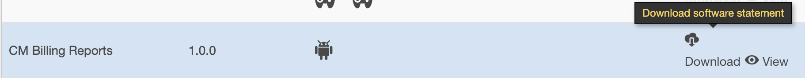

# Zugriff auf die API zur Überwachung der gleichzeitigen Verwendung {#cmu-api-usage-access}

>[!NOTE]
>
>Der Inhalt dieser Seite dient nur Informationszwecken. Für die Verwendung dieser API ist eine aktuelle Lizenz von Adobe erforderlich. Eine unbefugte Anwendung ist nicht zulässig. Wenden Sie sich bei Fragen zur Verfügbarkeit an Ihren Adobe-Support-Mitarbeiter.

## Übersicht über Zugriffsverfahren {#api-access-procedure-overview}

Wir haben den Zugriff auf CMU-Berichte aktualisiert, um mit dem Dynamic Client Registration Protocol von OAuth 2.0 kompatibel zu sein. Ein benutzerdefinierter OAuth 2.0-Autorisierungsserver wird bereitgestellt, um die Anforderungen der Anwendung zur Überwachung der Parallelität zu erfüllen. \
Damit die Client-Anwendungen die OAuth 2.0-Autorisierung verwenden können, muss sich der Server dynamisch registrieren, um bestimmte Informationen (Client-Anmeldeinformationen) zu erhalten und damit mit ihnen interagieren zu können. Im Rahmen des Registrierungsprozesses muss der Client eine Reihe integrierter Metadaten für den Client-Registrierungs-Endpunkt bereitstellen.
Diese Metadaten werden als Softwareanweisung übermittelt, die eine &quot;software_id&quot;enthält, damit unser Autorisierungsserver verschiedene Instanzen einer Anwendung mit derselben Softwareanweisung korrelieren kann.
Eine Softwareanweisung ist ein JSON Web Token (JWT), das Metadatenwerte über die Client-Software als Bundle durchsetzt. Wenn die Software dem Autorisierungsserver als Teil einer Anfrage zur Clientregistrierung präsentiert wird, muss sie digital signiert oder mit JSON Web Signature (JWS) als MACed signiert werden. \
Eine detailliertere Erklärung dazu, was Softwareanweisungen sind und wie sie funktionieren, finden Sie in der offiziellen Dokumentation <a href="https://datatracker.ietf.org/doc/html/rfc7591" target="_blank">[RFC7591]</a>.
Führen Sie die Schritte in den folgenden Abschnitten aus, um Zugriff zu erhalten.

## Schritte für Zugriffsverfahren {#access-procedure-steps}

1. Sie benötigen eine registrierte Anwendung im Adobe Pass DCR-Server. Wenden Sie sich für diesen Schritt an unser [Supportteam](mailto:tve-support@adobe.com).
2. Softwareanweisung abrufen
   1. Wechseln Sie zu TVE Dashboard <a href="https://console-preprod.auth.adobe.com/#!/" target="_blank"> Pre-Prod </a> oder <a href="https://console.auth.adobe.com/" target="_blank">PROD</a> .
   2. Programmierer auswählen
   3. Registerkarte &quot;Anwendungen&quot;
   4. Anwendung auswählen
   5. Klicken Sie auf DownLoad-Softwareanweisung , um eine Datei ähnlich der unten aufgeführten zu erhalten.
      <figure>
          
       </figure>
      <figure>
          
       </figure>

3. Zugriffstoken abrufen
   1. Rufen Sie mithilfe der oben abgerufenen Softwareanweisung Client-Anmeldeinformationen ab und führen Sie den nachfolgenden Aufruf aus. Auf diese Weise wird ein client_id - client_secret -Paar abgerufen, das zum Abrufen des Zugriffstokens verwendet werden kann.
      *Dieser Schritt sollte nicht jedes Mal ausgeführt werden. Dies sollte nur dann erneut erfolgen, wenn die Anmeldeinformationen ablaufen.*
      <figure>
          
       </figure>

   2. Rufen Sie mithilfe des nachfolgenden Aufrufs das Zugriffstoken ab. Verwenden Sie dieses Zugriffstoken, um eine beliebige CMU-API aufzurufen, bis das Token abläuft.
      *Dieser Schritt sollte nur ausgeführt werden, wenn das letzte generierte Token abgelaufen ist.*
      <figure>
          
       </figure>

4. Rufen Sie die CMU-API auf - siehe dazu gehörige Informationen unten.
   <figure>
          
       </figure>

## Verwandte Informationen {#related-information}

* [CMU-Übersicht](/help/concurrency-monitoring/cm-usage-reports.md)
* [CMU-API](/help/concurrency-monitoring/cmu-api.md)
