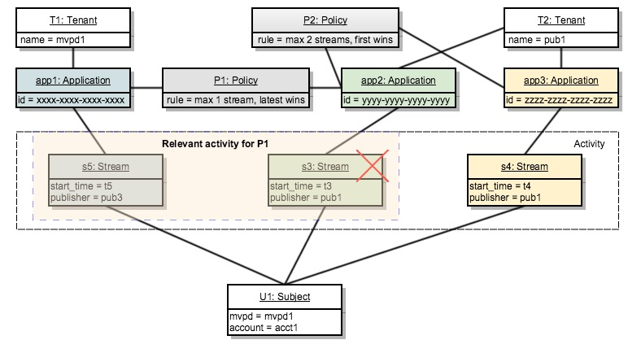

# Entscheidungspunkt der Richtlinie {#policy-desc-pt}

## Domain-Modell {#domain-model}

Diese Seite soll als Referenz für verschiedene Anwendungsfälle und Implementierungen von Richtlinien dienen. Wir empfehlen Ihnen, auch den [Glossar](/help/concurrency-monitoring/cm-glossary.md) Teil der Dokumentation zu den Begriffsdefinitionen zu konsultieren.

Ein **Mandant** besitzt **Programme** für die er (Richtlinien **durchsetzen**. **Client-Anwendungen** müssen mit der **Anwendungs-ID)** bereitgestellt von Adobe) konfiguriert werden.

Der Mandant verknüpft dann jede Anwendung mit einer oder mehreren Richtlinien, die entweder von ihm erstellt oder von anderen erstellt und freigegeben wurden. Richtlinien können mit mehreren Mandanten verknüpft werden.

Die **Betreffaktivität** besteht aus allen Streams (unabhängig von der Anwendung), die für ein bestimmtes Betreff an das Parallelitätsmonitoring gemeldet werden.

Wenn ein Stream für ein bestimmtes Subjekt autorisiert werden soll, prüft das System zunächst alle Richtlinien, die für die Anwendung definiert wurden, die den Stream erstellt hat.

Für jede der anwendbaren Richtlinien müssen wir dann alle **relevanten Aktivitäten** erfassen, die an die Regel übergeben werden. Die **relevante Aktivität** für eine Richtlinie P umfasst nur dann einen Stream S, wenn er die folgende Bedingung erfüllt:

**Stream „S“ wird von einer Anwendung gestartet, die Richtlinie „P“ zu ihren Richtlinien zählt.**

## Dry Run-Anwendungsfälle {#dry-run-use-cases}

In der folgenden exemplarischen Vorgehensweise wird das Modell für einige Anwendungsfälle validiert. Wir machen das schrittweise, indem wir mit einer grundlegenden Einrichtung beginnen und Komplexität auf verschiedene Arten hinzufügen.

### &#x200B;1. Einen Mandanten. Eine Anwendung. Eine Richtlinie. Ein Stream {#onetenant-oneapp-onepolicy-onestream}

Wir beginnen mit einem einzelnen Mandanten, wobei ein einzelnes Programm und eine einzige Richtlinie verknüpft sind. Nehmen wir an, die Richtlinie besagt, dass es für jeden Benutzer maximal einen aktiven Stream geben kann (der neueste Stream darf wiedergegeben werden).

Sobald ein Stream gestartet wurde, besteht die Aktivität nur aus diesem Stream und sie kann wiedergegeben werden.

### &#x200B;2. Einen Mandanten. Eine Anwendung. Eine Richtlinie. Zwei Streams. {#onetenant-oneapp-onepolicy-twostreams}

Sobald ein zweiter Stream gestartet wurde (vom selben Subjekt mit derselben Anwendung), besteht die für die Validierung verwendete Aktivität aus **s1** und **s2**.

Das Limit wird überschritten, da die Richtlinie angibt, dass nur ein Stream wiedergegeben werden darf, sodass nur der neueste Stream (**s2**) wiedergegeben wird.

>[!NOTE]
>
>Die Diagramme stellen die Systemansicht der Benutzeraktivität dar. Bei Stream-Initialisierungsversuchen wird die Zugriffsentscheidung in die Antwort aufgenommen. Bei aktiven Streams wird die Entscheidung bei der Heartbeat-Antwort zurückgegeben.

### &#x200B;3. Zwei Mieter. Zwei Anwendungen. Eine Richtlinie. Zwei Streams. {#twotenant-twoapp-onepolicy-twostreams}

Nehmen wir nun an, dass ein neuer Mandant dieselbe Richtlinie in seinen Anwendungen durchsetzen möchte:

Da die beiden Mandanten durch dieselbe Richtlinie verknüpft sind, gilt die in Anwendungsfall 2 beschriebene Situation hier, und **s3** darf wiedergegeben werden, da es sich um den neuesten Stream handelt.

### &#x200B;4. Zwei Mieter. Drei Anwendungen. Zwei Richtlinien. Zwei Streams. {#twotenants-threeapps-twopolicies-twostreams}

Nehmen wir nun an, dass der zweite Mandant ein neues Programm bereitstellt und eine neue Richtlinie definieren möchte, die von **app2** und **app3** gemeinsam verwendet wird.

In diesem Moment sind die aktiven Streams **s3** und **s4** beide zulässig. Bei **s3** zählt das System bei der Auswertung der **P1** nur **s3** als **relevante Aktivität** (**s4** steht in keiner Weise mit der **P1** in Zusammenhang), sodass keine Verletzung vorliegt.

Die Richtlinie **P2** wird auf beide Streams angewendet und umfasst sowohl **s3** als auch **s4** als relevante Aktivität. Da sich diese Aktivität innerhalb der Grenzen von zwei Streams befindet, sind beide Streams zulässig.

### &#x200B;5. Zwei Mieter. Drei Anwendungen. Zwei Richtlinien. Drei Streams. {#twotenants-threeapps-twopolicies-threestreams}

Nehmen wir nun an, dass ein neuer Stream-Initialisierungsversuch mit &lbrace;app2 **durchgeführt**:

**s5** darf mit **P1** beginnen (wodurch die Übernahme neuerer Streams möglich ist), wird aber von **P2** verweigert und startet daher nicht.

Dasselbe geschieht, wenn versucht wird, einen Stream mit App3 zu initialisieren: Dieselbe Richtlinie P2 verweigert den Zugriff dafür.

Sehen wir uns nun an, was passieren würde, wenn Benutzende versuchen, einen neuen Stream mit app1 zu erstellen:

Die Anwendung App1 ist in keiner Weise mit der Richtlinie **P2** verbunden, daher wird nur die Richtlinie **P1** angewendet, die den Start des neuen Streams ermöglicht und den älteren verweigert (in diesem Fall **s3**).
